# PRD: GitCommand Center v2.2 (Open-Source Composite Edition)

**Version**: 2.3
**Date**: 2025-12-14
**Status**: Draft
**Author**: Claude Code
**Previous**: v2.2 (AI 모델 및 구독제 반영)

---

## 문서 작성 지침

> **Mermaid 다이어그램 규칙**: 모든 워크플로우는 **세로 방향(TB: Top to Bottom)**으로 작성합니다.
>
> ```
> ✅ 권장: flowchart TB (세로)
> ❌ 금지: flowchart LR (가로)
> ```

---

## 1. Executive Summary

GitCommand Center는 검증된 오픈소스 AI 기술을 모듈식으로 통합한 **AI-Native 개발자 대시보드**입니다.

**프랑켄슈타인 전략**: Aider의 코딩 능력 + LangGraph의 워크플로우 제어 + OpenHands의 UI 아키텍처를 결합하여, GitHub 이슈 관리부터 코드 수정, 시각적 디버깅까지 단일 인터페이스에서 처리합니다.

### v2.2 → v2.3 주요 변경사항

| 영역 | v2.2 | v2.3 (개선) |
|------|------|-------------|
| 문서 지침 | 없음 | **Mermaid 세로 방향(TB) 규칙 추가** |

### v2.1 → v2.2 주요 변경사항

| 영역 | v2.1 | v2.2 (개선) |
|------|------|-------------|
| AI 모델 | Claude 3.5 + GPT-4o | **Claude Opus 4.5, GPT 5.2 Codex, Gemini 3.0, Qwen** |
| 과금 방식 | API 토큰 종량제 | **구독제 기반** (추가 비용 $0) |
| 로컬 AI | 없음 | **Qwen vLLM 로컬 옵션** |
| 리스크 | AI 비용 증가 | **구독 한도 → 로컬 대체** |

### v2.0 → v2.1 변경사항 (이전)

| 영역 | v2.0 | v2.1 |
|------|------|------|
| Aider 통합 | Library Mode | Subprocess 방식 |
| 보안 | Docker 언급만 | 다층 샌드박스 + microVM |
| 프로토콜 | 직접 API 호출 | MCP (Model Context Protocol) |
| HITL | 단순 y/n | 3단계 승인 체계 |
| 로드맵 | 6주 | 10주 (보안 Phase 추가) |

---

## 2. Strategic Architecture

### 2.1 전체 시스템 구조

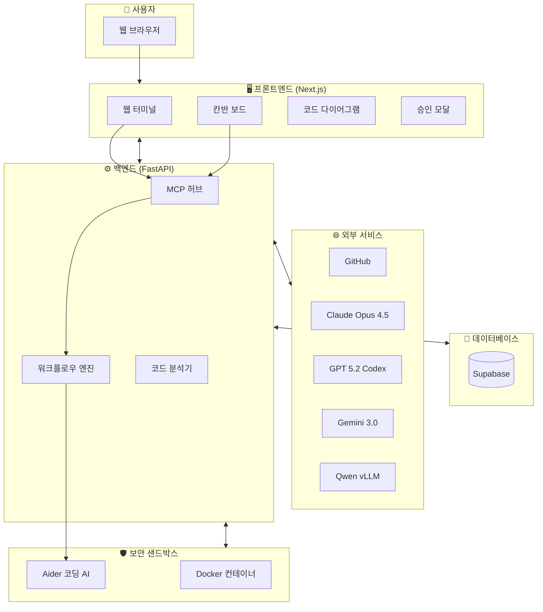

### 2.2 오픈소스 통합 구조 (프랑켄슈타인)

```mermaid
flowchart LR
    subgraph BRAIN["🧠 The Brain<br/>코딩 엔진"]
        AIDER_ENGINE[Aider]
    end

    subgraph NERVOUS["🔗 The Nervous System<br/>워크플로우"]
        LANGGRAPH[LangGraph]
    end

    subgraph BODY["🖐️ The Body<br/>인터페이스"]
        NEXTJS[Next.js 15]
        XTERM[Xterm.js]
        DNDKIT[@dnd-kit]
    end

    subgraph EYES["👁️ The Eyes<br/>시각화"]
        TREESITTER[Tree-sitter]
        REACTFLOW[React Flow]
    end

    subgraph SHIELD["🛡️ The Shield<br/>보안"]
        DOCKER_SANDBOX[Docker Sandbox]
    end

    subgraph PROTOCOL["📡 The Protocol<br/>통신"]
        MCP[MCP 프로토콜]
    end

    BODY --> NERVOUS
    NERVOUS --> BRAIN
    BRAIN --> SHIELD
    EYES --> BODY
    PROTOCOL --> NERVOUS
```

### 2.3 Make vs Buy 결정

| 컴포넌트 | 결정 | 선택 기술 | 이유 |
|----------|------|-----------|------|
| 코딩 엔진 | **구매** | Aider | Git 관리, 컨텍스트 처리 자체 구현 비효율 |
| 워크플로우 | **구매** | LangGraph | 업계 표준 오케스트레이션 |
| 터미널 UI | **구매** | Xterm.js | VS Code에서 검증됨 |
| 시각화 | **구매** | React Flow | MIT 라이선스, 풍부한 예제 |
| 칸반 | **자체 개발** | Custom | AI 자동 이동 커스텀 로직 필요 |
| 샌드박스 | **구매** | Docker | 2025년 Agent Safety 솔루션 |

---

## 3. Core Features

### 3.1 Aider 기반 코딩 엔진 (The Brain)

**Priority**: P0 (핵심)

#### 역할

사용자의 자연어 명령을 받아 **실제 코드를 수정**하고 **Git 커밋을 생성**하는 AI 코딩 어시스턴트입니다.

#### 작동 흐름

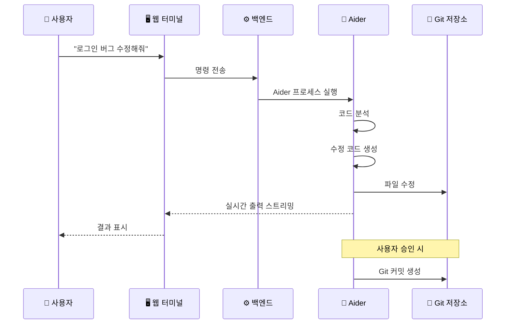

#### Aider가 하는 일

```mermaid
flowchart TB
    subgraph INPUT["입력"]
        CMD[사용자 명령<br/>"JWT 만료 버그 수정"]
        FILES[관련 파일들]
    end

    subgraph AIDER["Aider 처리"]
        ANALYZE[코드 분석<br/>Repository Map 생성]
        PLAN[수정 계획 수립]
        EDIT[코드 수정]
        COMMIT[커밋 메시지 생성]
    end

    subgraph OUTPUT["출력"]
        MODIFIED[수정된 파일]
        DIFF[변경 내역 Diff]
        MSG[커밋 메시지]
    end

    CMD --> ANALYZE
    FILES --> ANALYZE
    ANALYZE --> PLAN
    PLAN --> EDIT
    EDIT --> MODIFIED
    EDIT --> DIFF
    COMMIT --> MSG
```

#### 왜 Subprocess 방식인가?

| 방식 | 장점 | 단점 | 선택 |
|------|------|------|------|
| Library Mode | 빠름 | 불안정, 실험적 | ❌ |
| **Subprocess** | 안정적, 격리됨 | 약간 느림 | ✅ |

---

### 3.2 LangGraph 워크플로우 (The Nervous System)

**Priority**: P0 (핵심)

#### 역할

사용자의 요청을 **단계별 작업으로 분할**하고, 각 단계에서 **사용자 승인을 받는** 워크플로우 관리자입니다.

#### 3단계 Human-in-the-Loop (HITL) 체계

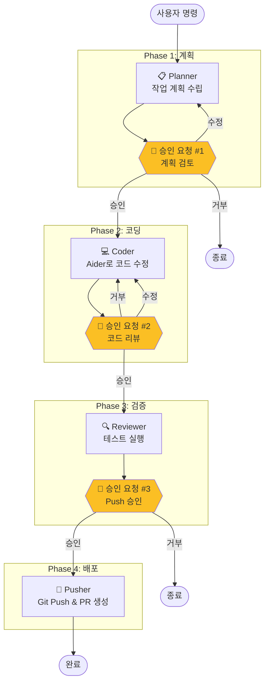

#### 각 단계별 역할

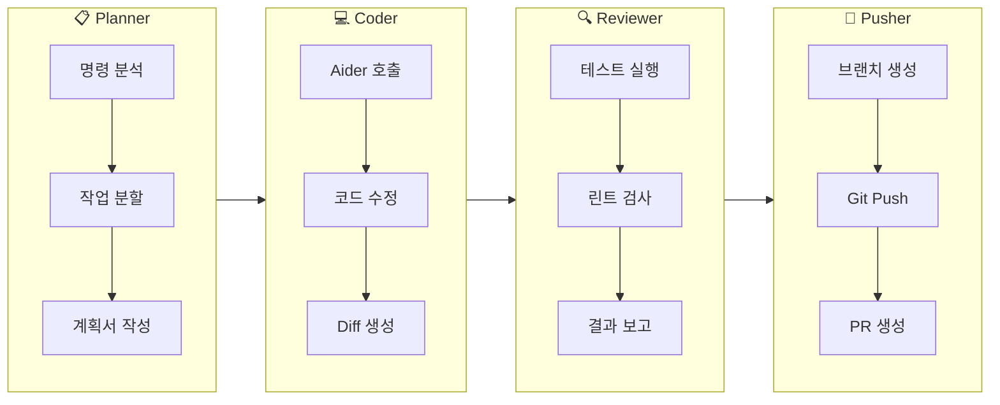

#### 사용자 승인 화면 (UI)

| 승인 단계 | 표시 내용 | 선택 옵션 |
|-----------|-----------|-----------|
| **계획 검토** | 작업 목록, 예상 변경 파일 | 승인 / 수정요청 / 취소 |
| **코드 리뷰** | 변경된 코드 Diff | 승인 / 수정요청 / 다시시도 |
| **Push 승인** | 최종 변경 사항, PR 제목 | 승인 / 취소 |

---

### 3.3 MCP 기반 도구 통합 (The Protocol)

**Priority**: P1 (높음)

#### MCP란?

**Model Context Protocol**: AI 에이전트가 외부 도구와 통신하는 **표준 프로토콜**입니다.
여러 도구를 일관된 방식으로 연결할 수 있어 확장이 쉽습니다.

#### MCP 아키텍처

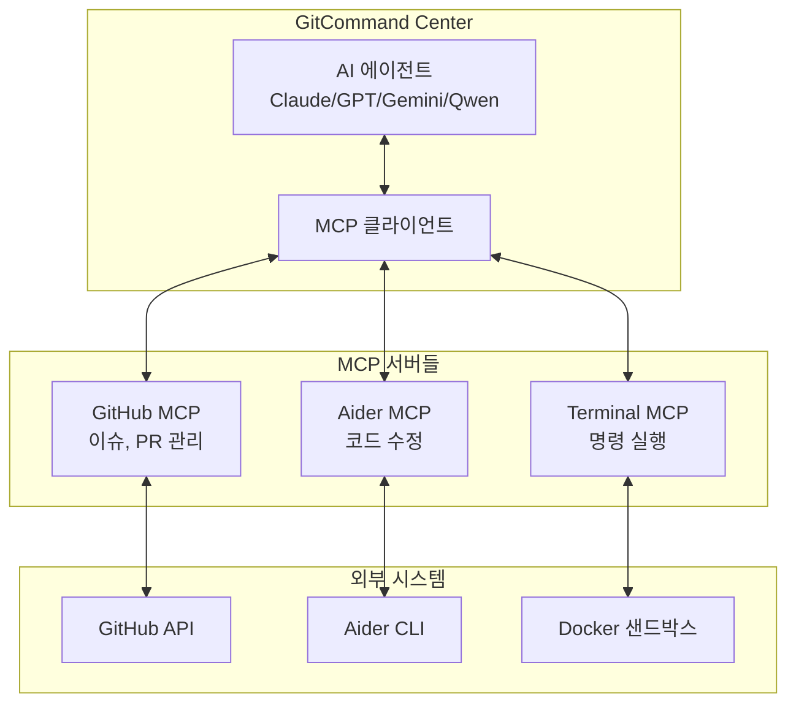

#### MCP 도입 효과

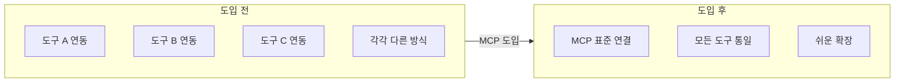

| 효과 | 설명 |
|------|------|
| **비용 절감** | 컨텍스트 윈도우 사용량 40% 감소 |
| **확장성** | 새 도구 추가 시 MCP 서버만 추가 |
| **표준화** | Claude, GPT, Gemini, Qwen 등 다양한 모델과 호환 |

---

### 3.4 샌드박스 보안 계층 (The Shield)

**Priority**: P0 (핵심)

#### 왜 샌드박스가 필요한가?

2025년 AI 에이전트 보안 사고 사례:

| 사고 | 원인 | 피해 |
|------|------|------|
| Git 저장소 삭제 | 격리 없는 실행 | 코드 손실 |
| 프롬프트 유출 | 무제한 네트워크 | 기밀 유출 |
| 설정 파일 삭제 | 과도한 권한 | 시스템 장애 |

#### 다층 보안 구조

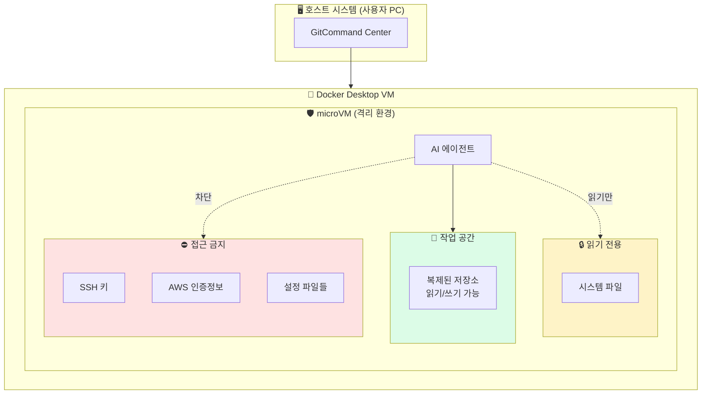

#### 보안 정책 상세

```mermaid
flowchart LR
    subgraph NETWORK["🌐 네트워크 정책"]
        direction TB
        ALLOW[✅ 허용]
        BLOCK[❌ 차단]

        ALLOW --> G[GitHub API]
        ALLOW --> P[PyPI/npm]
        ALLOW --> AI[AI API]

        BLOCK --> OTHER[기타 모든 사이트]
    end

    subgraph FILESYSTEM["📁 파일시스템 정책"]
        direction TB
        RW[읽기/쓰기]
        RO[읽기 전용]
        NO[접근 금지]

        RW --> WORK[/workspace]
        RO --> USR[/usr, /etc]
        NO --> SECRETS[~/.ssh, ~/.aws]
    end

    subgraph EXECUTION["⚡ 실행 정책"]
        direction TB
        LIMIT[제한 사항]

        LIMIT --> TIME[타임아웃: 5분]
        LIMIT --> MEM[메모리: 4GB]
        LIMIT --> ROOT[관리자 권한 금지]
    end
```

#### 위험 명령 감지 및 알림

| 위험 패턴 | 설명 | 조치 |
|-----------|------|------|
| `rm -rf /` | 전체 삭제 시도 | 차단 + 알림 |
| `curl \| sh` | 원격 스크립트 실행 | 차단 + 알림 |
| `chmod 777` | 과도한 권한 부여 | 경고 + 로깅 |
| `sudo` | 관리자 권한 요청 | 차단 |

---

### 3.5 하이브리드 인터페이스 (The Body)

**Priority**: P0 (핵심)

#### 대시보드 레이아웃

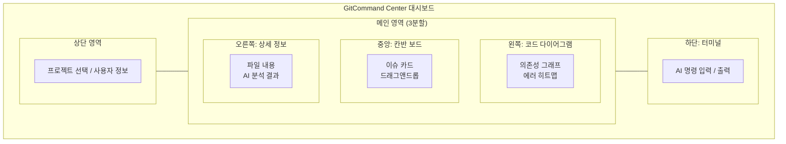

#### 웹 터미널 작동 방식

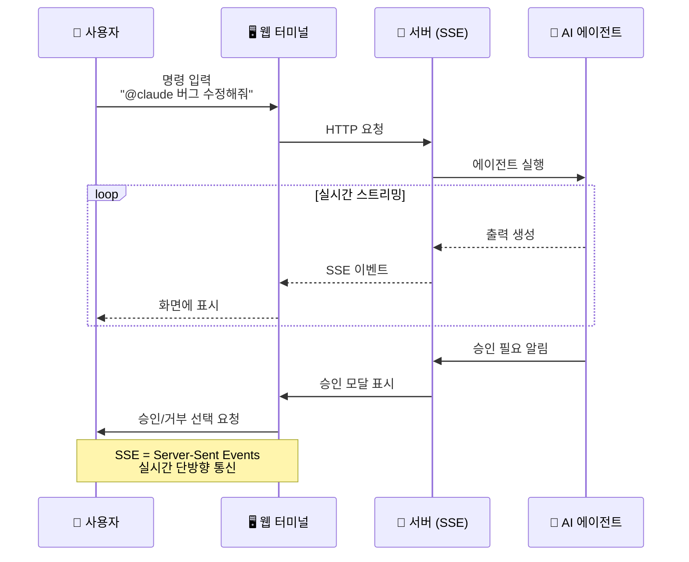

#### 칸반 보드 자동 이동

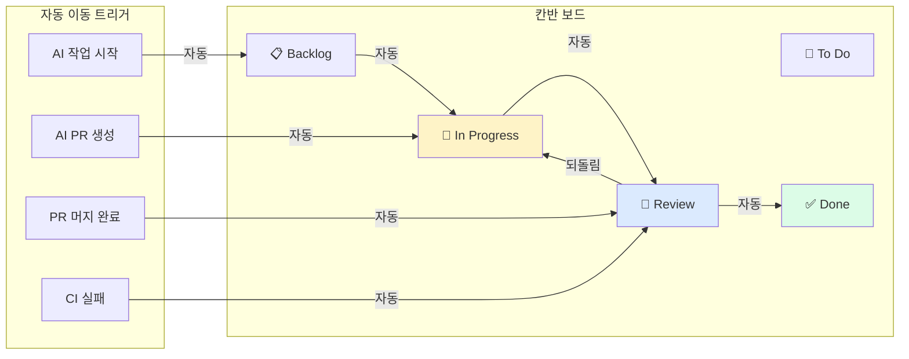

---

### 3.6 코드 시각화 (The Eyes)

**Priority**: P1 (높음)

#### 의존성 그래프

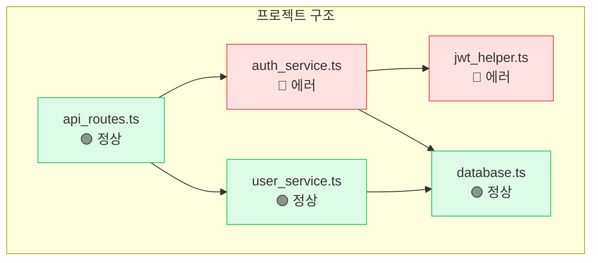

#### 노드 상태 의미

| 색상 | 상태 | 의미 |
|------|------|------|
| 🟢 녹색 | 정상 | 테스트 통과, 에러 없음 |
| 🟡 노랑 | 경고 | 린트 경고, 개선 필요 |
| 🔴 빨강 | 에러 | 테스트 실패, 빌드 에러 |
| ⚫ 회색 | 미분석 | 아직 분석되지 않음 |

#### 에러 추적 흐름

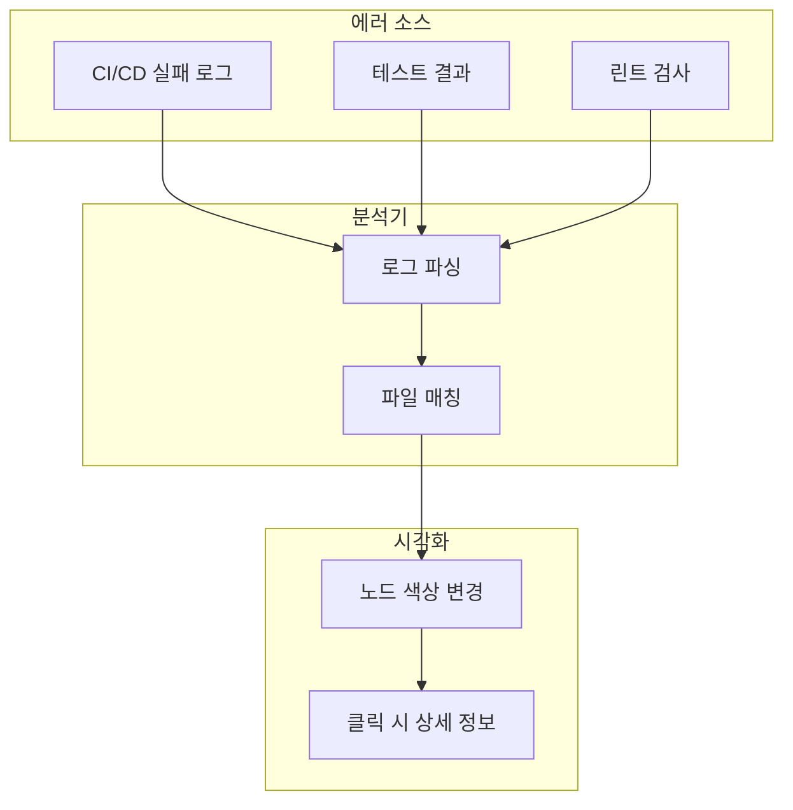

---

## 4. Technical Architecture

### 4.1 전체 시스템 흐름

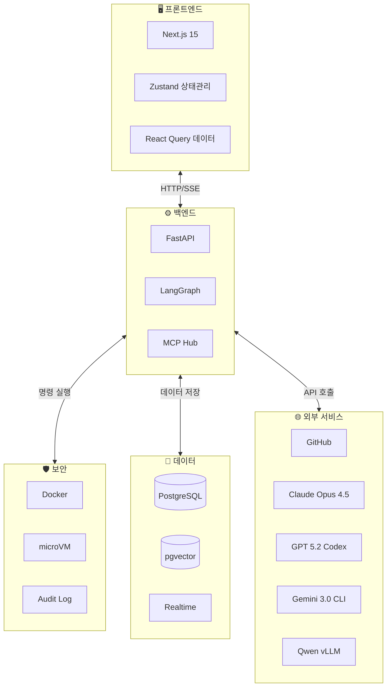

### 4.2 기술 스택 요약

```mermaid
flowchart LR
    subgraph FE["프론트엔드"]
        NEXT[Next.js 15]
        ZUSTAND[Zustand]
        RQUERY[React Query]
        XTERM[Xterm.js]
        RFLOW[React Flow]
        DND[@dnd-kit]
    end

    subgraph BE["백엔드"]
        FAST[FastAPI]
        LANG[LangGraph]
        TREE[Tree-sitter]
        MCP[MCP]
    end

    subgraph INFRA["인프라"]
        SUPA[Supabase]
        DOCK[Docker]
        PGVEC[pgvector]
    end

    FE --> BE --> INFRA
```

### 4.3 데이터 모델

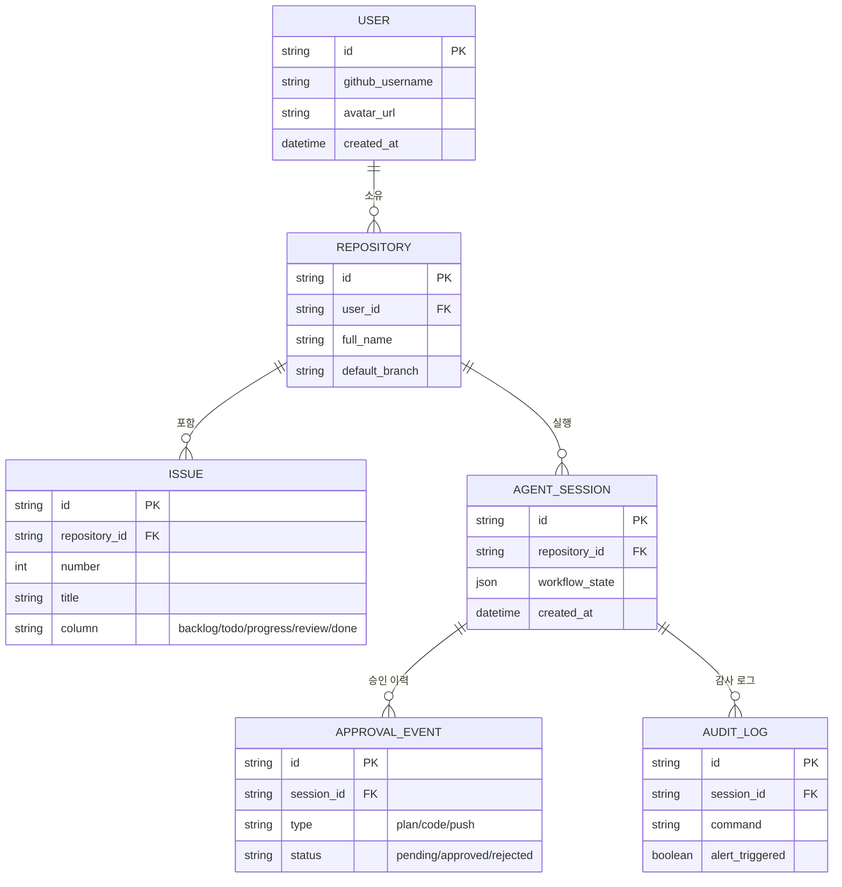

---

## 5. API 구조

### 5.1 주요 API 흐름

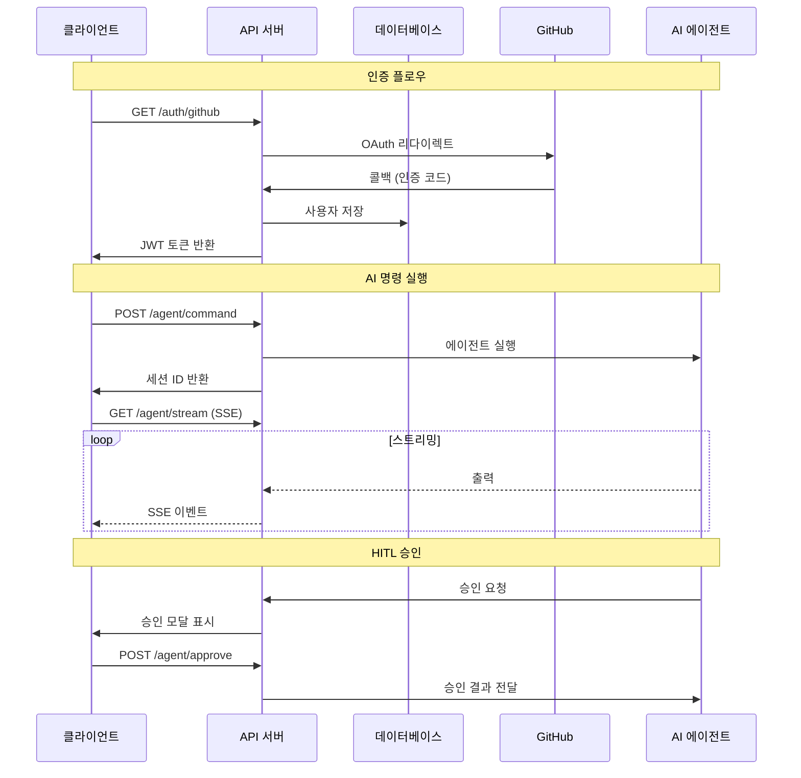

### 5.2 API 엔드포인트 목록

| 메서드 | 경로 | 설명 |
|--------|------|------|
| GET | `/auth/github` | GitHub OAuth 시작 |
| GET | `/auth/github/callback` | OAuth 콜백 |
| GET | `/repositories` | 저장소 목록 |
| POST | `/agent/command` | AI 명령 실행 |
| GET | `/agent/stream` | 실시간 출력 (SSE) |
| POST | `/agent/approve` | HITL 승인/거부 |
| GET | `/issues/{repo_id}` | 이슈 목록 (칸반) |
| PATCH | `/issues/{id}` | 이슈 상태 변경 |
| GET | `/visualization/graph/{repo_id}` | 의존성 그래프 |
| GET | `/visualization/heatmap/{repo_id}` | 에러 히트맵 |

---

## 6. Implementation Roadmap

### 6.1 전체 일정

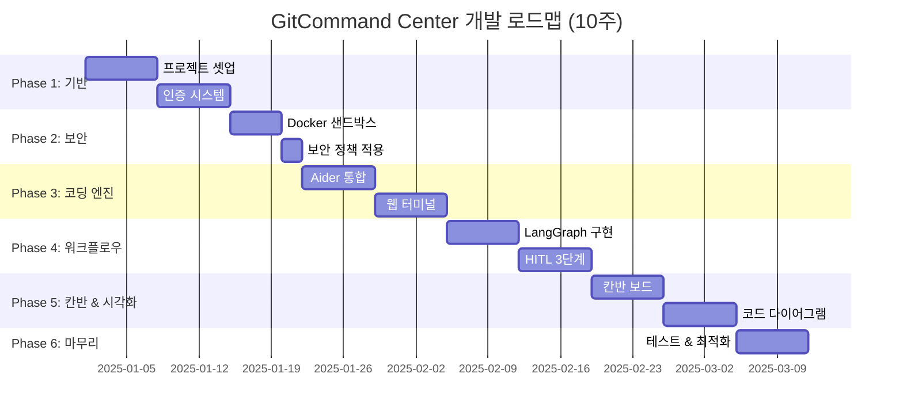

### 6.2 Phase별 마일스톤

| Phase | 기간 | 목표 | 완료 기준 |
|-------|------|------|-----------|
| **1. 기반** | 2주 | 프로젝트 기초 | GitHub 로그인 → 저장소 목록 표시 |
| **2. 보안** | 1주 | 샌드박스 구축 | 격리 환경에서 명령 실행 가능 |
| **3. 코딩 엔진** | 2주 | Aider 연동 | 웹 터미널에서 코드 수정 가능 |
| **4. 워크플로우** | 2주 | HITL 구현 | 3단계 승인 플로우 작동 |
| **5. 칸반 & 시각화** | 2주 | UI 완성 | 칸반 + 다이어그램 표시 |
| **6. 마무리** | 1주 | 배포 준비 | E2E 테스트 통과 |

---

## 7. Success Metrics

### 7.1 MVP 성공 기준

| 지표 | 목표 | 측정 방법 |
|------|------|----------|
| Aider 명령 성공률 | > 90% | 유효 응답 비율 |
| HITL 응답 시간 | < 3초 | 승인 모달 표시까지 |
| 샌드박스 보안 | 100% | 침투 테스트 통과 |
| 칸반 동기화 정확도 | > 99% | GitHub vs 앱 상태 일치 |

### 7.2 성능 목표

| 지표 | 목표 |
|------|------|
| 초기 로딩 | < 3초 |
| AI 첫 응답 | < 2초 |
| 다이어그램 렌더링 | < 1초 (100 노드) |
| 실시간 업데이트 | < 500ms |

---

## 8. Risk Management

### 8.1 위험 요소 및 대응

```mermaid
flowchart TB
    subgraph RISKS["위험 요소"]
        R1[Aider 불안정]
        R2[샌드박스 탈출]
        R3[구독 사용량 한도]
        R4[GitHub API 제한]
    end

    subgraph MITIGATION["대응 전략"]
        M1[Subprocess 방식 채택]
        M2[microVM 다층 격리]
        M3[로컬 Qwen vLLM 대체]
        M4[캐싱 + 배치 요청]
    end

    R1 --> M1
    R2 --> M2
    R3 --> M3
    R4 --> M4
```

### 8.2 위험 매트릭스

| 위험 | 영향 | 확률 | 대응 |
|------|------|------|------|
| Aider API 불안정 | 높음 | 중간 | Subprocess 방식 (완료) |
| 샌드박스 탈출 | 치명적 | 낮음 | microVM + 다층 격리 |
| 구독 사용량 한도 도달 | 낮음 | 낮음 | 로컬 Qwen vLLM으로 대체 |
| GitHub Rate Limit | 중간 | 중간 | 캐싱, 배치 요청 |

---

## 9. Cost Strategy (구독제 기반)

### 9.1 AI 서비스 구독 현황

> **핵심 원칙**: API 토큰 종량제가 아닌 **구독제**를 활용합니다.
> 모든 AI 서비스는 이미 구독 중이므로 추가 비용 없이 사용 가능합니다.

```mermaid
flowchart TB
    subgraph SUBSCRIPTIONS["📦 구독 중인 AI 서비스"]
        subgraph CLOUD["☁️ 클라우드 AI"]
            CLAUDE[Claude Code Opus 4.5<br/>🔷 구독 활성]
            GPT[GPT 5.2 Codex<br/>🔷 구독 활성]
            GEMINI[Gemini 3.0 CLI<br/>🔷 구독 활성]
            ANTIGRAVITY[Google Antigravity<br/>🔷 구독 활성]
        end

        subgraph LOCAL["💻 로컬/하이브리드"]
            QWEN[Qwen CLI<br/>🔷 구독 활성]
            QWEN_LOCAL[Qwen vLLM 로컬<br/>🟢 무료 옵션]
        end
    end

    style CLAUDE fill:#dbeafe
    style GPT fill:#dcfce7
    style GEMINI fill:#fef3c7
    style ANTIGRAVITY fill:#fee2e2
    style QWEN fill:#f3e8ff
    style QWEN_LOCAL fill:#e5e7eb
```

### 9.2 모델별 역할 분담

```mermaid
flowchart LR
    subgraph TASK["작업 유형"]
        PLAN[📋 계획 수립]
        CODE[💻 코드 생성]
        REVIEW[🔍 코드 리뷰]
        ANALYZE[📊 분석/검색]
    end

    subgraph MODEL["담당 AI 모델"]
        M1[Claude Opus 4.5]
        M2[GPT 5.2 Codex]
        M3[Gemini 3.0]
        M4[Qwen]
    end

    PLAN --> M1
    CODE --> M2
    CODE --> M1
    REVIEW --> M3
    ANALYZE --> M4

    style M1 fill:#dbeafe
    style M2 fill:#dcfce7
    style M3 fill:#fef3c7
    style M4 fill:#f3e8ff
```

### 9.3 구독제 vs 종량제 비교

| 항목 | 종량제 (API) | 구독제 (현재 사용) |
|------|-------------|------------------|
| 비용 예측 | ❌ 변동 | ✅ **고정** |
| 사용량 제한 | ❌ 비용 증가 | ✅ **무제한*** |
| 관리 부담 | ❌ 토큰 모니터링 필요 | ✅ **신경 쓸 필요 없음** |
| 적합 사용자 | 가끔 사용 | ✅ **헤비 유저** |

*일부 서비스는 일일/월간 사용량 상한이 있을 수 있음

### 9.4 비용 구조

```mermaid
flowchart TB
    subgraph COST["💰 월 비용 구조"]
        subgraph FIXED["고정 비용 (구독료)"]
            S1[Claude Pro/Team<br/>이미 결제 중]
            S2[ChatGPT Plus/Team<br/>이미 결제 중]
            S3[Gemini Advanced<br/>이미 결제 중]
            S4[기타 구독<br/>이미 결제 중]
        end

        subgraph INFRA["인프라 비용"]
            I1[Supabase Free Tier<br/>$0]
            I2[Docker Desktop<br/>$0 (개인)]
            I3[Vercel Free Tier<br/>$0]
        end
    end

    TOTAL[추가 비용: $0<br/>기존 구독으로 커버]

    FIXED --> TOTAL
    INFRA --> TOTAL

    style TOTAL fill:#dcfce7,stroke:#22c55e,stroke-width:2px
```

### 9.5 로컬 AI 활용 전략

```mermaid
flowchart TB
    subgraph LOCAL_STRATEGY["🏠 로컬 AI 활용"]
        QWEN_VLLM[Qwen vLLM<br/>로컬 실행]

        subgraph ADVANTAGES["장점"]
            A1[✅ 완전 무료]
            A2[✅ 오프라인 가능]
            A3[✅ 프라이버시 보장]
        end

        subgraph USE_CASES["활용 시나리오"]
            U1[반복적인 코드 분석]
            U2[민감한 코드 처리]
            U3[네트워크 불안정 시]
        end
    end

    QWEN_VLLM --> ADVANTAGES
    QWEN_VLLM --> USE_CASES
```

---

## 10. Testing Strategy

### 10.1 테스트 범위

```mermaid
flowchart TB
    subgraph TESTS["테스트 계층"]
        subgraph UNIT["단위 테스트"]
            U1[Aider 서비스]
            U2[코드 분석기]
            U3[LangGraph 노드]
        end

        subgraph INTEGRATION["통합 테스트"]
            I1[GitHub OAuth]
            I2[MCP 서버 통신]
            I3[Realtime 동기화]
        end

        subgraph E2E["E2E 테스트"]
            E1[로그인 → 명령 실행]
            E2[HITL 승인 플로우]
            E3[칸반 자동 이동]
        end
    end

    UNIT --> INTEGRATION --> E2E
```

### 10.2 E2E 테스트 시나리오

| 시나리오 | 설명 |
|----------|------|
| 정상 플로우 | 로그인 → 저장소 선택 → AI 명령 → 승인 → 완료 |
| 에러 복구 | 타임아웃, 권한 거부, 네트워크 오류 처리 |
| 경쟁 상태 | 동시 요청, 충돌 해결 |

---

## 11. References

### 관련 문서

- `prd.md` - 원본 PRD (v1.0)
- `prd_v02.md` - 프랑켄슈타인 전략 (v2.0)
- `0001-prd-gitcommand-center.md` - 상세 PRD (v1.0 기반)

### 외부 참조

| 기술 | 문서 링크 |
|------|-----------|
| LangGraph | langchain-ai.github.io/langgraph |
| Aider | aider.chat/docs |
| OpenHands | docs.all-hands.dev |
| MCP | modelcontextprotocol.io |
| Docker Sandbox | docker.com/blog |

---

**Next Steps**:
1. `/todo` 실행하여 Phase 1 Task 생성
2. GitHub 리포지토리 생성
3. 프로젝트 보일러플레이트 셋업
