# GitCommand Center: UI 디자인 및 워크플로우 가이드

**Version**: 1.1
**Date**: 2025-12-14
**Status**: Draft
**Related**: 0002-prd-gitcommand-center-v2.md

---

## 문서 작성 지침

> **Mermaid 다이어그램 규칙**: 모든 워크플로우는 **세로 방향(TB: Top to Bottom)**으로 작성합니다.
>
> ```
> ✅ 권장: flowchart TB (세로)
> ❌ 금지: flowchart LR (가로)
> ```
>
> **예외**: UI 레이아웃 표현 시 `direction LR`은 허용 (가로 배치 컴포넌트 표현용)

---

## 1. 문서 개요

이 문서는 GitCommand Center의 **사용자 인터페이스(UI) 설계**와 **사용자 워크플로우**를 시각적으로 설명합니다.
비개발자도 시스템의 구조와 사용 방법을 이해할 수 있도록 Mermaid 다이어그램으로 표현했습니다.

---

## 2. 전체 화면 구조

### 2.1 메인 대시보드 레이아웃

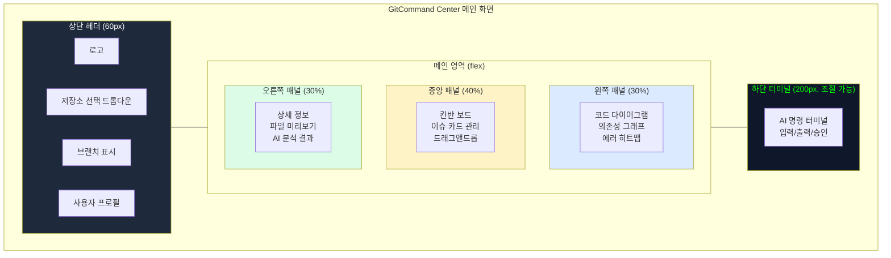

### 2.2 반응형 레이아웃

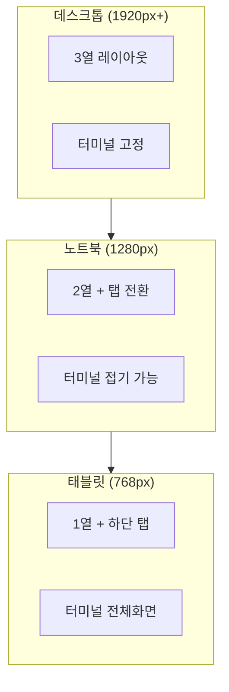

---

## 3. 화면별 상세 설계

### 3.1 로그인 화면

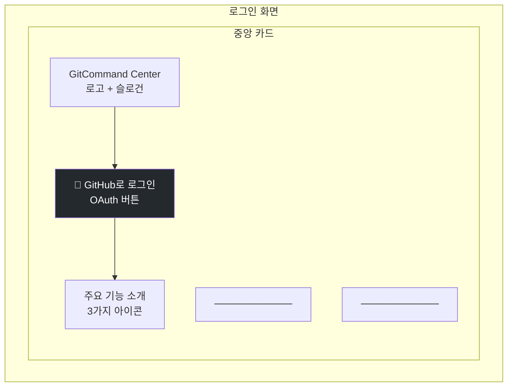

### 3.2 저장소 선택 화면

```mermaid
flowchart TB
    subgraph REPO_SELECT_SCREEN["저장소 선택"]
        subgraph SEARCH["검색 영역"]
            SEARCH_INPUT[🔍 저장소 검색...]
            FILTER[필터: 모두 / 소유 / 협업]
        end

        subgraph LIST["저장소 목록"]
            REPO1[📁 my-project<br/>⭐ 123 | 🍴 45 | 🟢 활성]
            REPO2[📁 another-repo<br/>⭐ 67 | 🍴 12 | 🟡 비활성]
            REPO3[📁 team-project<br/>⭐ 890 | 🍴 234 | 🟢 활성]
        end

        subgraph ACTIONS["하단 액션"]
            CLONE_NEW[+ 새 저장소 Clone]
            REFRESH[🔄 새로고침]
        end
    end

    SEARCH --> LIST --> ACTIONS

    style REPO1 fill:#dcfce7
    style REPO3 fill:#dcfce7
    style REPO2 fill:#fef3c7
```

### 3.3 헤더 컴포넌트

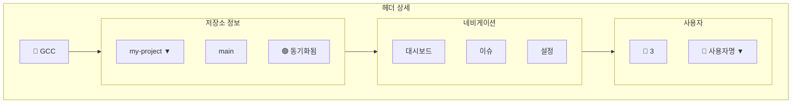

---

## 4. 핵심 컴포넌트 설계

### 4.1 프로젝트 선택 화면 (GitHub 스타일)

> **디자인 원칙**: GitHub 메인 홈과 동일한 UI로 학습 비용 제로

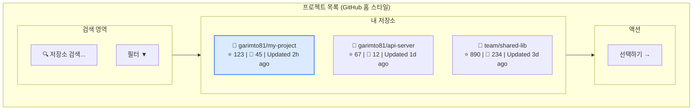

### 4.2 이슈 현황 보드 (2단계 구조)

> **디자인 원칙**: 복잡한 5단계 칸반 대신 **"열림/닫힘"** 2단계로 단순화

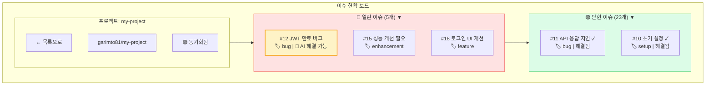

### 4.3 이슈 카드 상세

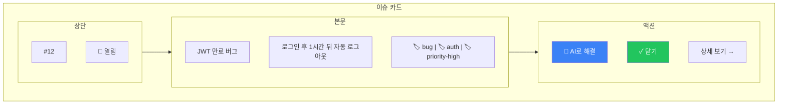

### 4.4 이슈 상세 화면 (좌우 분할)

> **이슈 클릭 시**: 좌측 이슈 정보 + 우측 코드 다이어그램

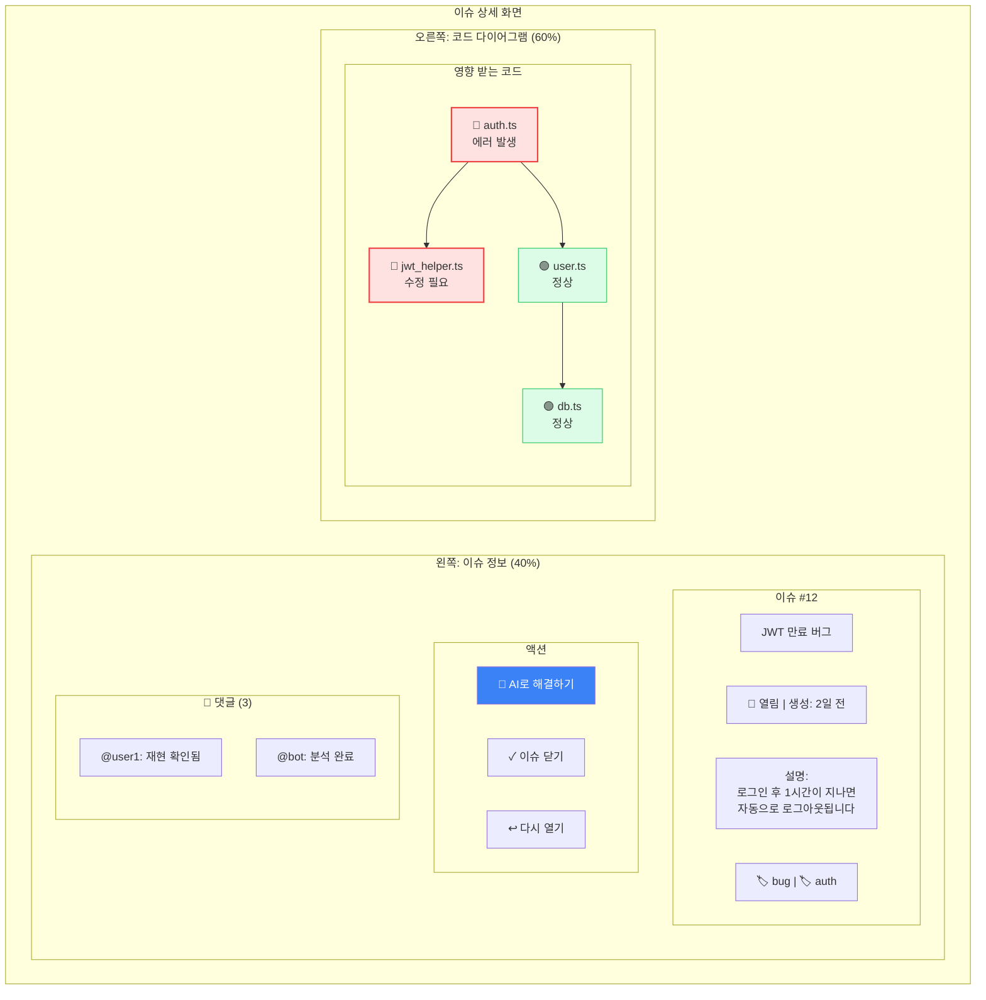

### 4.5 CLI 실시간 진행 표시 (AI 이슈 해결)

> **핵심**: "AI로 해결하기" 클릭 시 실시간으로 진행 과정을 확인

```mermaid
flowchart TB
    subgraph CLI_PROGRESS["🔴 LIVE - AI 이슈 해결 중"]
        subgraph PROGRESS_HEADER["상태"]
            ISSUE_TAG["이슈 #12 해결 중"]
            ELAPSED["⏱️ 경과: 00:45"]
        end

        subgraph PHASES["진행 단계"]
            PHASE1["✅ Phase 1: 분석 완료<br/>영향 파일 3개 확인"]
            PHASE2["✅ Phase 2: 계획 수립<br/>수정 계획 3단계"]
            PHASE3["🔄 Phase 3: 코드 수정 중<br/>━━━━━━━━░░░░ 60%"]
            PHASE4["⏳ Phase 4: 테스트 대기"]
            PHASE5["⏳ Phase 5: PR 생성 대기"]
        end

        subgraph LOG_OUTPUT["실시간 로그"]
            LOG1["> auth.ts:45 수정 중..."]
            LOG2["> JWT 만료 시간 변경"]
            LOG3["> 3600 → 7200"]
        end

        subgraph ACTIONS["액션"]
            PAUSE_BTN["⏸️ 일시정지"]
            CANCEL_BTN["❌ 취소"]
        end
    end

    PROGRESS_HEADER --> PHASES
    PHASES --> LOG_OUTPUT
    LOG_OUTPUT --> ACTIONS

    style PHASE1 fill:#dcfce7
    style PHASE2 fill:#dcfce7
    style PHASE3 fill:#fef3c7,stroke:#f59e0b,stroke-width:2px
    style PHASE4 fill:#e5e7eb
    style PHASE5 fill:#e5e7eb
    style CLI_PROGRESS fill:#0f172a,color:#fff
```

### 4.6 CLI 진행 완료 및 승인

```mermaid
flowchart TB
    subgraph APPROVAL_SCREEN["🔔 AI 작업 완료 - 승인 요청"]
        subgraph RESULT_SUMMARY["결과 요약"]
            RESULT_TITLE["이슈 #12 해결 완료"]
            RESULT_TIME["⏱️ 소요 시간: 2분 15초"]
        end

        subgraph CHANGES["변경 사항"]
            CHANGE1["📄 auth.ts (+15줄, -3줄)"]
            CHANGE2["📄 jwt_helper.ts (+8줄, -2줄)"]
            CHANGE3["📄 auth.test.ts (+45줄, 신규)"]
        end

        subgraph DIFF_PREVIEW["코드 변경 미리보기"]
            DIFF_OLD["- const expiry = 3600"]
            DIFF_NEW["+ const expiry = 7200"]
        end

        subgraph APPROVAL_ACTIONS["승인"]
            BTN_APPROVE["✅ 승인 (PR 생성)"]
            BTN_EDIT["✏️ 수정 요청"]
            BTN_REJECT["❌ 거부 (롤백)"]
        end
    end

    RESULT_SUMMARY --> CHANGES
    CHANGES --> DIFF_PREVIEW
    DIFF_PREVIEW --> APPROVAL_ACTIONS

    style BTN_APPROVE fill:#22c55e,color:#fff
    style BTN_REJECT fill:#ef4444,color:#fff
    style DIFF_OLD fill:#fee2e2
    style DIFF_NEW fill:#dcfce7
```

### 4.7 코드 다이어그램 (의존성 그래프)

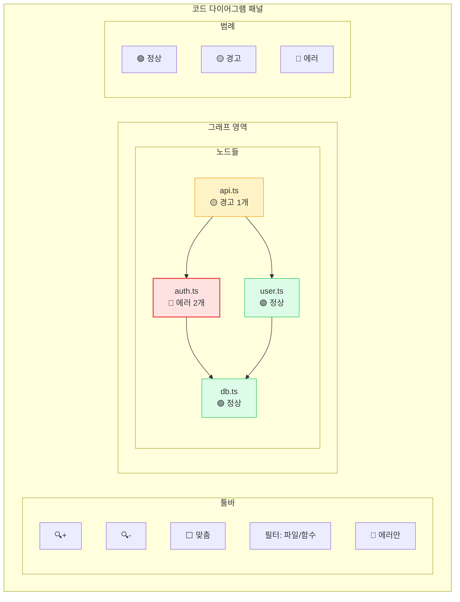

### 4.4 웹 터미널

```mermaid
flowchart TB
    subgraph TERMINAL["웹 터미널"]
        subgraph TERM_HEADER["터미널 헤더"]
            TERM_TITLE[AI 터미널]
            MODEL_SELECT[모델: Claude Opus 4.5 ▼]
            CLEAR_BTN[🗑️ 지우기]
            EXPAND_BTN[⬆️ 확장]
        end

        subgraph TERM_OUTPUT["출력 영역 (스크롤)"]
            OUT1[> @claude JWT 만료 버그 수정해줘]
            OUT2[🤖 코드 분석 중...]
            OUT3[📋 수정 계획:<br/>1. auth.ts 수정<br/>2. 테스트 추가]
            OUT4[⏳ 승인 대기 중...]
        end

        subgraph TERM_INPUT["입력 영역"]
            INPUT_FIELD[명령어 입력... (@model 태그 지원)]
            SEND_BTN[전송 ➤]
        end
    end

    TERM_HEADER --> TERM_OUTPUT --> TERM_INPUT

    style OUT4 fill:#fef3c7,stroke:#f59e0b
```

### 4.5 승인 모달

```mermaid
flowchart TB
    subgraph APPROVAL_MODAL["승인 모달"]
        subgraph MODAL_HEADER["헤더"]
            MODAL_ICON[🔔]
            MODAL_TITLE[AI 작업 승인 요청]
            MODAL_PHASE[Phase 2: 코드 리뷰]
        end

        subgraph MODAL_CONTENT["내용"]
            subgraph SUMMARY["요약"]
                SUMMARY_TEXT[auth.ts 파일에서<br/>JWT 만료 로직을 수정했습니다]
            end

            subgraph DIFF["변경 사항 (Diff)"]
                DIFF_OLD[- const expiry = 3600]
                DIFF_NEW[+ const expiry = 7200]
            end

            subgraph FILES["변경 파일"]
                FILE1[📄 src/auth.ts (+15, -3)]
                FILE2[📄 tests/auth.test.ts (+45)]
            end
        end

        subgraph MODAL_ACTIONS["액션 버튼"]
            BTN_APPROVE[✅ 승인]
            BTN_EDIT[✏️ 수정 요청]
            BTN_REJECT[❌ 거부]
        end
    end

    MODAL_HEADER --> MODAL_CONTENT --> MODAL_ACTIONS

    style DIFF_OLD fill:#fee2e2,color:#991b1b
    style DIFF_NEW fill:#dcfce7,color:#166534
    style BTN_APPROVE fill:#22c55e,color:#fff
    style BTN_REJECT fill:#ef4444,color:#fff
```

---

## 5. 사용자 워크플로우

### 5.1 첫 사용자 온보딩 플로우

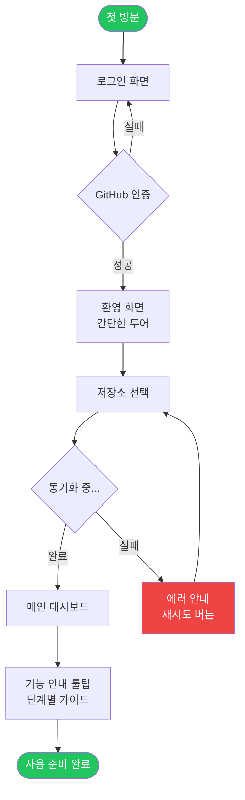

### 5.2 AI 이슈 해결 플로우 (새 디자인)

> **핵심**: 이슈 선택 → "AI로 해결하기" 클릭 → 실시간 진행 확인 → 승인

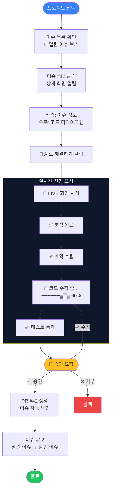

### 5.3 이슈 관리 워크플로우 (2단계 구조)

> **디자인 원칙**: 복잡한 5단계 대신 **열린 이슈 / 닫힌 이슈** 2단계

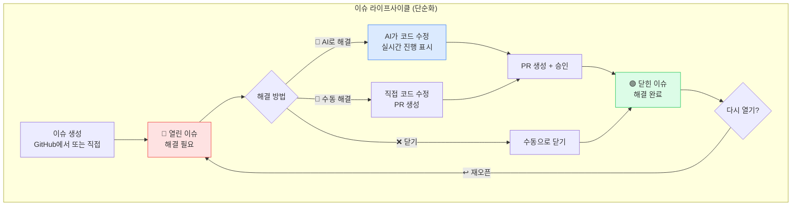

### 5.4 전체 사용자 여정 (End-to-End)

```mermaid
flowchart TB
    subgraph JOURNEY["전체 사용자 여정"]
        J1[🔐 GitHub 로그인]
        J2[📁 프로젝트 선택<br/>검색 + 필터]
        J3[📋 이슈 목록 확인<br/>열린 이슈 / 닫힌 이슈]
        J4[👆 이슈 클릭<br/>상세 + 다이어그램]
        J5[🤖 "AI로 해결" 클릭]
        J6[🔴 실시간 진행 확인<br/>분석 → 수정 → 테스트]
        J7[✅ 승인<br/>PR 생성]
        J8[🟢 이슈 닫힘<br/>완료]
    end

    J1 --> J2 --> J3 --> J4 --> J5 --> J6 --> J7 --> J8

    style J1 fill:#e5e7eb
    style J5 fill:#3b82f6,color:#fff
    style J6 fill:#0f172a,color:#fff
    style J8 fill:#22c55e,color:#fff
```

### 5.5 에러 추적 워크플로우

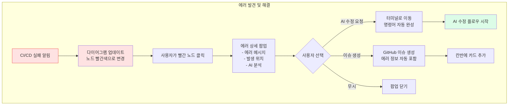

---

## 6. 상태별 UI 변화

### 6.1 터미널 상태 표시

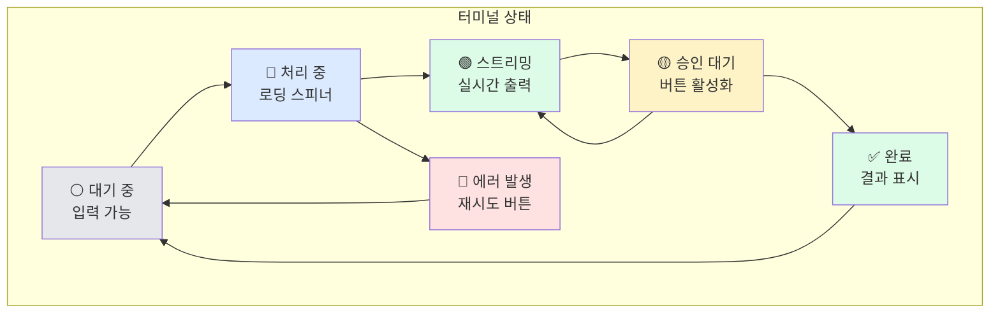

### 6.2 이슈 카드 상태 표시

```mermaid
flowchart TB
    subgraph CARD_STATES["카드 상태별 스타일"]
        subgraph NORMAL["기본 상태"]
            CARD_NORMAL[이슈 #1<br/>일반 작업<br/>흰색 배경]
        end

        subgraph AI_WORKING["AI 작업 중"]
            CARD_AI[이슈 #2<br/>🤖 AI 작업 중<br/>노란색 테두리<br/>펄스 애니메이션]
        end

        subgraph BLOCKED["차단됨"]
            CARD_BLOCKED[이슈 #3<br/>⛔ 차단됨<br/>빨간색 테두리]
        end

        subgraph HAS_PR["PR 있음"]
            CARD_PR[이슈 #4<br/>✅ PR #42<br/>파란색 배지]
        end
    end

    style CARD_NORMAL fill:#ffffff,stroke:#e5e7eb
    style CARD_AI fill:#fef3c7,stroke:#f59e0b,stroke-width:2px
    style CARD_BLOCKED fill:#fee2e2,stroke:#ef4444,stroke-width:2px
    style CARD_PR fill:#dbeafe,stroke:#3b82f6
```

### 6.3 노드 상태 표시 (코드 다이어그램)

```mermaid
flowchart TB
    subgraph NODE_STATES["노드 상태"]
        subgraph HEALTHY["정상"]
            NODE_OK[파일명.ts<br/>🟢<br/>녹색 테두리]
        end

        subgraph WARNING["경고"]
            NODE_WARN[파일명.ts<br/>🟡<br/>노란색 테두리<br/>경고 1개]
        end

        subgraph ERROR["에러"]
            NODE_ERR[파일명.ts<br/>🔴<br/>빨간색 테두리<br/>펄스 애니메이션]
        end

        subgraph SELECTED["선택됨"]
            NODE_SEL[파일명.ts<br/>🔵<br/>파란색 강조<br/>굵은 테두리]
        end

        subgraph UPDATING["업데이트 중"]
            NODE_UPD[파일명.ts<br/>⚪<br/>점멸 애니메이션]
        end
    end

    style NODE_OK fill:#dcfce7,stroke:#22c55e,stroke-width:2px
    style NODE_WARN fill:#fef3c7,stroke:#f59e0b,stroke-width:2px
    style NODE_ERR fill:#fee2e2,stroke:#ef4444,stroke-width:3px
    style NODE_SEL fill:#dbeafe,stroke:#3b82f6,stroke-width:3px
    style NODE_UPD fill:#f3f4f6,stroke:#9ca3af,stroke-dasharray:5
```

---

## 7. 인터랙션 패턴

### 7.1 드래그 앤 드롭 (칸반)

```mermaid
sequenceDiagram
    participant U as 사용자
    participant K as 칸반 보드
    participant S as 서버
    participant G as GitHub

    U->>K: 카드 드래그 시작
    K->>K: 드래그 미리보기 표시
    U->>K: 다른 컬럼에 드롭
    K->>K: 낙관적 UI 업데이트
    K->>S: 상태 변경 요청
    S->>G: GitHub 라벨 업데이트
    G-->>S: 성공 응답
    S-->>K: 확인 응답
    K->>K: UI 확정

    Note over K: 실패 시 롤백 + 토스트 알림
```

### 7.2 노드 클릭 인터랙션

```mermaid
sequenceDiagram
    participant U as 사용자
    participant D as 다이어그램
    participant P as 상세 패널
    participant T as 터미널

    U->>D: 노드 클릭
    D->>D: 노드 하이라이트
    D->>P: 파일 정보 전달
    P->>P: 파일 내용 표시

    alt 에러 노드인 경우
        P->>P: 에러 상세 표시
        P->>P: "AI 수정" 버튼 표시
        U->>P: "AI 수정" 클릭
        P->>T: 명령어 자동 완성
        T->>T: 포커스 이동
    end
```

### 7.3 실시간 스트리밍

```mermaid
sequenceDiagram
    participant U as 사용자
    participant T as 터미널
    participant S as 서버 (SSE)
    participant A as AI 에이전트

    U->>T: 명령 입력
    T->>S: POST /agent/command
    S->>A: 에이전트 실행
    S-->>T: 세션 ID 반환
    T->>S: GET /agent/stream (SSE 연결)

    loop 스트리밍
        A->>S: 출력 생성
        S-->>T: SSE 이벤트
        T->>T: 텍스트 렌더링
    end

    A->>S: 승인 필요
    S-->>T: 승인 이벤트
    T->>T: 승인 모달 표시
    U->>T: 승인 클릭
    T->>S: POST /agent/approve
    S->>A: 승인 전달
    A->>S: 계속 실행
```

---

## 8. 알림 및 피드백 시스템

### 8.1 알림 유형

```mermaid
flowchart TB
    subgraph NOTIFICATIONS["알림 시스템"]
        subgraph TOAST["토스트 메시지 (일시적)"]
            TOAST_SUCCESS[✅ 성공<br/>녹색, 3초 후 사라짐]
            TOAST_ERROR[❌ 에러<br/>빨간색, 수동 닫기]
            TOAST_INFO[ℹ️ 정보<br/>파란색, 5초 후 사라짐]
        end

        subgraph MODAL["모달 (즉시 응답 필요)"]
            MODAL_APPROVE[🔔 승인 요청<br/>버튼 클릭 필수]
            MODAL_CONFIRM[⚠️ 확인<br/>예/아니오]
            MODAL_ERROR[🚨 심각한 에러<br/>상세 정보 + 액션]
        end

        subgraph BADGE["배지 (지속적)"]
            BADGE_COUNT[🔔 3<br/>읽지 않은 알림]
            BADGE_STATUS[🟢 동기화됨<br/>상태 표시]
        end
    end

    style TOAST_SUCCESS fill:#dcfce7
    style TOAST_ERROR fill:#fee2e2
    style TOAST_INFO fill:#dbeafe
    style MODAL_APPROVE fill:#fef3c7
```

### 8.2 로딩 상태 표시

```mermaid
flowchart TB
    subgraph LOADING_TYPES["로딩 표시 유형"]
        SPINNER[스피너<br/>짧은 작업]
        PROGRESS[진행 바<br/>예상 시간 있음]
        SKELETON[스켈레톤<br/>콘텐츠 로딩]
        PULSE[펄스<br/>백그라운드 작업]
    end

    SPINNER --> |"< 3초"| SHORT[짧은 API 호출]
    PROGRESS --> |"3-30초"| MEDIUM[파일 동기화]
    SKELETON --> |"초기 로딩"| INITIAL[페이지 로드]
    PULSE --> |"비동기"| ASYNC[AI 작업 중]
```

---

## 9. 다크 모드 지원

### 9.1 색상 팔레트 비교

```mermaid
flowchart TB
    subgraph LIGHT["라이트 모드"]
        L_BG[배경: #ffffff]
        L_TEXT[텍스트: #1f2937]
        L_BORDER[테두리: #e5e7eb]
        L_PRIMARY[강조: #3b82f6]
    end

    subgraph DARK["다크 모드"]
        D_BG[배경: #0f172a]
        D_TEXT[텍스트: #f1f5f9]
        D_BORDER[테두리: #334155]
        D_PRIMARY[강조: #60a5fa]
    end

    style L_BG fill:#ffffff,color:#000
    style L_TEXT fill:#1f2937,color:#fff
    style D_BG fill:#0f172a,color:#fff
    style D_TEXT fill:#f1f5f9,color:#000
```

---

## 10. 접근성 (Accessibility)

### 10.1 키보드 네비게이션

| 키 | 동작 |
|---|------|
| `Tab` | 다음 요소로 이동 |
| `Shift + Tab` | 이전 요소로 이동 |
| `Enter` | 선택/실행 |
| `Escape` | 모달 닫기 / 취소 |
| `Arrow Keys` | 칸반 카드 이동 |
| `Ctrl + /` | 터미널 포커스 |
| `Ctrl + K` | 명령 팔레트 열기 |

### 10.2 스크린 리더 지원

```mermaid
flowchart TB
    subgraph ARIA["ARIA 레이블"]
        LABEL1[aria-label<br/>버튼 설명]
        LABEL2[aria-live<br/>실시간 업데이트]
        LABEL3[aria-expanded<br/>확장 상태]
        LABEL4[role<br/>역할 정의]
    end
```

---

## 11. 성능 최적화 가이드라인

### 11.1 렌더링 최적화

```mermaid
flowchart TB
    subgraph PERFORMANCE["성능 최적화"]
        subgraph LAZY["지연 로딩"]
            LAZY1[코드 분할<br/>라우트별]
            LAZY2[이미지 지연 로딩]
            LAZY3[무한 스크롤]
        end

        subgraph CACHE["캐싱"]
            CACHE1[API 응답 캐시<br/>React Query]
            CACHE2[다이어그램 캐시]
            CACHE3[로컬 스토리지]
        end

        subgraph VIRTUAL["가상화"]
            VIRTUAL1[칸반 카드 가상화<br/>100개+ 대응]
            VIRTUAL2[터미널 버퍼 제한<br/>최대 10,000줄]
        end
    end
```

---

## 12. 에러 화면

### 12.1 에러 페이지 유형

```mermaid
flowchart TB
    subgraph ERROR_PAGES["에러 페이지"]
        subgraph E404["404 Not Found"]
            E404_ICON[🔍]
            E404_MSG[페이지를 찾을 수 없습니다]
            E404_BTN[홈으로 돌아가기]
        end

        subgraph E500["500 Server Error"]
            E500_ICON[⚠️]
            E500_MSG[서버 오류가 발생했습니다]
            E500_BTN[다시 시도 / 문의하기]
        end

        subgraph OFFLINE["오프라인"]
            OFF_ICON[📡]
            OFF_MSG[인터넷 연결을 확인해주세요]
            OFF_BTN[다시 연결]
        end

        subgraph AUTH_ERROR["인증 만료"]
            AUTH_ICON[🔒]
            AUTH_MSG[세션이 만료되었습니다]
            AUTH_BTN[다시 로그인]
        end
    end

    style E404 fill:#fef3c7
    style E500 fill:#fee2e2
    style OFFLINE fill:#e5e7eb
    style AUTH_ERROR fill:#dbeafe
```

---

## 13. References

### 관련 문서

| 문서 | 설명 |
|------|------|
| `0002-prd-gitcommand-center-v2.md` | 제품 요구사항 정의서 |
| `prd_v02.md` | 프랑켄슈타인 전략 원본 |

### 디자인 참조

| 참조 | 용도 |
|------|------|
| Tailwind CSS | 색상 팔레트, 간격 |
| Shadcn UI | 컴포넌트 스타일 |
| OpenHands UI | 터미널 레이아웃 참조 |
| Linear | 칸반 보드 UX 참조 |
| GitHub | 이슈 카드 디자인 참조 |

---

**Next Steps**:
1. Figma/Penpot으로 실제 UI 목업 제작
2. 컴포넌트 라이브러리 선정 (Shadcn UI 권장)
3. 프로토타입 개발 시작
