# GitCommand Center: TDD 테스트 계획서

**Version**: 1.2
**Date**: 2025-12-14
**Status**: Draft
**Related**: 0002-prd-gitcommand-center-v2.md, 0003-ui-design-workflow.md

---

## 문서 작성 지침

> **Mermaid 다이어그램 규칙**: 모든 워크플로우는 **세로 방향(TB: Top to Bottom)**으로 작성합니다.
>
> ```
> ✅ 권장: flowchart TB (세로)
> ❌ 금지: flowchart LR (가로)
> ```

---

## 1. 테스트 전략 개요

### 1.1 TDD 원칙

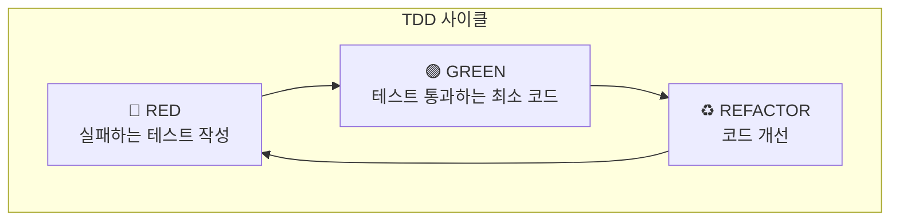

### 1.2 테스트 범위

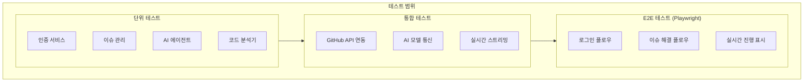

---

## 2. 핵심 기능별 테스트 목록

### 2.1 인증 (Authentication)

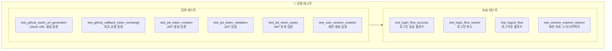

| 테스트 ID | 테스트명 | 유형 | 우선순위 |
|-----------|----------|------|----------|
| AUTH-U01 | `test_github_oauth_url_generation` | 단위 | P0 |
| AUTH-U02 | `test_github_callback_token_exchange` | 단위 | P0 |
| AUTH-U03 | `test_jwt_token_creation` | 단위 | P0 |
| AUTH-U04 | `test_jwt_token_validation` | 단위 | P0 |
| AUTH-U05 | `test_jwt_token_expiry` | 단위 | P1 |
| AUTH-U06 | `test_user_session_creation` | 단위 | P1 |
| AUTH-E01 | `test_login_flow_success` | E2E | P0 |
| AUTH-E02 | `test_login_flow_cancel` | E2E | P1 |
| AUTH-E03 | `test_logout_flow` | E2E | P1 |
| AUTH-E04 | `test_session_expired_redirect` | E2E | P1 |

---

### 2.2 프로젝트 관리 (Repository)

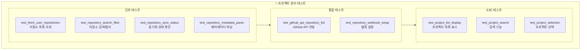

| 테스트 ID | 테스트명 | 유형 | 우선순위 |
|-----------|----------|------|----------|
| REPO-U01 | `test_fetch_user_repositories` | 단위 | P0 |
| REPO-U02 | `test_repository_search_filter` | 단위 | P0 |
| REPO-U03 | `test_repository_sync_status` | 단위 | P1 |
| REPO-U04 | `test_repository_metadata_parse` | 단위 | P1 |
| REPO-I01 | `test_github_api_repository_list` | 통합 | P0 |
| REPO-I02 | `test_repository_webhook_setup` | 통합 | P1 |
| REPO-E01 | `test_project_list_display` | E2E | P0 |
| REPO-E02 | `test_project_search` | E2E | P0 |
| REPO-E03 | `test_project_selection` | E2E | P0 |

---

### 2.3 이슈 관리 (Issue Management)

```mermaid
flowchart TB
    subgraph ISSUE_TESTS["📋 이슈 관리 테스트"]
        subgraph ISSUE_UNIT["단위 테스트"]
            IU1["test_fetch_open_issues<br/>열린 이슈 조회"]
            IU2["test_fetch_closed_issues<br/>닫힌 이슈 조회"]
            IU3["test_issue_close<br/>이슈 닫기"]
            IU4["test_issue_reopen<br/>이슈 다시 열기"]
            IU5["test_issue_label_parse<br/>라벨 파싱"]
            IU6["test_issue_priority_sort<br/>우선순위 정렬"]
        end

        subgraph ISSUE_INTEG["통합 테스트"]
            II1["test_github_issue_api<br/>GitHub Issue API"]
            II2["test_issue_state_sync<br/>상태 동기화"]
        end

        subgraph ISSUE_E2E["E2E 테스트"]
            IE1["test_open_issues_accordion<br/>열린 이슈 아코디언"]
            IE2["test_closed_issues_accordion<br/>닫힌 이슈 아코디언"]
            IE3["test_issue_click_detail_view<br/>이슈 클릭 → 상세 화면"]
            IE4["test_issue_close_button<br/>이슈 닫기 버튼"]
            IE5["test_issue_reopen_button<br/>이슈 다시 열기 버튼"]
        end
    end

    ISSUE_UNIT --> ISSUE_INTEG --> ISSUE_E2E
```

| 테스트 ID | 테스트명 | 유형 | 우선순위 |
|-----------|----------|------|----------|
| ISSUE-U01 | `test_fetch_open_issues` | 단위 | P0 |
| ISSUE-U02 | `test_fetch_closed_issues` | 단위 | P0 |
| ISSUE-U03 | `test_issue_close` | 단위 | P0 |
| ISSUE-U04 | `test_issue_reopen` | 단위 | P0 |
| ISSUE-U05 | `test_issue_label_parse` | 단위 | P1 |
| ISSUE-U06 | `test_issue_priority_sort` | 단위 | P1 |
| ISSUE-I01 | `test_github_issue_api` | 통합 | P0 |
| ISSUE-I02 | `test_issue_state_sync` | 통합 | P1 |
| ISSUE-E01 | `test_open_issues_accordion` | E2E | P0 |
| ISSUE-E02 | `test_closed_issues_accordion` | E2E | P0 |
| ISSUE-E03 | `test_issue_click_detail_view` | E2E | P0 |
| ISSUE-E04 | `test_issue_close_button` | E2E | P0 |
| ISSUE-E05 | `test_issue_reopen_button` | E2E | P0 |

---

### 2.4 AI 이슈 해결 (AI Issue Resolution)

```mermaid
flowchart TB
    subgraph AI_TESTS["🤖 AI 이슈 해결 테스트"]
        subgraph AI_UNIT["단위 테스트"]
            AIU1["test_ai_analyze_issue<br/>이슈 분석"]
            AIU2["test_ai_generate_plan<br/>계획 생성"]
            AIU3["test_ai_code_modification<br/>코드 수정"]
            AIU4["test_ai_test_generation<br/>테스트 생성"]
            AIU5["test_ai_pr_creation<br/>PR 생성"]
        end

        subgraph AI_INTEG["통합 테스트"]
            AII1["test_aider_subprocess_execution<br/>Aider 실행"]
            AII2["test_ai_model_api_call<br/>AI 모델 API 호출"]
            AII3["test_langgraph_workflow<br/>LangGraph 워크플로우"]
        end

        subgraph AI_E2E["E2E 테스트"]
            AIE1["test_ai_resolve_button_click<br/>'AI로 해결' 버튼 클릭"]
            AIE2["test_ai_progress_display<br/>실시간 진행 표시"]
            AIE3["test_ai_approval_flow<br/>승인 플로우"]
            AIE4["test_ai_rollback<br/>롤백 기능"]
        end
    end

    AI_UNIT --> AI_INTEG --> AI_E2E
```

| 테스트 ID | 테스트명 | 유형 | 우선순위 |
|-----------|----------|------|----------|
| AI-U01 | `test_ai_analyze_issue` | 단위 | P0 |
| AI-U02 | `test_ai_generate_plan` | 단위 | P0 |
| AI-U03 | `test_ai_code_modification` | 단위 | P0 |
| AI-U04 | `test_ai_test_generation` | 단위 | P1 |
| AI-U05 | `test_ai_pr_creation` | 단위 | P0 |
| AI-I01 | `test_aider_subprocess_execution` | 통합 | P0 |
| AI-I02 | `test_ai_model_api_call` | 통합 | P0 |
| AI-I03 | `test_langgraph_workflow` | 통합 | P0 |
| AI-E01 | `test_ai_resolve_button_click` | E2E | P0 |
| AI-E02 | `test_ai_progress_display` | E2E | P0 |
| AI-E03 | `test_ai_approval_flow` | E2E | P0 |
| AI-E04 | `test_ai_rollback` | E2E | P1 |

---

### 2.5 AI CLI 연동 (AI CLI Integration)

> **구독 기반 AI CLI**: Claude Opus 4.5, GPT 5.2 Codex, Gemini 3.0, Qwen CLI

```mermaid
flowchart TB
    subgraph CLI_TESTS["🖥️ AI CLI 연동 테스트"]
        subgraph CLI_UNIT["단위 테스트"]
            CLIU1["test_claude_cli_available<br/>Claude CLI 설치 확인"]
            CLIU2["test_gpt_codex_cli_available<br/>GPT Codex CLI 설치 확인"]
            CLIU3["test_gemini_cli_available<br/>Gemini CLI 설치 확인"]
            CLIU4["test_qwen_cli_available<br/>Qwen CLI 설치 확인"]
            CLIU5["test_cli_command_parse<br/>CLI 명령어 파싱"]
            CLIU6["test_cli_output_parse<br/>CLI 출력 파싱"]
        end

        subgraph CLI_INTEG["통합 테스트"]
            CLII1["test_claude_cli_code_generation<br/>Claude CLI 코드 생성"]
            CLII2["test_gpt_codex_cli_code_generation<br/>GPT Codex CLI 코드 생성"]
            CLII3["test_gemini_cli_code_generation<br/>Gemini CLI 코드 생성"]
            CLII4["test_qwen_cli_code_generation<br/>Qwen CLI 코드 생성"]
            CLII5["test_cli_streaming_output<br/>CLI 스트리밍 출력"]
            CLII6["test_cli_error_handling<br/>CLI 에러 처리"]
            CLII7["test_cli_timeout_handling<br/>CLI 타임아웃 처리"]
        end

        subgraph CLI_E2E["E2E 테스트"]
            CLIE1["test_model_selection_dropdown<br/>모델 선택 드롭다운"]
            CLIE2["test_claude_issue_resolution<br/>Claude로 이슈 해결"]
            CLIE3["test_gpt_issue_resolution<br/>GPT로 이슈 해결"]
            CLIE4["test_gemini_issue_resolution<br/>Gemini로 이슈 해결"]
            CLIE5["test_model_fallback<br/>모델 폴백 (실패 시 대체)"]
        end
    end

    CLI_UNIT --> CLI_INTEG --> CLI_E2E
```

#### CLI 명령어 형식

| AI 모델 | CLI 명령어 | 용도 |
|---------|-----------|------|
| **Claude Opus 4.5** | `claude code` | 코드 생성, 분석, 수정 |
| **GPT 5.2 Codex** | `codex` | 코드 생성, 자동완성 |
| **Gemini 3.0** | `gemini` | 코드 분석, 리뷰 |
| **Qwen CLI** | `qwen` | 로컬/클라우드 코드 생성 |

#### 테스트 케이스 상세

| 테스트 ID | 테스트명 | 유형 | 우선순위 |
|-----------|----------|------|----------|
| CLI-U01 | `test_claude_cli_available` | 단위 | P0 |
| CLI-U02 | `test_gpt_codex_cli_available` | 단위 | P0 |
| CLI-U03 | `test_gemini_cli_available` | 단위 | P0 |
| CLI-U04 | `test_qwen_cli_available` | 단위 | P1 |
| CLI-U05 | `test_cli_command_parse` | 단위 | P0 |
| CLI-U06 | `test_cli_output_parse` | 단위 | P0 |
| CLI-I01 | `test_claude_cli_code_generation` | 통합 | P0 |
| CLI-I02 | `test_gpt_codex_cli_code_generation` | 통합 | P0 |
| CLI-I03 | `test_gemini_cli_code_generation` | 통합 | P0 |
| CLI-I04 | `test_qwen_cli_code_generation` | 통합 | P1 |
| CLI-I05 | `test_cli_streaming_output` | 통합 | P0 |
| CLI-I06 | `test_cli_error_handling` | 통합 | P0 |
| CLI-I07 | `test_cli_timeout_handling` | 통합 | P1 |
| CLI-E01 | `test_model_selection_dropdown` | E2E | P0 |
| CLI-E02 | `test_claude_issue_resolution` | E2E | P0 |
| CLI-E03 | `test_gpt_issue_resolution` | E2E | P0 |
| CLI-E04 | `test_gemini_issue_resolution` | E2E | P0 |
| CLI-E05 | `test_model_fallback` | E2E | P1 |

#### CLI 실행 검증 흐름

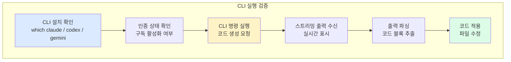

#### 모델별 테스트 시나리오

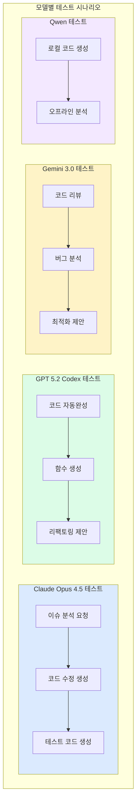

---

### 2.6 실시간 진행 표시 (Real-time Progress)

```mermaid
flowchart TB
    subgraph REALTIME_TESTS["🔴 실시간 진행 표시 테스트"]
        subgraph RT_UNIT["단위 테스트"]
            RTU1["test_sse_event_generation<br/>SSE 이벤트 생성"]
            RTU2["test_progress_phase_update<br/>단계 업데이트"]
            RTU3["test_progress_percentage_calc<br/>진행률 계산"]
            RTU4["test_log_message_format<br/>로그 메시지 포맷"]
        end

        subgraph RT_INTEG["통합 테스트"]
            RTI1["test_sse_connection<br/>SSE 연결"]
            RTI2["test_sse_streaming<br/>SSE 스트리밍"]
            RTI3["test_sse_reconnection<br/>SSE 재연결"]
        end

        subgraph RT_E2E["E2E 테스트"]
            RTE1["test_live_indicator_display<br/>🔴 LIVE 표시"]
            RTE2["test_progress_bar_animation<br/>진행 바 애니메이션"]
            RTE3["test_phase_checklist_update<br/>단계 체크리스트 업데이트"]
            RTE4["test_realtime_log_scroll<br/>실시간 로그 스크롤"]
            RTE5["test_pause_resume_buttons<br/>일시정지/재개 버튼"]
        end
    end

    RT_UNIT --> RT_INTEG --> RT_E2E
```

| 테스트 ID | 테스트명 | 유형 | 우선순위 |
|-----------|----------|------|----------|
| RT-U01 | `test_sse_event_generation` | 단위 | P0 |
| RT-U02 | `test_progress_phase_update` | 단위 | P0 |
| RT-U03 | `test_progress_percentage_calc` | 단위 | P1 |
| RT-U04 | `test_log_message_format` | 단위 | P1 |
| RT-I01 | `test_sse_connection` | 통합 | P0 |
| RT-I02 | `test_sse_streaming` | 통합 | P0 |
| RT-I03 | `test_sse_reconnection` | 통합 | P1 |
| RT-E01 | `test_live_indicator_display` | E2E | P0 |
| RT-E02 | `test_progress_bar_animation` | E2E | P0 |
| RT-E03 | `test_phase_checklist_update` | E2E | P0 |
| RT-E04 | `test_realtime_log_scroll` | E2E | P1 |
| RT-E05 | `test_pause_resume_buttons` | E2E | P1 |

---

### 2.7 코드 다이어그램 (Code Diagram)

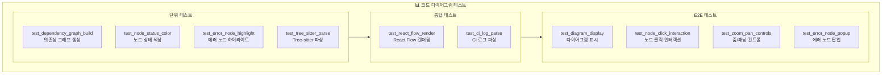

| 테스트 ID | 테스트명 | 유형 | 우선순위 |
|-----------|----------|------|----------|
| DG-U01 | `test_dependency_graph_build` | 단위 | P0 |
| DG-U02 | `test_node_status_color` | 단위 | P0 |
| DG-U03 | `test_error_node_highlight` | 단위 | P0 |
| DG-U04 | `test_tree_sitter_parse` | 단위 | P1 |
| DG-I01 | `test_react_flow_render` | 통합 | P0 |
| DG-I02 | `test_ci_log_parse` | 통합 | P1 |
| DG-E01 | `test_diagram_display` | E2E | P0 |
| DG-E02 | `test_node_click_interaction` | E2E | P0 |
| DG-E03 | `test_zoom_pan_controls` | E2E | P1 |
| DG-E04 | `test_error_node_popup` | E2E | P0 |

---

### 2.8 승인 플로우 (Approval Flow)

```mermaid
flowchart TB
    subgraph APPROVAL_TESTS["✅ 승인 플로우 테스트"]
        subgraph AP_UNIT["단위 테스트"]
            APU1["test_approval_request_create<br/>승인 요청 생성"]
            APU2["test_approval_status_update<br/>승인 상태 업데이트"]
            APU3["test_diff_generation<br/>Diff 생성"]
            APU4["test_rollback_execution<br/>롤백 실행"]
        end

        subgraph AP_INTEG["통합 테스트"]
            API1["test_langgraph_hitl_interrupt<br/>HITL 인터럽트"]
            API2["test_git_branch_creation<br/>Git 브랜치 생성"]
            API3["test_pr_auto_creation<br/>PR 자동 생성"]
        end

        subgraph AP_E2E["E2E 테스트"]
            APE1["test_approval_modal_display<br/>승인 모달 표시"]
            APE2["test_diff_preview_display<br/>Diff 미리보기"]
            APE3["test_approve_button<br/>승인 버튼"]
            APE4["test_reject_button<br/>거부 버튼"]
            APE5["test_edit_request_button<br/>수정 요청 버튼"]
        end
    end

    AP_UNIT --> AP_INTEG --> AP_E2E
```

| 테스트 ID | 테스트명 | 유형 | 우선순위 |
|-----------|----------|------|----------|
| AP-U01 | `test_approval_request_create` | 단위 | P0 |
| AP-U02 | `test_approval_status_update` | 단위 | P0 |
| AP-U03 | `test_diff_generation` | 단위 | P0 |
| AP-U04 | `test_rollback_execution` | 단위 | P0 |
| AP-I01 | `test_langgraph_hitl_interrupt` | 통합 | P0 |
| AP-I02 | `test_git_branch_creation` | 통합 | P0 |
| AP-I03 | `test_pr_auto_creation` | 통합 | P0 |
| AP-E01 | `test_approval_modal_display` | E2E | P0 |
| AP-E02 | `test_diff_preview_display` | E2E | P0 |
| AP-E03 | `test_approve_button` | E2E | P0 |
| AP-E04 | `test_reject_button` | E2E | P0 |
| AP-E05 | `test_edit_request_button` | E2E | P1 |

---

## 3. 테스트 우선순위 요약

### 3.1 P0 (필수) 테스트 - MVP

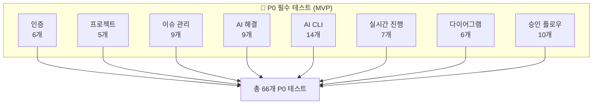

### 3.2 테스트 유형별 분포

| 유형 | P0 | P1 | 합계 |
|------|-----|-----|------|
| 단위 테스트 | 29 | 11 | 40 |
| 통합 테스트 | 17 | 6 | 23 |
| E2E 테스트 | 20 | 9 | 29 |
| **합계** | **66** | **26** | **92** |

---

## 4. TDD 실행 순서

### 4.1 Phase 1: 인증 + 프로젝트 (주 1-2)

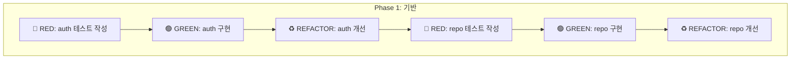

### 4.2 Phase 2: 이슈 관리 (주 3-4)

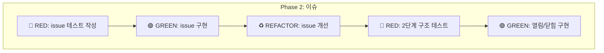

### 4.3 Phase 3: AI 해결 + 실시간 (주 5-7)

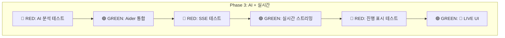

### 4.4 Phase 4: 다이어그램 + 승인 (주 8-9)

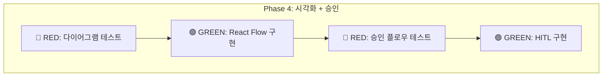

### 4.5 Phase 5: E2E 통합 (주 10)

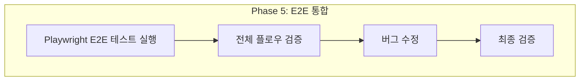

---

## 5. 테스트 파일 구조

```
tests/
├── unit/
│   ├── test_auth.py
│   ├── test_repository.py
│   ├── test_issue.py
│   ├── test_ai_agent.py
│   ├── test_ai_cli.py          # 🆕 AI CLI 단위 테스트
│   ├── test_realtime.py
│   ├── test_diagram.py
│   └── test_approval.py
├── integration/
│   ├── test_github_api.py
│   ├── test_ai_model.py
│   ├── test_ai_cli_integration.py  # 🆕 AI CLI 통합 테스트
│   ├── test_sse_stream.py
│   └── test_langgraph.py
└── e2e/
    ├── test_login.spec.ts
    ├── test_project.spec.ts
    ├── test_issue.spec.ts
    ├── test_ai_resolve.spec.ts
    ├── test_ai_cli.spec.ts     # 🆕 AI CLI E2E 테스트
    ├── test_realtime.spec.ts
    ├── test_diagram.spec.ts
    └── test_approval.spec.ts
```

---

## 6. 성공 기준

| 지표 | 목표 |
|------|------|
| 단위 테스트 커버리지 | > 80% |
| 통합 테스트 커버리지 | > 70% |
| E2E 테스트 통과율 | 100% |
| P0 테스트 통과율 | 100% |

---

## 7. References

- `0002-prd-gitcommand-center-v2.md` - PRD 요구사항
- `0003-ui-design-workflow.md` - UI 설계
- Playwright 문서: https://playwright.dev/
- pytest 문서: https://docs.pytest.org/
