# PRD: DevFlow - 비개발자 AI 협업 개발 플랫폼

**Version**: 6.1
**Date**: 2025-12-15
**Status**: Draft

---

## 🆕 v6.1 변경사항

| 항목 | v6.0 | v6.1 |
|------|------|------|
| **아키텍처** | 3-tier (Vercel + Railway + Supabase) | **2-tier (Vercel + Supabase)** |
| **백엔드** | FastAPI (Railway) | **Next.js API Routes (서버리스)** |
| **인증** | Auth.js | **Supabase Auth** (GitHub OAuth 내장) |
| **비용** | $5/월~ | **$0/월** (무료 티어) |

### v6.0 → v6.1 핵심 변경

```
v6.0 (3-tier)                    v6.1 (2-tier)
─────────────                    ─────────────
Next.js (Vercel)                 Next.js (Vercel)
     │                                │
     ▼                                │ (API Routes = 백엔드)
FastAPI (Railway) ← 제거              │
     │                                ▼
     ▼                           Supabase
Supabase                         (Auth + DB + Storage)
```

---

## Executive Summary

**DevFlow**는 코딩을 전혀 모르는 비개발자가 AI와 협업하여 소프트웨어를 개발하는 플랫폼이다.

### 한 줄 정의

> **"AI가 코딩 100%, 비개발자가 검증 100%"**

### 핵심 문제

| 문제 | 원인 | 결과 |
|------|------|------|
| **순환 오류** | User 지시 → AI 시도 → 실패 → 반복 | 시간/토큰 낭비 |
| **AI 컨텍스트 손실** | 토큰 한도로 이전 내용 망각 | 잘못된 코드 생성 |
| **비개발자의 지옥** | 코드를 모르니 디버깅 불가 | 프로젝트 포기 |

### DevFlow 해결책

| 시스템이 하는 것 | User가 하는 것 |
|-----------------|---------------|
| 이전/현재 출력 비교 표시 | "이거 아까랑 다른데?" 판단 |
| 시도 이력 표시 | "이 정보가 빠진 것 같아" 파악 |
| 코드 → 논리 흐름 변환 | 논리 오류 발견 |
| 중복/불일치 자동 감지 | 해결 방향 지시 |

---

## 투트랙 전략

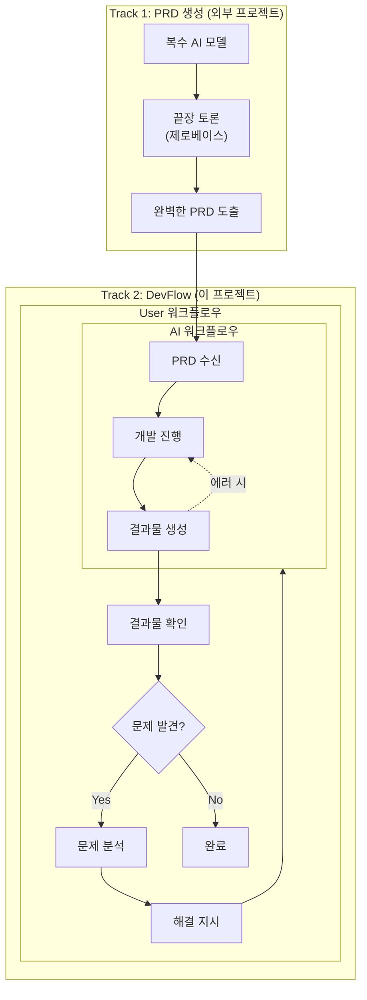

### 역할 분담

| 영역 | Track 1 (외부) | Track 2 (DevFlow) |
|------|----------------|-------------------|
| **입력** | 아이디어, 요구사항 | 완성된 PRD |
| **처리** | 복수 AI 끝장 토론 | AI 개발 + 이슈 관리 |
| **출력** | 완벽한 PRD | 동작하는 앱 |
| **비개발자 역할** | PRD 검토/승인 | 오류 감지 + 해결 지시 |

---

## 핵심 문제: 순환 오류

> **User 지시 → AI 시도 → 실패 → 다시 지시 → 다시 실패... 바이브 코더의 시간/자원 손실 구간**

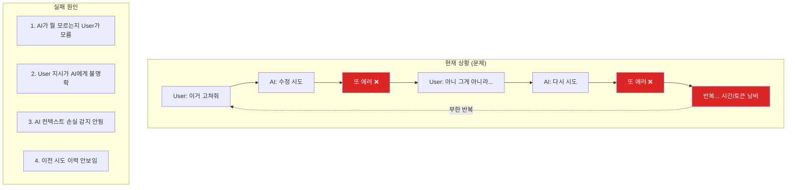

### AI의 숨겨진 문제

> **AI는 자신이 컨텍스트를 잃어버린 것을 모른다.**

| AI의 착각 | 현실 |
|-----------|------|
| "모든 것을 기억합니다" | 토큰 한도로 초반 내용 망각 |
| "문제가 생기면 알려드리겠습니다" | 문제를 인식하지 못함 |
| "이전 요청대로 만들었습니다" | 요청을 잊고 다르게 만듦 |

**AI가 모르는 것:**
- 토큰이 부족한지 모름
- 뭘 잊어버렸는지 모름
- 정보가 오염됐는지 모름
- 자신이 틀렸는지 모름

---

## DevFlow 해결 전략

### 시스템과 User의 역할 분담

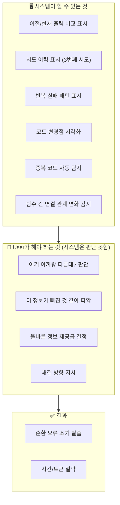

### 비개발자가 AI보다 잘하는 것

| 비개발자 | AI |
|----------|-----|
| 처음 요청을 기억함 | 토큰 한도로 잊음 |
| "이거 아까 다르게 말했는데?" | 모순을 인식 못함 |
| 결과물이 틀린 것을 앎 | 자신있게 틀린 것을 제출 |
| 비즈니스 맥락 이해 | 기술적으로만 해석 |

---

## 핵심 기능

### 1. 코드 → 논리 흐름 변환

**문제**: 비개발자는 코드를 읽을 수 없다
**해결**: 코드를 논리 흐름으로 자동 변환

```
변환 전 (코드 - 이해 불가)          변환 후 (논리 흐름 - 이해 가능)
┌─────────────────────────┐        ┌─────────────────────────┐
│ function deleteProject  │        │                         │
│   (id) {                │   →    │  삭제 버튼 클릭         │
│   const result =        │        │       │                 │
│     api.delete(id);     │        │       ▼                 │
│   refreshList();        │        │  서버에 삭제 요청       │
│ }                       │        │       │                 │
│                         │        │       ▼                 │
│                         │        │  목록 새로고침          │
└─────────────────────────┘        └─────────────────────────┘
```

#### 코드 구조 다이어그램

비개발자가 코드 구조를 직관적으로 파악할 수 있도록 시각화:

```
┌────────────────────────────────────────────────────────────┐
│  코드 구조 다이어그램                                        │
├────────────────────────────────────────────────────────────┤
│                                                            │
│  ┌──────────┐  ┌──────────┐  ┌──────────┐  ┌──────────┐   │
│  │ main.py  │  │  auth/   │  │  cli/    │  │ ai_agent/│   │
│  │  (회색)  │  │  (빨강)  │  │  (회색)  │  │  (회색)  │   │
│  └──────────┘  └──────────┘  └──────────┘  └──────────┘   │
│                   ⚠️ 에러                                   │
│  ┌──────────┐  ┌──────────┐  ┌──────────┐  ┌──────────┐   │
│  │  issue/  │  │ approval/│  │ realtime/│  │ diagram/ │   │
│  │  (회색)  │  │  (회색)  │  │  (회색)  │  │  (회색)  │   │
│  └──────────┘  └──────────┘  └──────────┘  └──────────┘   │
│                                                            │
│  범례: ■ 회색 = 정상  ■ 빨강 = 에러                        │
└────────────────────────────────────────────────────────────┘
```

**설계 원칙**:

| 원칙 | 구현 |
|------|------|
| **단일 색상** | 모든 정상 모듈은 회색(#64748b) |
| **에러 강조** | 버그 관련 모듈만 빨간색(#dc2626) |
| **연결선 제거** | 복잡한 호출 관계 숨김 → 직관성 향상 |
| **그리드 레이아웃** | 모듈을 격자형으로 배치 |

**에러 표시 조건**:
- 이슈 라벨에 `bug` 포함
- 이슈 제목에 해당 모듈명 포함
- 조건 충족 시 해당 박스만 빨간색 + "⚠️ 에러" 표시

#### 1.1 상세 설계: 코드 로직 시각화

##### API 설계

```
POST /api/logic-flow/generate
```

**Request:**
```json
{
  "repo": "owner/repo-name",
  "path": "src/auth/login.ts",      // 특정 파일 (선택)
  "scope": "file" | "function" | "module",
  "function_name": "handleLogin",   // scope=function일 때
  "issue_number": 42                // 관련 이슈 (에러 하이라이트용)
}
```

**Response:**
```json
{
  "diagram_type": "flowchart",
  "mermaid_code": "flowchart TB\n  A[버튼 클릭] --> B[서버 요청]...",
  "nodes": [
    {
      "id": "A",
      "label": "로그인 버튼 클릭",
      "type": "user_action",
      "status": "normal",
      "source_location": { "file": "login.ts", "line": 15 }
    },
    {
      "id": "B",
      "label": "서버에 인증 요청",
      "type": "system_process",
      "status": "error",
      "error_detail": "토큰 검증 실패"
    }
  ],
  "summary": {
    "total_steps": 5,
    "error_points": 1,
    "description": "사용자 로그인 처리 흐름 (토큰 검증 단계에서 오류)"
  }
}
```

##### 노드 타입 정의

| type | 설명 | 아이콘 | 색상 |
|------|------|--------|------|
| `user_action` | 사용자 동작 (클릭, 입력) | 👤 | 파란색 |
| `system_process` | 시스템 내부 처리 | ⚙️ | 회색 |
| `api_call` | 외부 API 호출 | 🔗 | 보라색 |
| `decision` | 조건 분기 | ❓ | 노란색 |
| `result_success` | 성공 결과 | ✅ | 초록색 |
| `result_error` | 실패 결과 | ❌ | 빨간색 |

##### AI 프롬프트 설계

```markdown
## 역할
당신은 코드를 비개발자가 이해할 수 있는 논리 흐름으로 변환하는 전문가입니다.

## 규칙
1. 기술 용어 금지: `async`, `Promise`, `callback` → "처리 중", "완료 대기"
2. 함수명 → 동작 설명: `validateToken()` → "토큰이 유효한지 확인"
3. 조건문 → 질문 형태: `if (isValid)` → "유효한가?"
4. 에러 → 원인과 결과: `throw Error` → "문제 발생: ~할 수 없음"

## 출력 형식
- Mermaid flowchart 문법 사용
- 각 노드는 한글 5~15자 이내
- 최대 10단계 (복잡하면 그룹화)

## 예시
입력: function login(id, pw) { if (!validate(id)) return false; ... }
출력:
flowchart TB
    A["아이디 입력"] --> B{"아이디 형식 맞음?"}
    B -->|아니오| C["로그인 실패"]
    B -->|예| D["비밀번호 확인"]
```

##### React 컴포넌트 구조

```
src/components/logic-flow/
├── LogicFlowViewer.tsx      # 메인 뷰어 컴포넌트
├── MermaidRenderer.tsx      # Mermaid 다이어그램 렌더링
├── NodeTooltip.tsx          # 노드 호버 시 상세 정보
├── FlowControls.tsx         # 확대/축소, 전체보기 컨트롤
└── hooks/
    └── useLogicFlow.ts      # API 호출 + 상태 관리
```

**LogicFlowViewer Props:**
```typescript
interface LogicFlowViewerProps {
  repo: string;
  path?: string;
  issueNumber?: number;
  onNodeClick?: (node: FlowNode) => void;
  showLegend?: boolean;
}
```

##### 사용자 시나리오

| 시나리오 | 트리거 | 표시 내용 |
|----------|--------|----------|
| **이슈 상세 보기** | 이슈 클릭 | 관련 코드의 로직 흐름 + 에러 지점 하이라이트 |
| **파일 탐색** | 파일 선택 | 해당 파일의 주요 함수 흐름 |
| **AI 수정 결과** | AI 작업 완료 | 이전/이후 로직 비교 다이어그램 |
| **에러 발생** | 빌드/테스트 실패 | 에러 발생 지점까지의 흐름 |

##### 캐싱 전략

```
1. 파일 해시 기반 캐싱
   - 코드 변경 없으면 캐시된 다이어그램 반환
   - TTL: 24시간

2. 점진적 업데이트
   - 전체 재생성 대신 변경된 노드만 업데이트
   - diff 기반 하이라이트 지원
```

### 2. 이상 징후 자동 감지 + 알림

시스템이 감지하고, User에게 알림:

| 감지 항목 | 알림 예시 |
|----------|----------|
| 중복 코드 | "'삭제' 함수가 2개 감지됨" |
| 연결 끊김 | "'확인 버튼'이 '삭제 실행'과 연결 안됨" |
| 인터페이스 불일치 | "A함수: projectId(숫자), B함수: project_id(문자)" |
| 이전 버전과 다름 | "이전 버전과 다른 로직 감지" |

#### 2.1 상세 설계: 이상 징후 감지 시스템

##### API 설계

```
POST /api/anomaly/scan
```

**Request:**
```json
{
  "repo": "owner/repo-name",
  "scan_type": "full" | "incremental",
  "base_commit": "abc123",      // incremental일 때 비교 기준
  "target_paths": ["src/"]      // 스캔 범위 (선택)
}
```

**Response:**
```json
{
  "scan_id": "scan_xyz",
  "anomalies": [
    {
      "type": "duplicate",
      "severity": "warning",
      "title": "'삭제' 함수가 2개 감지됨",
      "description": "동일한 기능을 하는 함수가 2곳에 존재합니다",
      "locations": [
        { "file": "src/utils/delete.ts", "line": 15, "function": "deleteItem" },
        { "file": "src/api/remove.ts", "line": 42, "function": "removeItem" }
      ],
      "suggestion": "하나로 통합하고 다른 곳에서 import하세요",
      "auto_fixable": false
    },
    {
      "type": "interface_mismatch",
      "severity": "error",
      "title": "파라미터 타입 불일치",
      "description": "같은 데이터를 다른 형식으로 전달하고 있습니다",
      "locations": [
        { "file": "src/api/project.ts", "param": "projectId", "type": "number" },
        { "file": "src/utils/helper.ts", "param": "project_id", "type": "string" }
      ],
      "suggestion": "projectId(숫자)로 통일하세요",
      "auto_fixable": true
    }
  ],
  "summary": {
    "total": 5,
    "errors": 1,
    "warnings": 3,
    "info": 1
  }
}
```

##### 이상 징후 타입 정의

| type | 심각도 | 설명 | 자동 수정 |
|------|--------|------|----------|
| `duplicate` | warning | 중복 코드/함수 | ❌ (사용자 결정 필요) |
| `interface_mismatch` | error | 타입/이름 불일치 | ✅ 가능 |
| `disconnected` | warning | 호출되지 않는 코드 | ❌ |
| `logic_change` | info | 이전 버전과 로직 변경 | ❌ |
| `missing_error_handling` | warning | 에러 처리 누락 | ✅ 가능 |

##### 감지 알고리즘

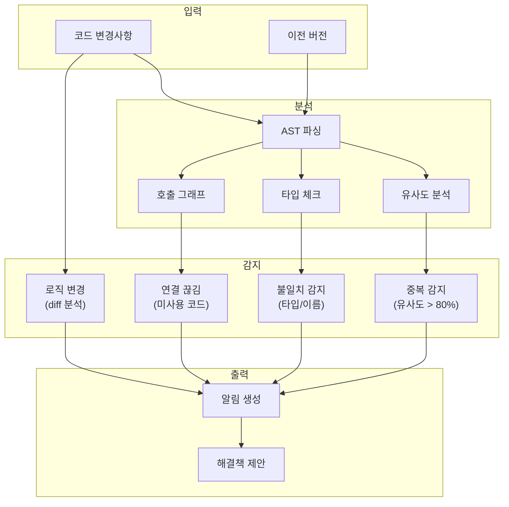

##### 실시간 알림 (SSE)

```typescript
// 프론트엔드에서 실시간 알림 수신
const eventSource = new EventSource('/api/anomaly/stream?repo=owner/repo');

eventSource.onmessage = (event) => {
  const anomaly = JSON.parse(event.data);
  // 토스트 알림 표시
  showToast({
    type: anomaly.severity,
    title: anomaly.title,
    action: () => navigateToLocation(anomaly.locations[0])
  });
};
```

##### UI 컴포넌트

```
src/components/anomaly/
├── AnomalyPanel.tsx         # 이상 징후 목록 패널
├── AnomalyCard.tsx          # 개별 이상 징후 카드
├── AnomalyToast.tsx         # 실시간 알림 토스트
├── SeverityBadge.tsx        # 심각도 뱃지 (error/warning/info)
└── hooks/
    └── useAnomalyStream.ts  # SSE 연결 + 상태 관리
```

### 3. 비개발자 언어로 오류 설명

```
기술적 설명 (이해 불가)
┌─────────────────────────────────────────────────────┐
│ TypeError: Cannot read property 'id' of undefined   │
│ at line 42                                          │
└─────────────────────────────────────────────────────┘
                        │
                        ▼
직관적 설명 (이해 가능)
┌─────────────────────────────────────────────────────┐
│ 문제 위치: '프로젝트 삭제' 기능                     │
│ 무슨 문제: 삭제할 프로젝트를 찾을 수 없음           │
│ 예상 원인: 이미 삭제된 프로젝트를 다시 삭제하려 함  │
│ 해결 방법: '이미 삭제된 프로젝트입니다' 메시지 추가 │
└─────────────────────────────────────────────────────┘
```

#### 3.1 상세 설계: 오류 번역 시스템

##### API 설계

```
POST /api/error/translate
```

**Request:**
```json
{
  "error_type": "runtime" | "build" | "test" | "lint",
  "raw_error": "TypeError: Cannot read property 'id' of undefined\n    at deleteProject (src/api/project.ts:42:15)",
  "context": {
    "file": "src/api/project.ts",
    "function": "deleteProject",
    "recent_changes": ["프로젝트 삭제 기능 추가"]
  }
}
```

**Response:**
```json
{
  "translated": {
    "location": "프로젝트 삭제 기능",
    "problem": "삭제할 프로젝트를 찾을 수 없음",
    "cause": "이미 삭제된 프로젝트를 다시 삭제하려 함",
    "solution": "'이미 삭제된 프로젝트입니다' 메시지 추가"
  },
  "severity": "error",
  "category": "data_not_found",
  "related_issues": [
    { "number": 42, "title": "프로젝트 삭제 오류" }
  ],
  "suggested_actions": [
    {
      "label": "AI에게 수정 요청",
      "action": "ai_fix",
      "prompt": "deleteProject 함수에서 프로젝트가 없을 때 친절한 에러 메시지를 보여주도록 수정해줘"
    },
    {
      "label": "이슈 생성",
      "action": "create_issue",
      "template": "bug"
    }
  ]
}
```

##### 오류 카테고리 매핑

| 기술적 오류 | 카테고리 | 비개발자 설명 |
|------------|----------|--------------|
| `TypeError: undefined` | `data_not_found` | "찾으려는 데이터가 없음" |
| `SyntaxError` | `code_typo` | "코드 작성 중 오타" |
| `NetworkError` | `connection_failed` | "서버 연결 실패" |
| `401 Unauthorized` | `auth_required` | "로그인이 필요함" |
| `403 Forbidden` | `no_permission` | "권한이 없음" |
| `404 Not Found` | `not_exist` | "페이지/데이터가 없음" |
| `500 Internal Error` | `server_problem` | "서버 내부 문제" |
| `CORS Error` | `blocked_request` | "브라우저가 요청을 차단함" |

##### AI 프롬프트 설계

```markdown
## 역할
당신은 기술적 오류 메시지를 비개발자가 이해할 수 있는 설명으로 번역합니다.

## 규칙
1. 전문 용어 제거: TypeError, undefined, null → 제거
2. 무엇이 문제인지 → 사용자 관점에서 설명
3. 왜 발생했는지 → 일상 비유 사용
4. 어떻게 해결하는지 → 구체적 행동 제시

## 출력 형식 (JSON)
{
  "location": "어디서 문제가 발생했는지 (기능명)",
  "problem": "무슨 문제인지 (한 문장)",
  "cause": "왜 발생했는지 (가능성 높은 원인)",
  "solution": "어떻게 해결하는지 (구체적 행동)"
}

## 예시
입력: TypeError: Cannot read property 'email' of null at sendEmail()
출력: {
  "location": "이메일 발송 기능",
  "problem": "이메일을 보낼 사용자 정보가 없음",
  "cause": "로그인하지 않은 상태에서 이메일 발송 시도",
  "solution": "먼저 로그인한 후 다시 시도하세요"
}
```

##### UI 컴포넌트

```
src/components/error/
├── ErrorExplainer.tsx       # 메인 오류 설명 컴포넌트
├── ErrorCard.tsx            # 번역된 오류 카드 UI
├── TechnicalDetails.tsx     # 기술 상세 (접기/펼치기)
├── SuggestedActions.tsx     # 추천 행동 버튼들
└── hooks/
    └── useErrorTranslation.ts  # API 호출 + 캐싱
```

**ErrorExplainer Props:**
```typescript
interface ErrorExplainerProps {
  error: {
    type: 'runtime' | 'build' | 'test' | 'lint';
    message: string;
    stack?: string;
  };
  context?: {
    file?: string;
    function?: string;
  };
  onActionClick?: (action: SuggestedAction) => void;
  showTechnicalDetails?: boolean;  // 개발자용 상세 표시
}
```

##### 실시간 오류 감지 흐름

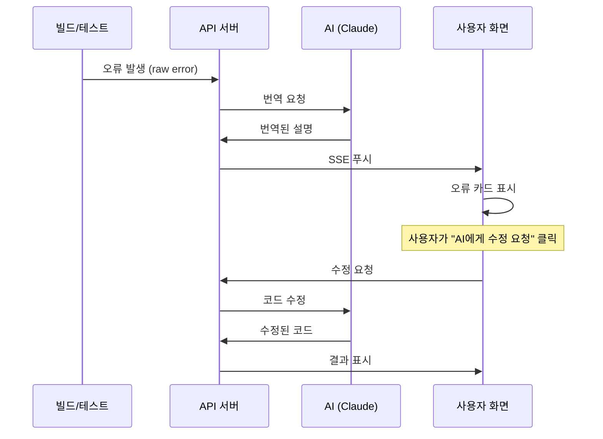

##### 에러 히스토리 저장

```typescript
interface ErrorHistory {
  id: string;
  timestamp: Date;
  raw_error: string;
  translated: TranslatedError;
  resolution?: {
    method: 'ai_fix' | 'manual' | 'ignored';
    resolved_at: Date;
    commit?: string;
  };
}
```

- 동일 오류 반복 시 "이전에도 같은 문제 발생" 알림
- 해결 방법 자동 제안 (이전 해결 사례 기반)

### 4. 이슈 기반 워크플로우

```
PRD 입력 → AI 개발 → 이슈 발생 → 시각화 → User 결정 → AI 해결 → 반복
```

| 이슈 유형 | 발생 상황 | User 역할 |
|----------|----------|----------|
| 버그 | AI 코드에서 오류 발생 | 증상 확인 + 수정 방향 지시 |
| 중복 | AI가 이미 있는 기능 재개발 | 중복 감지 + 통합 지시 |
| 불일치 | 함수 간 인터페이스 충돌 | 어느 쪽이 맞는지 결정 |
| 추가 기능 | 새로운 기능 필요 | 우선순위 결정 |

---

## UI 설계 (Mermaid 목업)

### 1. 메인 대시보드

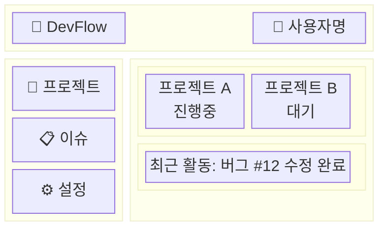

### 2. 이슈 해결 화면

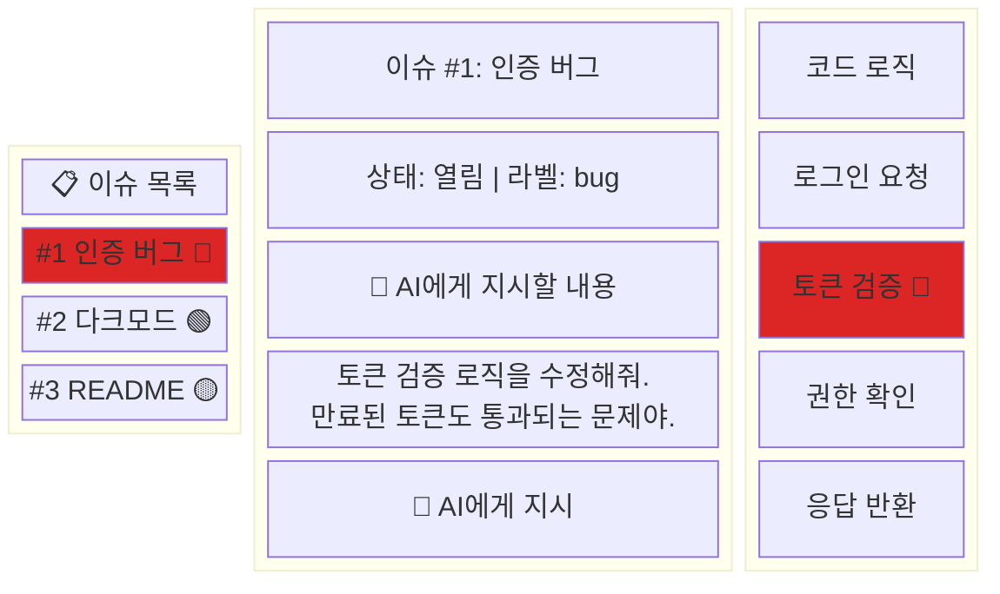

### 2-1. 코드 로직 시각화 (비개발자용)

> 비개발자가 "코드가 어떻게 동작하는지" 직관적으로 이해할 수 있는 로직 흐름

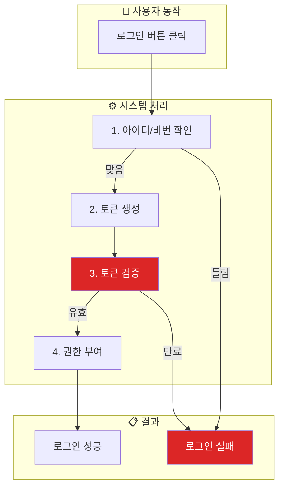

**🔴 에러 지점 설명:**
- **토큰 검증**: 만료된 토큰도 통과시키는 버그 발견
- 수정 필요: "만료 여부 확인" 로직 추가

### 2-2. AI 이슈 해결 로직

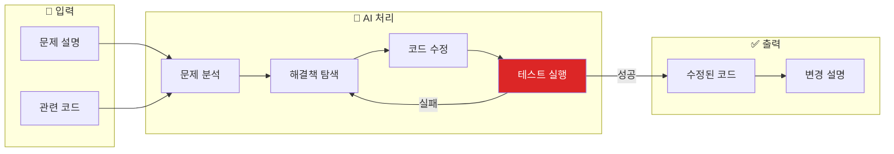

### 3. AI 작업 진행 상태

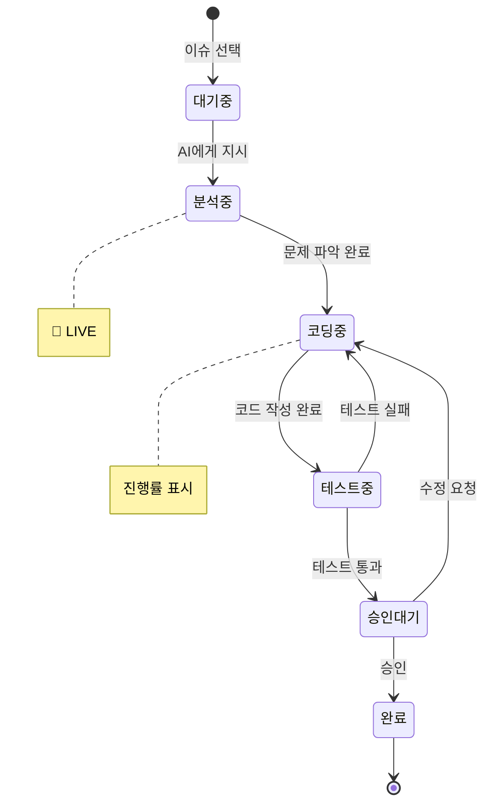

### 4. 승인 플로우 모달

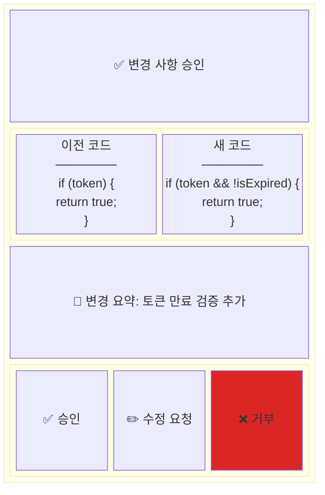

### 5. 사용자 여정 플로우

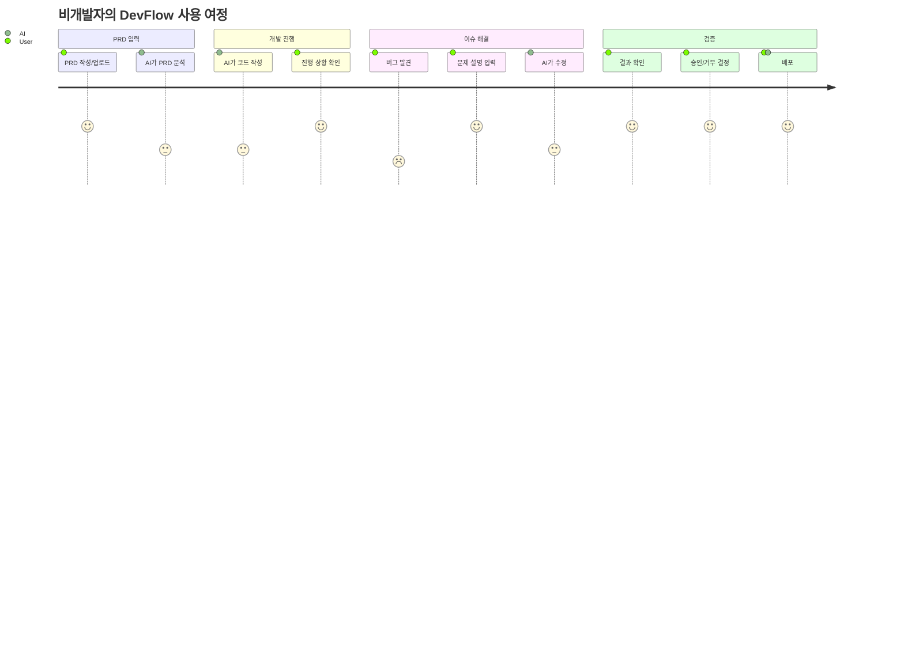

### 6. 시스템 아키텍처 (2-tier)

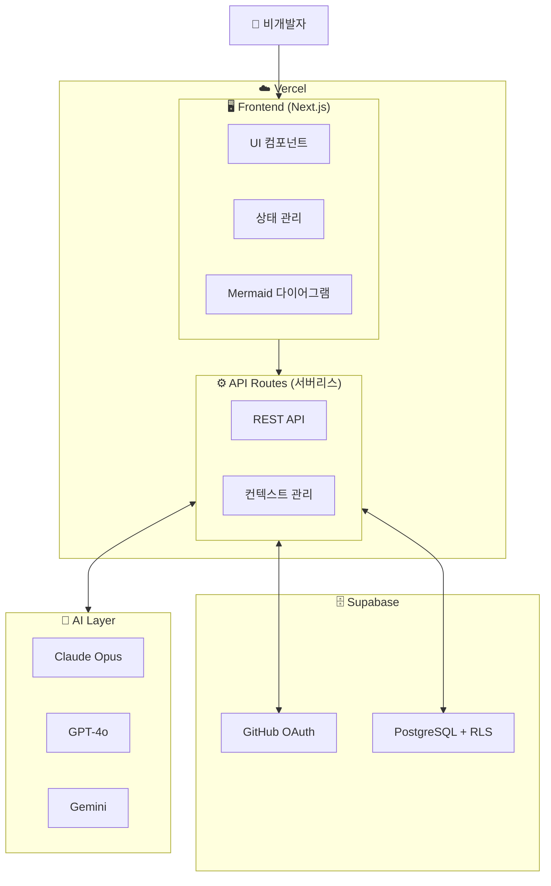

---

## 대상 사용자

| 페르소나 | 배경 | 역량 |
|----------|------|------|
| 기획자 | IT 기획 5년, 코딩 0 | 논리적 사고, 요구사항 정의 |
| 디자이너 | UX 디자인 3년 | 시각적 검증, 사용자 관점 |
| 창업자 | 비기술 배경 | 비즈니스 판단, 우선순위 |
| PM | 프로젝트 관리 7년 | 논리 흐름 검증 |

### 필요 역량 vs 불필요 역량

| 필요 (User가 갖춘 것) | 불필요 (AI가 담당) |
|---------------------|-------------------|
| 논리적 사고력 | 프로그래밍 언어 지식 |
| 비즈니스 도메인 지식 | 코드 문법/구조 이해 |
| 자연어로 요구사항 설명 | 기술 스택 선택 |
| 결과물 평가 능력 | 디버깅 기술 |

---

## 기술 아키텍처

> 📊 시스템 아키텍처 다이어그램은 [UI 설계 섹션 #6](#6-시스템-아키텍처-2-tier) 참조

### 기술 스택 (2-tier)

| 레이어 | 기술 | 역할 |
|--------|------|------|
| **Frontend** | Next.js, Mermaid.js | UI, 다이어그램 렌더링 |
| **Backend** | Next.js API Routes | 서버리스 API |
| **Auth** | Supabase Auth | GitHub OAuth |
| **AI** | Claude, GPT-4o, Gemini | 코드 생성, 분석 |
| **Database** | Supabase PostgreSQL | 데이터 저장, RLS |

### 컨텍스트 손실 대응

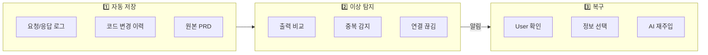

---

## 핵심 차별점

| 도구 | 대상 | 방식 | 한계 |
|------|------|------|------|
| **Copilot/Cursor** | 개발자 | 코드 자동완성 | 비개발자 사용 불가 |
| **Claude Code/Aider** | 개발자 | 자연어 → 코드 | 기술 용어 필요 |
| **DevFlow** | **비개발자** | 자연어 → AI 100% 구현 | - |

### DevFlow 강점

1. **코드 숨김** → 논리 흐름만 표시
2. **비즈니스 언어**로 소통
3. **실행 결과**로 검증 (코드 검토 불필요)
4. **시스템이 비교/이력 제공** → User가 판단

---

## 성공 지표

| 지표 | 목표 |
|------|------|
| 비개발자 프로젝트 완료율 | > 80% |
| 코드 작성 0% 달성 | 100% |
| 순환 오류 평균 횟수 | < 3회 |
| 컨텍스트 복구 성공률 | > 95% |

---

## 🆕 공개 웹앱 아키텍처 (2-tier)

### 인증 시스템 (Supabase Auth + GitHub OAuth)

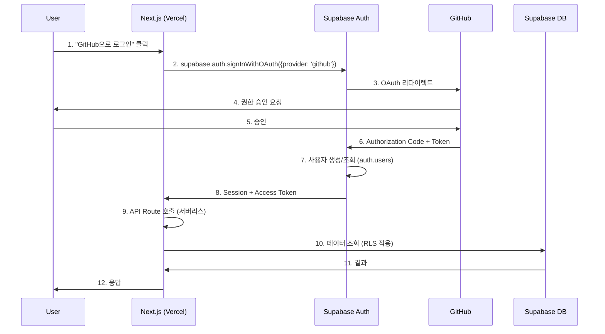

### 인증 솔루션 비교 (2025)

| 솔루션 | 무료 MAU | 장점 | 단점 | 추천 |
|--------|----------|------|------|------|
| **Supabase Auth** | 50,000 | DB 통합, RLS, GitHub OAuth 내장 | UI 단순 | ✅ **채택** |
| Auth.js | 무제한 | 완전 제어, 무료 | 직접 구현, 1-3시간 | - |
| Clerk | 10,000 | 최고 UI, 빠른 설정 | 유료 전환 빠름 ($550/월) | - |

### 채택: Supabase Auth + GitHub OAuth

```typescript
// lib/supabase.ts
import { createClient } from '@supabase/supabase-js'

export const supabase = createClient(
  process.env.NEXT_PUBLIC_SUPABASE_URL!,
  process.env.NEXT_PUBLIC_SUPABASE_ANON_KEY!
)

// GitHub OAuth 로그인
export async function signInWithGitHub() {
  const { data, error } = await supabase.auth.signInWithOAuth({
    provider: 'github',
    options: {
      scopes: 'read:user user:email repo',
      redirectTo: `${window.location.origin}/auth/callback`
    }
  })
  return { data, error }
}

// 현재 세션 조회
export async function getSession() {
  const { data: { session } } = await supabase.auth.getSession()
  return session
}

// GitHub Access Token 가져오기
export async function getGitHubToken() {
  const session = await getSession()
  return session?.provider_token  // GitHub API 호출용
}
```

### GitHub OAuth 권한 범위

| Scope | 용도 | 필수 |
|-------|------|------|
| `read:user` | 사용자 프로필 조회 | ✅ |
| `user:email` | 이메일 조회 | ✅ |
| `repo` | 레포지토리 접근 (비공개 포함) | ✅ |
| `write:repo_hook` | Webhook 설정 (향후) | 선택 |

### 배포 아키텍처 (2-tier)

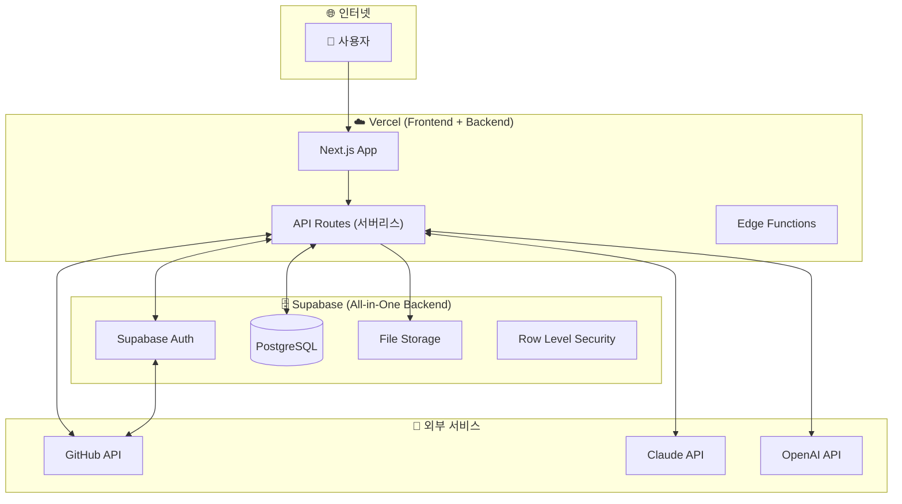

### 기술 스택 (2-tier 공개 웹앱)

| 레이어 | 기술 | 역할 | 비용 |
|--------|------|------|------|
| **Frontend** | Vercel + Next.js | 호스팅, SSR, Edge | 무료 (Hobby) |
| **Backend** | Next.js API Routes | 서버리스 함수 | 무료 (Vercel 포함) |
| **Auth** | Supabase Auth | GitHub OAuth, 세션 | 무료 (50,000 MAU) |
| **Database** | Supabase PostgreSQL | 데이터 저장, RLS | 무료 (500MB) |
| **Storage** | Supabase Storage | 파일 저장 | 무료 (1GB) |
| **합계** | - | - | **$0/월** |

### 보안 요구사항

| 항목 | 구현 방법 |
|------|----------|
| **HTTPS** | Vercel 자동 적용 |
| **CORS** | Next.js API Routes 설정 |
| **Rate Limiting** | Vercel Edge Middleware |
| **Input Validation** | Zod 스키마 검증 |
| **SQL Injection** | Supabase Parameterized Query |
| **XSS** | Next.js 자동 이스케이프 |
| **CSRF** | Supabase Auth 내장 보호 |
| **RLS** | Supabase Row Level Security |
| **Secrets** | Vercel 환경변수 |

### 멀티테넌시 데이터 모델

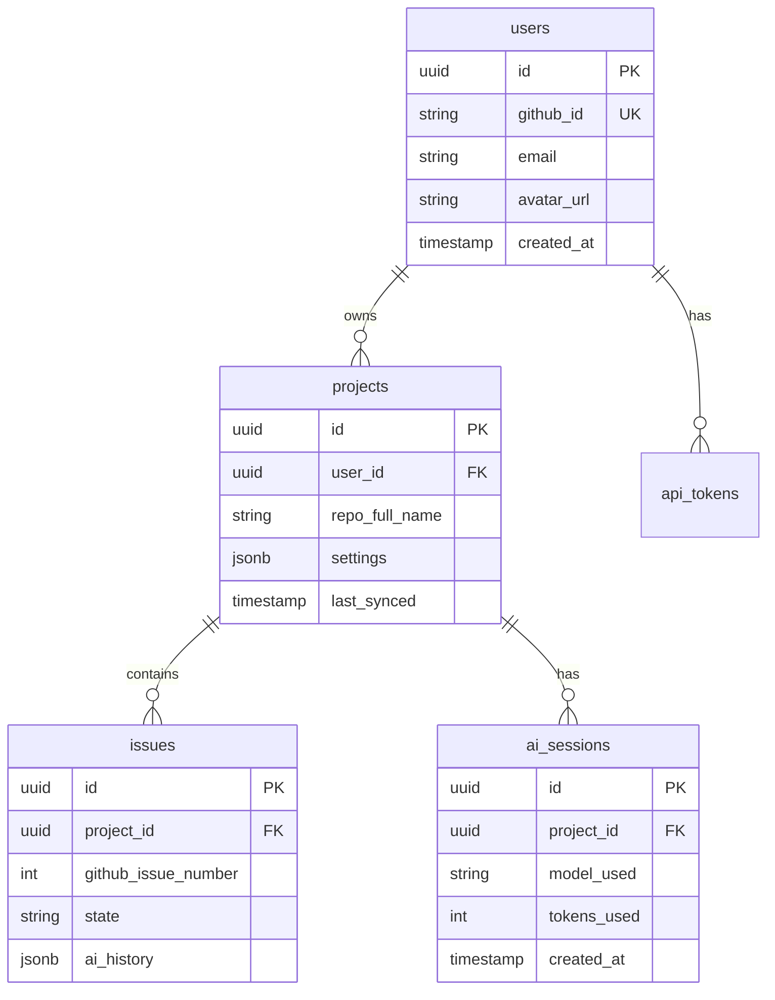

### Row Level Security (RLS) 정책

```sql
-- users 테이블: 본인만 접근
CREATE POLICY "Users can view own data" ON users
  FOR SELECT USING (auth.uid() = id);

-- projects 테이블: 소유자만 접근
CREATE POLICY "Users can manage own projects" ON projects
  FOR ALL USING (auth.uid() = user_id);

-- issues 테이블: 프로젝트 소유자만 접근
CREATE POLICY "Users can manage project issues" ON issues
  FOR ALL USING (
    project_id IN (SELECT id FROM projects WHERE user_id = auth.uid())
  );
```

### 배포 단계 (2-tier)

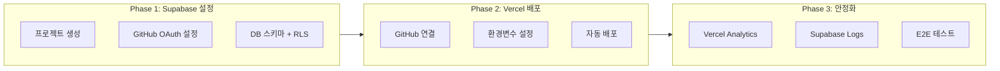

### 환경변수 (필수)

```env
# Supabase (필수)
NEXT_PUBLIC_SUPABASE_URL=https://xxx.supabase.co
NEXT_PUBLIC_SUPABASE_ANON_KEY=your_anon_key
SUPABASE_SERVICE_ROLE_KEY=your_service_key

# AI (선택)
ANTHROPIC_API_KEY=sk-ant-xxx
OPENAI_API_KEY=sk-xxx
```

> **참고**: GitHub Token은 Supabase Auth가 자동 관리 (provider_token)

### 마이그레이션 계획 (현재 → 2-tier)

| 현재 코드 | 마이그레이션 | 비고 |
|----------|-------------|------|
| `backend/src/main.py` | `frontend/src/app/api/` | FastAPI → Next.js API Routes |
| `backend/src/issue/` | `frontend/src/app/api/issues/` | 이슈 API |
| `backend/src/ai_agent/` | `frontend/src/app/api/ai/` | AI 호출 API |
| 환경변수 `GITHUB_TOKEN` | Supabase `provider_token` | 사용자별 토큰 |
| Docker 설정 | 삭제 | Vercel 서버리스 |

### API Routes 구조 (예정)

```
frontend/src/app/api/
├── auth/
│   └── callback/route.ts     # OAuth 콜백
├── repositories/
│   ├── route.ts              # GET /api/repositories
│   └── [owner]/[repo]/
│       └── route.ts          # GET /api/repositories/:owner/:repo
├── issues/
│   ├── route.ts              # GET /api/issues
│   └── [number]/
│       └── route.ts          # GET/PATCH /api/issues/:number
└── ai/
    └── resolve/route.ts      # POST /api/ai/resolve
```

### 삭제 대상

| 폴더/파일 | 이유 |
|----------|------|
| `backend/` | Next.js API Routes로 대체 |
| `docker-compose.yml` | Vercel 서버리스로 대체 |
| `.env` GITHUB_TOKEN | Supabase provider_token으로 대체 |

---

## 로드맵

```mermaid
timeline
    title DevFlow 개발 로드맵
    section Phase 1: MVP
        PRD 입력 : AI 개발 : 미리보기
    section Phase 2: 감지
        이상 징후 탐지 : 알림 시스템
    section Phase 3: 시각화
        코드→논리 변환 : Mermaid 통합
    section Phase 4: 안정화
        E2E 테스트 : 피드백 반영
    section Phase 5: 공개 배포
        GitHub OAuth : Vercel 배포 : 멀티테넌시
```

| Phase | 목표 | 상태 |
|-------|------|------|
| **1. MVP** | PRD 입력 → AI 개발 → 미리보기 | ✅ 완료 |
| **2. 감지 시스템** | 이상 징후 자동 감지 + 알림 | 🔄 진행중 |
| **3. 시각화** | 코드 → 논리 흐름 변환 (Mermaid) | 🔄 진행중 |
| **4. 안정화** | E2E 테스트 + 피드백 반영 | ✅ 완료 |
| **5. 공개 배포** | GitHub OAuth + Vercel + 멀티테넌시 | 🆕 신규 |

---

## 위험 요소

| 위험 | 영향 | 대응 |
|------|------|------|
| AI가 비즈니스 로직 오해 | 높음 | 단계별 확인 + 체크리스트 |
| 토큰 한도 컨텍스트 손실 | 높음 | 자동 저장 + 복구 시스템 |
| 비개발자가 검증 어려워함 | 중간 | 실행 결과 기반 검증 |

---

## 요약

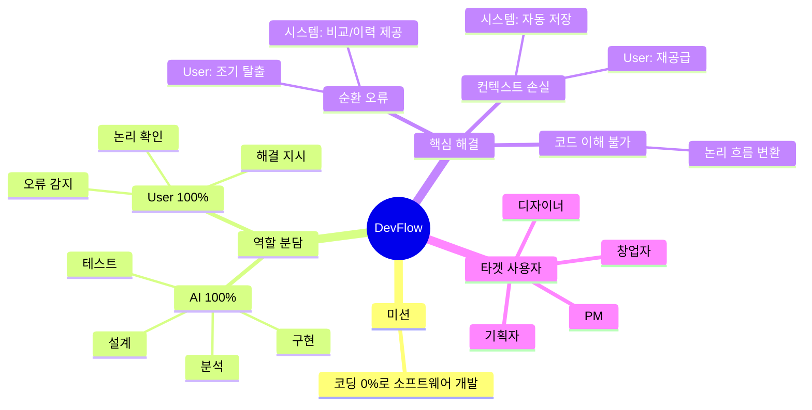

### 한 줄 요약

> **"AI가 코딩 100%, 비개발자가 검증 100%"** - 코드 없이 아이디어를 현실로
