# PRD: DevFlow - 비개발자 AI 협업 개발 플랫폼

**Version**: 4.0
**Date**: 2025-12-14
**Status**: Draft
**Author**: Claude Code
**Previous**: v3.0 (투트랙 전략 반영)

---

## Executive Summary

**DevFlow**는 코딩을 전혀 모르는 비개발자가 AI와 협업하여 소프트웨어를 개발하는 플랫폼입니다.

### 핵심 가치

| 기존 문제 | DevFlow 솔루션 |
|-----------|---------------|
| 비개발자는 아이디어가 있어도 구현 불가 | AI가 100% 코딩 전담 |
| AI 토큰 한도로 컨텍스트 손실 | 비개발자가 오류 감지 + 컨텍스트 복구 |
| 컨텍스트 오염으로 인한 오개발 | 비개발자가 조기 발견 + 해결책 제시 |
| AI 출력물의 논리적 오류 | 비개발자가 비즈니스 관점 검증 |
| 기술 용어로 인한 소통 장벽 | 자연어 기반 인터페이스 |

### 핵심 문제 정의: AI의 미시적 오류

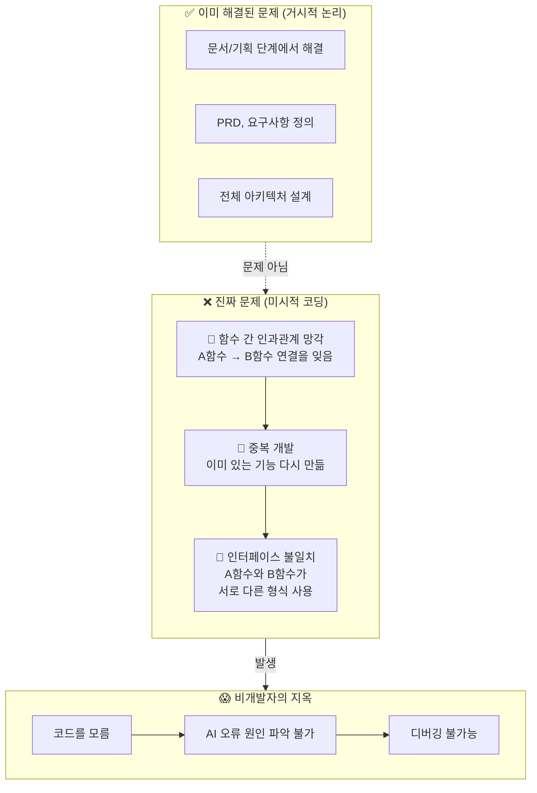

### 프로젝트 핵심 목표

> **"코딩을 모르는 비개발자도 AI의 미시적 오류를 직관적으로 이해하고 해결할 수 있게 한다"**

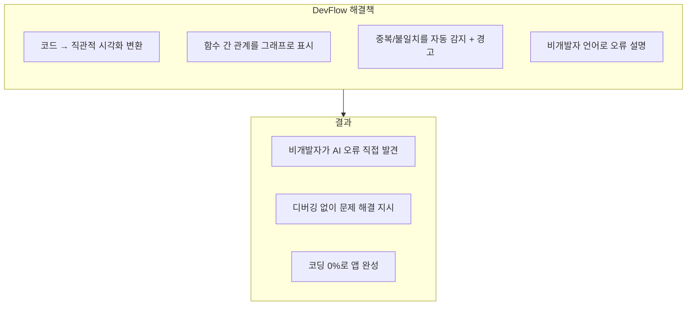

### 역할 분담 원칙

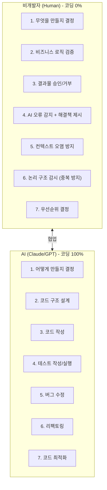

---

## 투트랙 전략

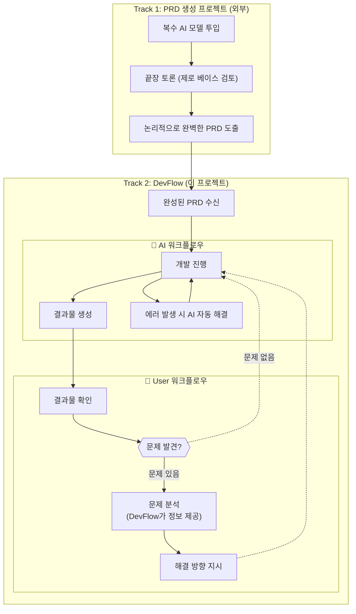

### 핵심 문제: 순환 오류

> **User 지시 → AI 시도 → 실패 → 다시 지시 → 다시 실패... 바이브 코더의 시간/자원 손실 구간**

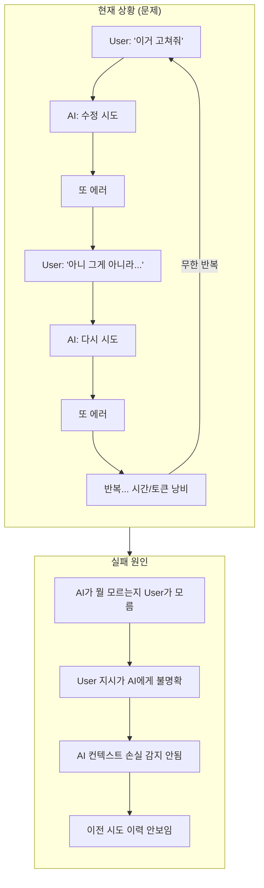

### DevFlow 해결 전략

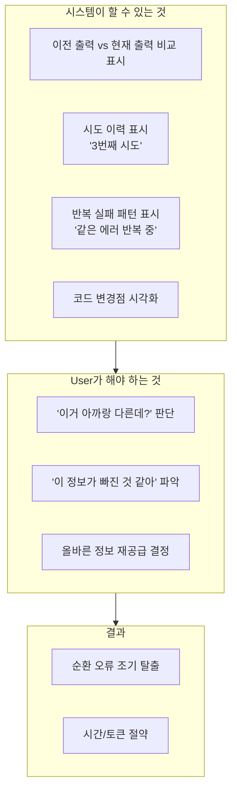

### 역할 분담

| 영역 | Track 1 (외부) | Track 2 (DevFlow) |
|------|----------------|-------------------|
| **입력** | 아이디어, 요구사항 | 완성된 PRD |
| **처리** | 복수 AI 끝장 토론 | AI 개발 + 이슈 관리 |
| **출력** | 완벽한 PRD | 동작하는 앱 |
| **비개발자 역할** | PRD 검토/승인 | 오류 감지 + 이슈 처리 |

### DevFlow의 핵심 역할

> **PRD는 이미 완성되어 들어온다. DevFlow는 개발 실행 + 이슈 관리를 담당한다.**

1. PRD 기반 개발 실행
2. **오류 발생 시** → 이슈 생성 → 비개발자가 직관적으로 이해 → 처리 지시
3. **추가 기능 요청 시** → 이슈 생성 → 우선순위 결정 → 개발

### 핵심 패러다임 전환

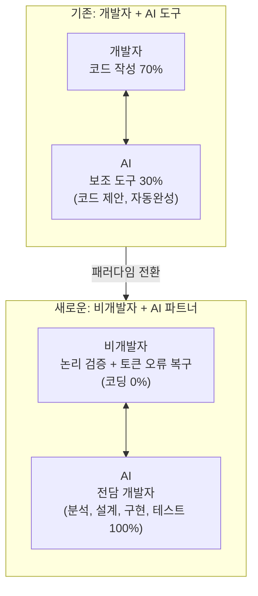

---

## 대상 사용자

### Primary Users (100%)

| 페르소나 | 배경 | 목표 | 역량 |
|----------|------|------|------|
| **기획자 김** | IT 기획 5년, 코딩 경험 0 | 본인 아이디어를 직접 앱으로 | 논리적 사고, 요구사항 정의 |
| **디자이너 이** | UX 디자인 3년 | 디자인 → 실제 구현 | 시각적 검증, 사용자 관점 |
| **창업자 박** | 비기술 배경 | MVP 빠르게 제작 | 비즈니스 판단, 우선순위 결정 |
| **PM 최** | 프로젝트 관리 7년 | 개발 없이 프로토타입 | 논리 흐름 검증, 일정 관리 |

### 사용자 역량 요구사항

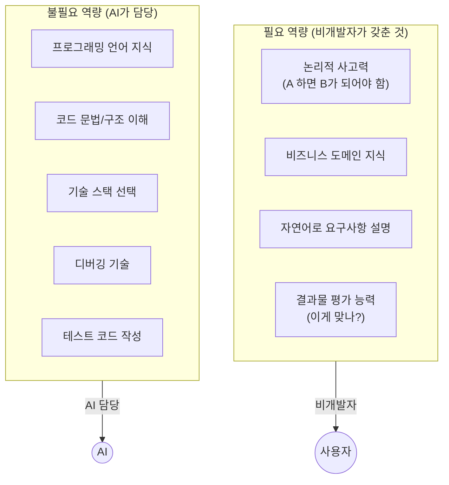

---

## 핵심 기능

### 이슈 기반 개발 워크플로우

> PRD는 외부에서 완성되어 들어옴. DevFlow는 **개발 실행 + 이슈 관리**에 집중.

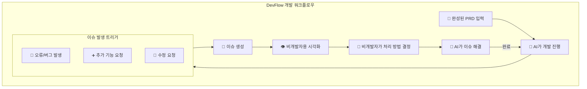

### 이슈 유형

| 유형 | 발생 상황 | 비개발자 역할 |
|------|----------|--------------|
| **버그** | AI 코드에서 오류 발생 | 증상 확인 + 수정 방향 지시 |
| **중복** | AI가 이미 있는 기능 재개발 | 중복 감지 + 통합 지시 |
| **불일치** | 함수 간 인터페이스 충돌 | 어느 쪽이 맞는지 결정 |
| **추가 기능** | 새로운 기능 필요 | 우선순위 결정 + 요구사항 설명 |

### 논리 흐름 시각화 (코드 숨김)

**핵심**: 비개발자가 이해할 수 있는 형태로 진행 상황 표시

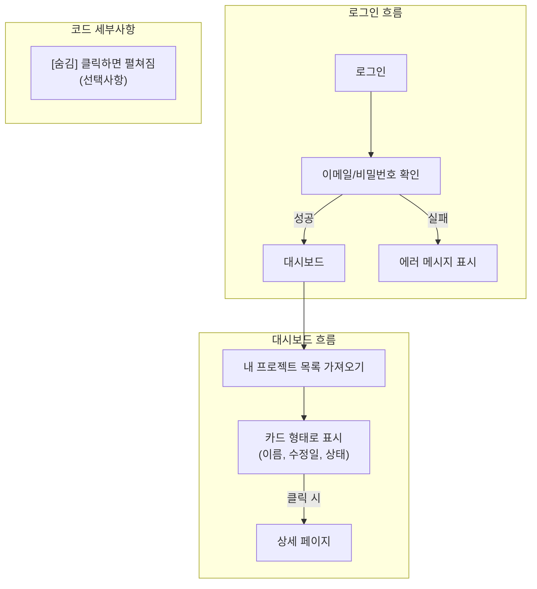

### AI의 숨겨진 문제 (핵심)

> **AI는 자신이 컨텍스트를 잃어버린 것을 모른다. 오염된 정보로 자신있게 잘못된 코드를 만든다.**

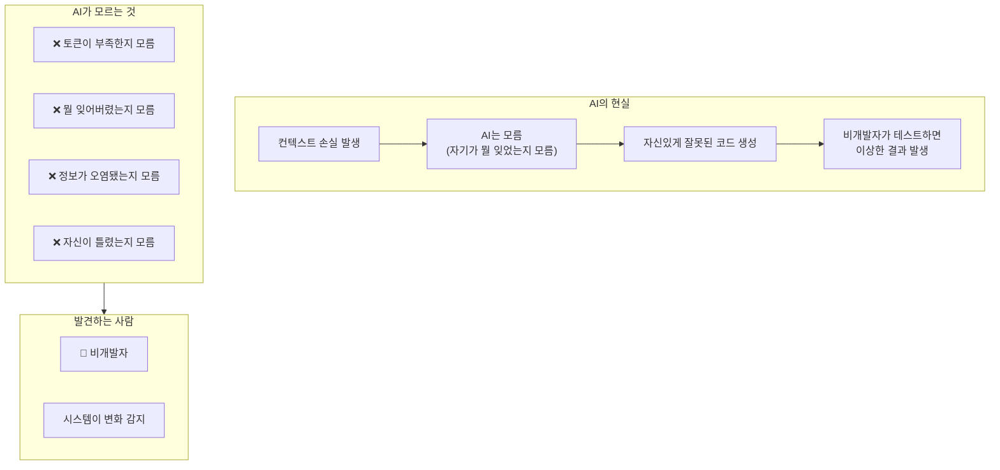

### 핵심 진실

| AI의 착각 | 현실 |
|-----------|------|
| "저는 모든 것을 기억합니다" | 토큰 한도로 초반 내용 망각 |
| "문제가 생기면 알려드리겠습니다" | 문제를 인식하지 못함 |
| "이전 요청대로 만들었습니다" | 요청을 잊고 다르게 만듦 |
| (경고 없이) 작업 완료 | 잘못된 결과물 제출 |

### 컨텍스트 손실 감지 시스템

> **AI는 모르니까, 시스템과 비개발자가 감지해야 한다.**

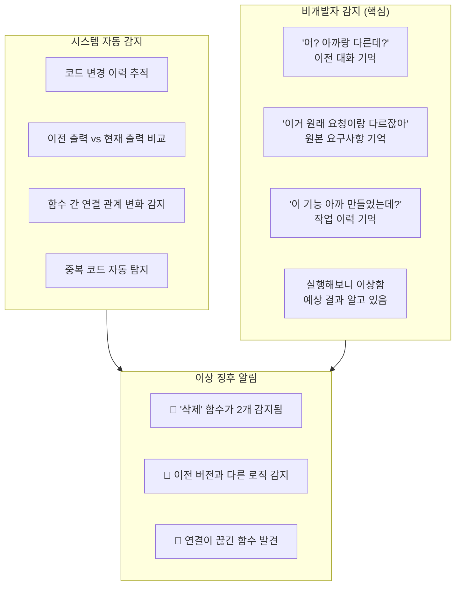

### 비개발자가 AI보다 잘하는 것

| 비개발자 | AI |
|----------|-----|
| 처음 요청을 기억함 | 토큰 한도로 잊음 |
| "이거 아까 다르게 말했는데?" | 모순을 인식 못함 |
| 결과물이 틀린 것을 앎 | 자신있게 틀린 것을 제출 |
| 비즈니스 맥락 이해 | 기술적으로만 해석 |

### AI 오류 감지 및 오개발 방지 (핵심 역할)

**비개발자의 핵심 기여**: AI의 토큰 한도와 컨텍스트 오염으로 인한 오개발을 감지하고 해결책을 제시

#### AI 오류 유형과 비개발자 대응

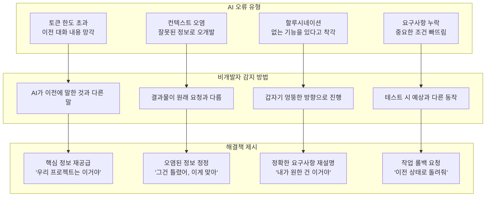

#### 오개발 방지 워크플로우

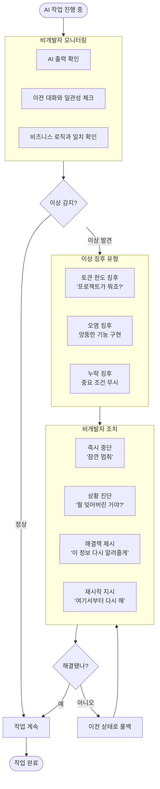

#### 컨텍스트 오염 감지 체크리스트

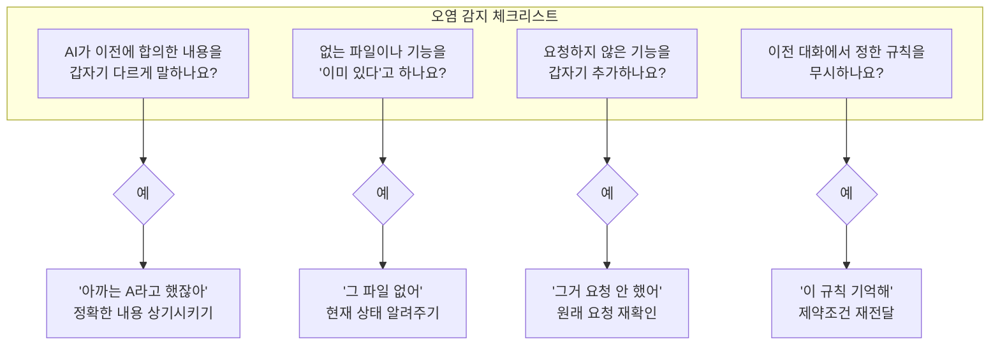

#### 해결책 제시 패턴

| 상황 | 비개발자 감지 신호 | 해결책 제시 방법 |
|------|-------------------|-----------------|
| **토큰 한도** | AI가 "프로젝트가 뭐죠?" 질문 | 저장된 프로젝트 정보 전달 |
| **컨텍스트 오염** | 이전 결정과 반대로 구현 | "아까 A로 하기로 했어" 상기 |
| **할루시네이션** | 없는 기능을 있다고 주장 | "그 기능 아직 없어, 확인해봐" |
| **요구사항 누락** | 중요 조건 빠진 결과물 | "이 조건도 꼭 포함해야 해" |
| **방향 이탈** | 엉뚱한 기능 구현 시작 | "잠깐, 지금 우리가 할 건 B야" |
| **중복 개발** | 이미 있는 기능을 다시 만듦 | "그거 아까 만들었잖아, 재사용해" |

---

### 함수 논리 구조 감시 (중복 개발 방지)

**비개발자의 역할**: 코드가 아닌 **논리 구조**를 감시하여 AI의 중복 개발 방지

#### AI의 대표적 실수: 중복 개발

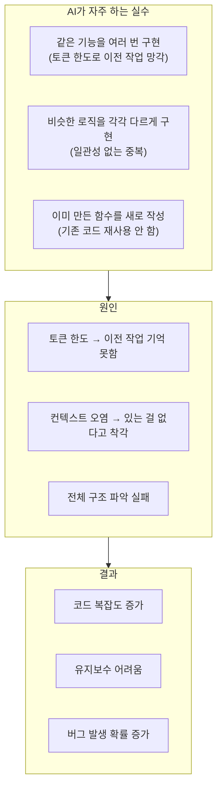

#### 비개발자의 논리 구조 감시

> **핵심**: 코드를 읽지 않고, **기능 단위**로 논리 구조를 파악

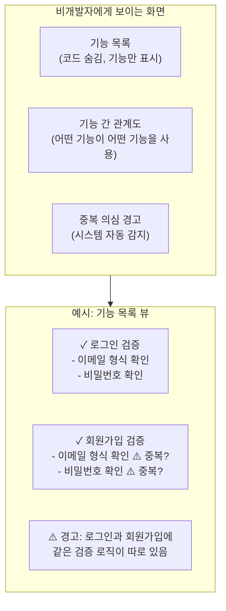

#### 중복 개발 감지 워크플로우

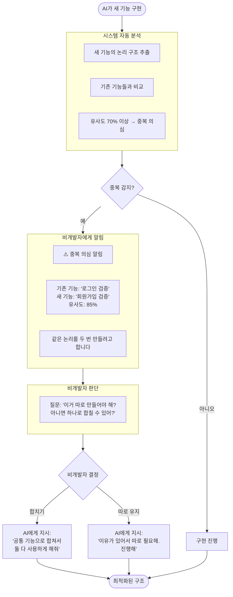

#### 비개발자가 할 수 있는 논리 질문

| 상황 | 비개발자 질문 (코드 몰라도 가능) | AI 대응 |
|------|-------------------------------|---------|
| **중복 의심** | "이거 아까 만든 거랑 같은 거 아니야?" | 기존 기능 재사용하도록 수정 |
| **분리 필요** | "이 기능은 너무 많은 일을 하는 것 같아. 나눌 수 있어?" | 기능 분리 |
| **통합 필요** | "이 두 개는 항상 같이 쓰이는데, 하나로 합칠 수 있어?" | 기능 통합 |
| **재사용 가능** | "이 로직 다른 데서도 쓸 수 있을 것 같은데?" | 공통 기능으로 추출 |
| **의존성 확인** | "이거 바꾸면 다른 데 영향 있어?" | 영향 범위 분석 후 설명 |

#### 논리 구조 시각화 (비개발자용)

```mermaid
flowchart TB
    subgraph GOOD["좋은 구조 (중복 없음)"]
        direction TB
        COMMON["공통 검증 기능<br/>- 이메일 형식<br/>- 비밀번호 규칙"]
        LOGIN["로그인"] --> COMMON
        SIGNUP["회원가입"] --> COMMON
        RESET["비밀번호 재설정"] --> COMMON
    end

    subgraph BAD["나쁜 구조 (중복 있음)"]
        direction TB
        LOGIN2["로그인<br/>- 이메일 형식 ✗<br/>- 비밀번호 규칙 ✗"]
        SIGNUP2["회원가입<br/>- 이메일 형식 ✗<br/>- 비밀번호 규칙 ✗"]
        RESET2["비밀번호 재설정<br/>- 이메일 형식 ✗<br/>- 비밀번호 규칙 ✗"]
    end

    BAD -->|"비개발자: '이거 합쳐'"--> GOOD

```

#### 비개발자 감시 체크리스트

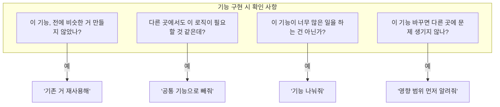

---

### 논리 검증 체크리스트

**사용자 역할**: AI 결과물이 원래 의도와 맞는지 확인

```mermaid
flowchart TB
    subgraph CHECKLIST["논리 검증 체크리스트"]
        TITLE["AI가 '로그인 기능'을 완료했습니다.<br/>아래 항목을 확인해주세요:"]

        subgraph BUSINESS["비즈니스 로직 검증"]
            B1["□ 이메일 형식이 틀리면 에러가 나오나요?"]
            B2["□ 비밀번호가 틀리면 적절한 메시지가 나오나요?"]
            B3["□ 로그인 성공 후 대시보드로 이동하나요?"]
        end

        subgraph BEHAVIOR["예상 동작 확인"]
            BE1["□ 새로고침해도 로그인 상태가 유지되나요?"]
            BE2["□ 로그아웃 버튼이 있나요?"]
        end

        subgraph RESULT["결과"]
            R1["○ 모두 정상 → [승인]"]
            R2["○ 문제 있음 → [수정 요청] + 문제점 설명"]
        end
    end

    TITLE --> BUSINESS --> BEHAVIOR --> RESULT

```

### 실행 결과 미리보기 (코드 없이)

**핵심**: 코드가 아닌 실제 실행 결과로 확인

```mermaid
flowchart TB
    subgraph PREVIEW["실행 결과 미리보기"]
        subgraph SCREEN["미리보기 화면"]
            LOGIN_TITLE["DevFlow 로그인"]
            EMAIL["이메일: [입력칸]"]
            PASSWORD["비밀번호: [입력칸]"]
            BUTTONS["[로그인] [회원가입]"]
        end

        subgraph SCENARIOS["테스트 시나리오"]
            T1["1. 빈 이메일로 로그인 시도<br/>→ ❌ '이메일을 입력하세요'"]
            T2["2. 잘못된 비밀번호<br/>→ ❌ '비밀번호가 틀립니다'"]
            T3["3. 올바른 정보<br/>→ ✓ 대시보드로 이동"]
        end

        ACTION["[직접 테스트]<br/>클릭하면 실제 앱 열림"]
    end

    SCREEN --> SCENARIOS --> ACTION

```

### 코드 직관적 시각화 (핵심 기능)

**목표**: 코딩을 모르는 비개발자도 AI의 미시적 오류를 직관적으로 이해

```mermaid
flowchart TB
    subgraph CONCEPT["핵심 개념: 코드 → 직관적 시각화"]
        CODE["💻 실제 코드<br/>(비개발자가 이해 불가)"]
        VISUAL["🎯 직관적 시각화<br/>(비개발자도 이해 가능)"]
        CODE -->|"자동 변환"| VISUAL
    end

    subgraph EXAMPLE["변환 예시"]
        subgraph BEFORE["❌ 코드 (이해 불가)"]
            C1["function deleteProject(id) {<br/>  const result = api.delete(id);<br/>  refreshList();<br/>}"]
        end

        subgraph AFTER["✅ 시각화 (이해 가능)"]
            V1["삭제 버튼 클릭"]
            V2["서버에 삭제 요청"]
            V3["목록 새로고침"]
            V1 --> V2 --> V3
        end
    end

    CONCEPT --> EXAMPLE

```

#### 함수 간 인과관계 시각화

```mermaid
flowchart TB
    subgraph FUNC_MAP["함수 관계 맵"]
        direction LR
        subgraph USER_ACTIONS["사용자 행동"]
            UA1["로그인 버튼"]
            UA2["프로젝트 클릭"]
            UA3["삭제 버튼"]
        end

        subgraph FUNCTIONS["처리 함수"]
            F1["로그인 처리"]
            F2["프로젝트 로드"]
            F3["삭제 처리"]
        end

        subgraph DATA["데이터 변경"]
            D1["사용자 정보 저장"]
            D2["프로젝트 표시"]
            D3["목록에서 제거"]
        end

        UA1 --> F1 --> D1
        UA2 --> F2 --> D2
        UA3 --> F3 --> D3
    end

```

#### 오류 자동 감지 및 경고

```mermaid
flowchart TB
    subgraph ERRORS["자동 감지되는 오류"]
        subgraph E1["🔴 중복 개발 감지"]
            DUP1["'프로젝트 삭제' 함수가<br/>2개 있습니다"]
            DUP2["deleteProject()<br/>removeProject()"]
            DUP3["💡 하나로 통합할까요?"]
        end

        subgraph E2["🔴 연결 끊김 감지"]
            BROKEN1["'삭제 확인 창'이<br/>'삭제 실행'과 연결되지 않음"]
            BROKEN2["확인 버튼 → ???"]
            BROKEN3["💡 연결해드릴까요?"]
        end

        subgraph E3["🔴 불일치 감지"]
            MISMATCH1["A함수: projectId (숫자)<br/>B함수: project_id (문자)"]
            MISMATCH2["서로 다른 형식 사용"]
            MISMATCH3["💡 통일할까요?"]
        end
    end

```

#### 비개발자용 오류 설명

```mermaid
flowchart TB
    subgraph EXPLAIN["오류 설명 (비개발자 언어)"]
        subgraph TECH["❌ 기술적 설명 (이해 불가)"]
            T1["TypeError: Cannot read property<br/>'id' of undefined at line 42"]
        end

        subgraph SIMPLE["✅ 직관적 설명 (이해 가능)"]
            S1["📍 문제 위치: '프로젝트 삭제' 기능"]
            S2["❓ 무슨 문제: 삭제할 프로젝트를 찾을 수 없음"]
            S3["💡 예상 원인: 이미 삭제된 프로젝트를<br/>다시 삭제하려 함"]
            S4["✏️ 해결 방법: '이미 삭제된 프로젝트입니다'<br/>메시지 추가"]
        end

        TECH -.->|"변환"| SIMPLE
    end

```

#### 디버깅 없는 문제 해결

```mermaid
flowchart TB
    subgraph NO_DEBUG["디버깅 없이 문제 해결하기"]
        DETECT["🔍 시스템이 오류 감지"]
        EXPLAIN["📋 비개발자 언어로 설명"]
        OPTIONS["🎯 해결 옵션 제시"]

        subgraph CHOICES["선택지"]
            C1["[옵션 1] 중복 함수 A 삭제"]
            C2["[옵션 2] 중복 함수 B 삭제"]
            C3["[옵션 3] 두 함수 통합"]
        end

        USER_SELECT["👤 비개발자가 선택"]
        AI_FIX["🤖 AI가 자동 수정"]
        DONE["✅ 완료"]

        DETECT --> EXPLAIN --> OPTIONS --> CHOICES
        CHOICES --> USER_SELECT --> AI_FIX --> DONE
    end

```

---

## UI/UX 설계

### 메인 화면 구조

```mermaid
flowchart TB
    subgraph MAIN_SCREEN["DevFlow 메인 화면"]
        subgraph HEADER["헤더"]
            LOGO["[로고] DevFlow"]
            PROJECT["[내 프로젝트 ▼]"]
            STATUS["[AI 상태: 🟢]"]
        end

        subgraph CONTENT["메인 콘텐츠"]
            subgraph LEFT["진행 상황"]
                P1["✓ 로그인"]
                P2["✓ 대시보드"]
                P3["🔄 휴지통"]
                P4["○ 설정"]
                TOKEN["토큰: 45%<br/>████░░░░░░"]
            end

            subgraph RIGHT["AI 대화창"]
                AI_MSG["[AI] 로그인 기능을 만들었어요.<br/>실행해서 확인해보세요."]
                BUTTONS["[미리보기] [테스트 실행]"]
                INPUT["[입력] 다음에 뭘 하면 될까? [전송]"]
            end
        end

        subgraph FLOW_VIEW["논리 흐름 뷰"]
            F1["로그인"] --> F2["대시보드"] --> F3["상세"] --> F4["수정"]
            F2 --> F5["휴지통<br/>(작업 중)"]
        end
    end

```

### AI 상태 표시 (상세)

```mermaid
flowchart TB
    subgraph PANEL["AI 상태 패널"]
        STATE["현재 상태: 🟢 정상 작동 중"]

        subgraph USAGE["컨텍스트 사용량: 65%"]
            BAR["██████████████████░░░░░░░░░░"]
            LEGEND1["🟢 0-60%: 안전"]
            LEGEND2["🟡 60-80%: 주의 (곧 정리 필요)"]
            LEGEND3["🔴 80-100%: 위험 (정보 손실 가능)"]
        end

        subgraph MEMORY["AI가 기억하고 있는 것"]
            M1["✓ 프로젝트 목표 및 요구사항"]
            M2["✓ 현재 작업 (휴지통 기능)"]
            M3["✓ 완료된 파일 목록"]
            M4["△ 초반 대화 내용 (일부 손실 가능)"]
        end

        ACTIONS["[핵심 정보 저장] [컨텍스트 정리 요청]"]
    end

    STATE --> USAGE --> MEMORY --> ACTIONS

```

### 검증 화면

```mermaid
flowchart TB
    subgraph VERIFY["검증 요청 화면"]
        ALERT["🔔 AI가 작업을 완료했습니다. 검증해주세요."]
        TASK["완료된 작업: '프로젝트 삭제 + 휴지통 기능'"]

        subgraph FLOW["논리 흐름"]
            FL1["프로젝트 카드"]
            FL2["삭제 버튼 클릭"]
            FL3["확인 창<br/>('휴지통으로 이동할까요?')"]
            FL4["휴지통으로 이동<br/>(30일 보관)"]
            FL5["휴지통에서 복구 가능"]
            FL1 --> FL2 --> FL3 --> FL4 --> FL5
        end

        subgraph CHECK["검증 체크리스트"]
            C1["□ 삭제 버튼이 프로젝트 카드에 있나요?"]
            C2["□ 확인 창이 뜨나요?"]
            C3["□ 휴지통 페이지가 있나요?"]
            C4["□ 복구 버튼이 작동하나요?"]
        end

        PREVIEW["[미리보기 실행]<br/>← 실제로 테스트해보기"]

        subgraph RESULT["결과"]
            R1["○ 모두 정상 → [승인하기]"]
            R2["○ 문제 있음 → [수정 요청]"]
            INPUT["문제점 입력:<br/>예: '복구 버튼 눌러도 아무 반응이 없어요'"]
        end
    end

    ALERT --> TASK --> FLOW --> CHECK --> PREVIEW --> RESULT

```

---

## 기술 아키텍처

### 시스템 구조

```mermaid
flowchart TB
    subgraph SYSTEM["DevFlow 시스템 구조"]
        USER["👤 비개발자"]

        subgraph FRONTEND["프론트엔드 (Next.js)"]
            F1["💬 대화창"]
            F2["🔀 논리뷰"]
            F3["👁️ 미리보기"]
            F4["📊 AI상태"]
        end

        subgraph BACKEND["백엔드 (FastAPI)"]
            B1["컨텍스트 관리자"]
            B2["토큰 사용량 추적기"]
            B3["진행상황 저장소"]
            B4["핵심정보 자동저장"]
        end

        subgraph AI["AI 레이어"]
            subgraph WORKFLOW["LangGraph 워크플로우"]
                W1["계획"]
                W2["코딩"]
                W3["테스트"]
                W4["검증요청"]
                W1 --> W2 --> W3 --> W4
            end
            AI1["Claude Opus"]
            AI2["GPT-4o"]
            AI3["Aider (코딩)"]
        end

        subgraph SANDBOX["샌드박스 실행 환경"]
            subgraph DOCKER["Docker 컨테이너 (격리된 코드 실행)"]
                D1["생성된 앱 실행"]
                D2["테스트 실행"]
                D3["미리보기 제공"]
            end
        end
    end

    USER --> FRONTEND
    FRONTEND --> BACKEND
    BACKEND --> AI
    AI --> SANDBOX

```

### 컨텍스트 손실 대응 시스템

> **AI는 자신이 잃어버린 것을 모른다. 시스템이 감지하고 비개발자가 확인한다.**

```mermaid
flowchart TB
    subgraph CONTEXT["컨텍스트 손실 대응 시스템"]
        PROBLEM["❌ 문제: AI는 자신의 컨텍스트 손실을 인지 못함"]

        subgraph STEP1["1️⃣ 시스템 자동 저장 (AI 모르게)"]
            S1_1["📌 모든 요청/응답 로그"]
            S1_2["📊 코드 변경 이력"]
            S1_3["🔗 함수 간 연결 관계"]
            S1_4["📋 원본 PRD 보관"]
        end

        subgraph STEP2["2️⃣ 이상 징후 자동 탐지"]
            S2_1["🔍 이전 출력과 현재 출력 비교"]
            S2_2["🔍 중복 코드 감지"]
            S2_3["🔍 끊어진 연결 감지"]
            S2_4["🔔 비개발자에게 알림"]
        end

        subgraph STEP3["3️⃣ 비개발자 확인 후 정보 재공급"]
            S3_1["👤 비개발자가 이상 확인"]
            S3_2["📄 저장된 정보 선택"]
            S3_3["➡️ AI에게 다시 주입"]
        end
    end

    PROBLEM --> STEP1
    STEP1 --> STEP2
    STEP2 --> STEP3

```

---

## 핵심 차별점

### 기존 AI 코딩 도구 vs DevFlow

```mermaid
flowchart TB
    subgraph COMPARE["비교: 기존 도구 vs DevFlow"]
        subgraph COPILOT["GitHub Copilot / Cursor"]
            CP1["👤 대상: 개발자"]
            CP2["⚙️ 방식: 코드 자동완성, 제안"]
            CP3["📊 역할: 코드 작성 70% + AI 30%"]
            CP4["❌ 한계: 비개발자 사용 불가"]
        end

        subgraph CLAUDE["Claude Code / Aider"]
            CC1["👤 대상: 개발자"]
            CC2["⚙️ 방식: 자연어 → 코드 생성"]
            CC3["📊 역할: 기술적 지시 + 코드 검토"]
            CC4["❌ 한계: 기술 용어/코드 이해 필요"]
        end

        subgraph DEVFLOW["DevFlow ⭐"]
            DF1["👤 대상: 비개발자"]
            DF2["⚙️ 방식: 자연어 → AI가 100% 구현"]
            DF3["📊 역할: 논리 검증 + 토큰 오류 복구<br/>(코딩 0%)"]

            subgraph STRENGTH["💪 강점"]
                ST1["🙈 코드 숨김 (논리 흐름만 표시)"]
                ST2["💬 비즈니스 언어로 소통"]
                ST3["🔄 토큰 관리 자동화"]
                ST4["✅ 실행 결과로 검증 (코드 검토 불필요)"]
            end
        end
    end

    COPILOT -.->|"진화"| CLAUDE
    CLAUDE -.->|"패러다임 전환"| DEVFLOW

```

### 비개발자의 기여 가치

```mermaid
flowchart TB
    subgraph VALUE["비개발자가 AI보다 잘하는 것"]
        subgraph V1["1️⃣ 비즈니스 컨텍스트 이해"]
            V1_AI["🤖 AI: '로그인 기능을 만들었습니다'"]
            V1_USER["👤 비개발자: '근데 우리 서비스는 기업용이라<br/>SSO 로그인이 필수야'"]
            V1_RESULT["✅ AI가 모르는 비즈니스 요구사항 제공"]
            V1_AI --> V1_USER --> V1_RESULT
        end

        subgraph V2["2️⃣ 논리적 일관성 검증"]
            V2_AI["🤖 AI: '삭제 기능을 추가했습니다'"]
            V2_USER["👤 비개발자: '어? 아까는 수정만 가능하다고 했는데?<br/>삭제는 관리자만 할 수 있어야 해'"]
            V2_RESULT["✅ AI가 잊어버린 제약조건 상기"]
            V2_AI --> V2_USER --> V2_RESULT
        end

        subgraph V3["3️⃣ 우선순위 결정"]
            V3_AI["🤖 AI: '다음에 A, B, C 중 뭘 할까요?'"]
            V3_USER["👤 비개발자: 'B부터. 다음 주 데모에 B가 필요해'"]
            V3_RESULT["✅ 비즈니스 일정에 맞춘 판단"]
            V3_AI --> V3_USER --> V3_RESULT
        end

        subgraph V4["4️⃣ 토큰 한도 오류 복구"]
            V4_AI["🤖 AI: '죄송합니다, 프로젝트 정보를 잊어버렸어요'"]
            V4_USER["👤 비개발자: [저장된 정보 전달]<br/>'지금 휴지통 기능 하고 있었어'"]
            V4_RESULT["✅ AI가 스스로 복구할 수 없는 정보 제공"]
            V4_AI --> V4_USER --> V4_RESULT
        end
    end

    V1 --> V2 --> V3 --> V4

```

---

## 성공 지표

### 핵심 KPI

| 지표 | 목표 | 측정 방법 |
|------|------|-----------|
| 비개발자 완료율 | > 80% | 시작한 프로젝트 중 완료 비율 |
| 코드 작성 0% 달성 | 100% | 사용자가 코드를 직접 작성한 횟수 = 0 |
| 토큰 오류 복구 성공률 | > 95% | 컨텍스트 손실 후 정상 재개 비율 |
| 논리 검증 정확도 | > 90% | 사용자가 발견한 논리 오류 비율 |

### 사용자 만족도 지표

| 질문 | 목표 점수 |
|------|-----------|
| "코딩 없이 원하는 기능을 만들 수 있었나요?" | > 4.5/5 |
| "AI의 작업을 이해하기 쉬웠나요?" | > 4.0/5 |
| "토큰 한도 문제를 해결하기 쉬웠나요?" | > 4.0/5 |

---

## 로드맵

### Phase 1: 핵심 기능 (4주)

- [ ] 자연어 요구사항 입력 인터페이스
- [ ] 논리 흐름 시각화 (코드 숨김)
- [ ] 기본 AI 연동 (Claude)
- [ ] 실행 결과 미리보기

### Phase 2: 토큰 관리 (2주)

- [ ] 토큰 사용량 실시간 모니터링
- [ ] 핵심 정보 자동 추출/저장
- [ ] 컨텍스트 복구 시스템

### Phase 3: 검증 시스템 (2주)

- [ ] 논리 검증 체크리스트 자동 생성
- [ ] 단계별 승인 워크플로우
- [ ] 수정 요청 → AI 재작업 흐름

### Phase 4: 안정화 (2주)

- [ ] E2E 테스트
- [ ] 사용자 피드백 반영
- [ ] 성능 최적화

---

## 위험 요소 및 대응

| 위험 | 영향 | 대응 |
|------|------|------|
| AI가 비즈니스 로직을 잘못 이해 | 높음 | 단계별 확인 + 명확한 체크리스트 |
| 토큰 한도로 컨텍스트 손실 | 높음 | 자동 저장 + 복구 시스템 |
| 비개발자가 검증을 어려워함 | 중간 | 실행 결과 기반 검증 (코드 검토 X) |
| AI 응답 지연 | 중간 | 진행률 표시 + 백그라운드 작업 |

---

## 요약

```mermaid
flowchart TB
    subgraph SUMMARY["DevFlow 핵심 요약"]
        MISSION["🎯 미션: 코딩 0%로 소프트웨어 개발"]

        subgraph ROLES["역할 분담"]
            R1["👤 비개발자: 무엇을 만들지 +<br/>맞는지 확인 + 토큰 오류 복구"]
            R2["🤖 AI: 어떻게 만들지 +<br/>코드 100% 전담"]
        end

        subgraph DIFF["핵심 차별점"]
            D1["1️⃣ 코드 숨김 → 논리 흐름만 표시"]
            D2["2️⃣ 토큰 관리 자동화 + 복구 지원"]
            D3["3️⃣ 실행 결과로 검증 (코드 검토 불필요)"]
            D4["4️⃣ 비즈니스 언어로 소통"]
        end

        subgraph TARGET["타겟 사용자"]
            T1["💡 코딩을 모르지만 아이디어가 있는 모든 사람"]
            T2["기획자 | 디자이너 | PM | 창업자"]
        end
    end

    MISSION --> ROLES --> DIFF --> TARGET

```

---

**Next Steps**:
1. 사용자 피드백 수집 (PRD 검토)
2. 와이어프레임 제작
3. Phase 1 개발 착수
