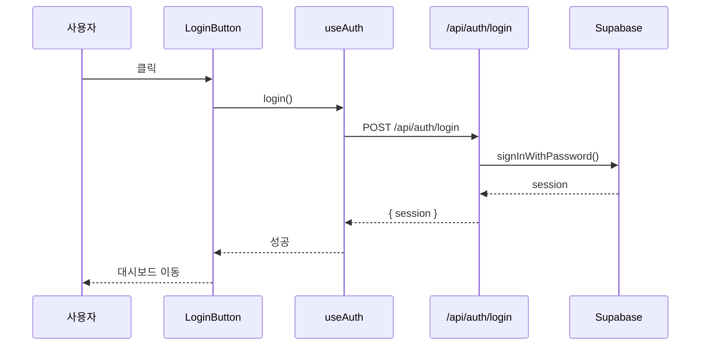

# PRD: 코드 시각화 시스템 재설계

**Version**: 1.2 (MVP)
**Date**: 2025-01-03
**Status**: Draft
**PRD-ID**: PRD-0007

---

## v1.2 변경사항 (MVP 간소화)

| 항목 | v1.1 | v1.2 (MVP) |
|------|------|------------|
| **데이터 저장** | Supabase DB + 캐시 | **Vercel KV 캐시만** |
| **체크포인트** | DB 저장 + 이어서 분석 | **캐시 미스 시 재분석** |
| **TTL** | 영구 + 캐시 5분 | **24시간** |
| **복잡도** | 높음 | **낮음 (MVP)** |

### MVP 전략

```
Phase 1 (MVP): 캐시만 사용 → 빠른 구현
Phase 2 (선택): DB 추가 → 영구 보관, 체크포인트
```

---

## v1.1 변경사항

| 항목 | v1.0 | v1.1 |
|------|------|------|
| **분석 시점** | 프로젝트 클릭 시 실시간 | **로그인 시 백그라운드 사전 분석** |
| **UX** | 클릭 → 로딩 → 표시 | **클릭 → 즉시 표시** |

---

## Executive Summary

현재 DevFlow의 코드 시각화 시스템은 **import 문 파싱**과 **파일명 휴리스틱**에 의존하여 실제 코드 로직을 분석하지 못한다. 이 PRD는 **AST 기반 정적 분석**을 통해 실제 함수 호출 관계와 실행 흐름을 시각화하는 시스템을 설계한다.

### 한 줄 정의

> **"로그인 → 백그라운드 분석 → 캐시 → 클릭 시 즉시 표시"**

---

## 1. 문제 정의

### 1.1 현재 상태 (As-Is)

| 항목 | 현재 방식 | 문제점 |
|------|-----------|--------|
| **레이어 분류** | 파일명 휴리스틱 (`components/*` → UI) | 오분류 빈번 |
| **의존성 분석** | import 문 정규식 파싱 | 동적 import 미지원 |
| **함수 분석** | 없음 | 호출 관계 파악 불가 |
| **실행 흐름** | 없음 | 데이터 흐름 추적 불가 |
| **노드 제한** | 레이어당 8개 | 실용성 부족 |

### 1.2 핵심 문제

```
현재: 파일 구조만 표시
src/
├── components/   → "UI 레이어입니다"
├── lib/          → "Logic 레이어입니다"
└── api/          → "Server 레이어입니다"

필요: 실제 코드 흐름 표시
LoginButton.onClick()
  → useAuth().login()
  → fetch('/api/auth/login')
  → supabase.auth.signInWithPassword()
  → session 저장
```

### 1.3 사용자 페인 포인트

| 사용자 | 문제 | 영향 |
|--------|------|------|
| **비개발자** | 다이어그램이 코드 이해에 도움 안 됨 | "이게 뭔지 모르겠어요" |
| **개발자** | 정확도가 낮아 신뢰 불가 | "그냥 코드 직접 볼게요" |
| **AI** | 코드 컨텍스트 파악 어려움 | 잘못된 수정 제안 |

---

## 2. 목표

### 2.1 성공 지표

| 지표 | 현재 | 목표 |
|------|------|------|
| 레이어 분류 정확도 | ~30% | **>90%** |
| 함수 호출 관계 추출 | 0% | **>85%** |
| 실행 흐름 추적 | 0% | **>80%** |
| 분석 시간 (100파일) | - | **<10초** |

### 2.2 범위

**In Scope:**
- TypeScript/JavaScript 프로젝트 분석
- Next.js App Router 특화 분석
- Supabase 연동 코드 탐지
- React 컴포넌트 흐름 추적

**Out of Scope:**
- Python/기타 언어 (Phase 2)
- 런타임 동적 분석
- 테스트 코드 분석

---

## 3. 솔루션 설계

### 3.1 아키텍처 개요

```
┌─────────────────────────────────────────────────────────────┐
│                    프로젝트 클릭                             │
└─────────────────────────────────────────────────────────────┘
                              │
                              ▼
┌─────────────────────────────────────────────────────────────┐
│  Phase 1: 코드 획득                                         │
│  ┌─────────────────────────────────────────────────────────┐│
│  │ GitHub API → 파일 목록 → 선택적 파일 내용 fetch         ││
│  │ (캐시: Redis/KV 5분)                                    ││
│  └─────────────────────────────────────────────────────────┘│
└─────────────────────────────────────────────────────────────┘
                              │
                              ▼
┌─────────────────────────────────────────────────────────────┐
│  Phase 2: AST 분석 (ts-morph)                               │
│  ┌───────────────┐ ┌───────────────┐ ┌───────────────────┐  │
│  │ 함수 추출     │ │ 클래스 추출   │ │ 타입 추출         │  │
│  │ - 이름        │ │ - 메서드      │ │ - interface       │  │
│  │ - 파라미터    │ │ - 프로퍼티    │ │ - type alias      │  │
│  │ - 반환 타입   │ │ - 상속 관계   │ │ - generic         │  │
│  └───────────────┘ └───────────────┘ └───────────────────┘  │
└─────────────────────────────────────────────────────────────┘
                              │
                              ▼
┌─────────────────────────────────────────────────────────────┐
│  Phase 3: 호출 그래프 생성                                  │
│  ┌─────────────────────────────────────────────────────────┐│
│  │ 함수 A                                                  ││
│  │   └─ calls → 함수 B                                     ││
│  │              └─ calls → fetch('/api/x')                 ││
│  │                         └─ matches → API Route X        ││
│  └─────────────────────────────────────────────────────────┘│
└─────────────────────────────────────────────────────────────┘
                              │
                              ▼
┌─────────────────────────────────────────────────────────────┐
│  Phase 4: 흐름 추출                                         │
│  ┌─────────────────────────────────────────────────────────┐│
│  │ 진입점 탐지:                                            ││
│  │   - React 이벤트 핸들러 (onClick, onSubmit)             ││
│  │   - useEffect                                           ││
│  │   - API Route handlers (GET, POST)                      ││
│  │   - 페이지 컴포넌트                                     ││
│  └─────────────────────────────────────────────────────────┘│
└─────────────────────────────────────────────────────────────┘
                              │
                              ▼
┌─────────────────────────────────────────────────────────────┐
│  Phase 5: 시각화                                            │
│  ┌───────────────┐ ┌───────────────┐ ┌───────────────────┐  │
│  │ 레이어 뷰     │ │ 흐름 뷰       │ │ 코드 연동 뷰      │  │
│  │ (구조 파악)   │ │ (동작 이해)   │ │ (상세 확인)       │  │
│  └───────────────┘ └───────────────┘ └───────────────────┘  │
└─────────────────────────────────────────────────────────────┘
```

### 3.2 레이어 분류 로직 (개선)

**현재: 파일명 기반**
```typescript
// 현재 (부정확)
if (path.includes('components')) return 'ui'
if (path.includes('api')) return 'server'
```

**개선: Export 패턴 분석**
```typescript
// 개선 (정확)
function classifyByExport(sourceFile: SourceFile): LayerType {
  const exports = sourceFile.getExportedDeclarations()

  for (const [name, declarations] of exports) {
    for (const decl of declarations) {
      // React 컴포넌트 판별
      if (isReactComponent(decl)) return 'ui'

      // Custom Hook 판별
      if (isCustomHook(decl)) return 'logic'

      // API Route Handler 판별
      if (isApiRouteHandler(decl)) return 'api'

      // Supabase/DB 호출 포함
      if (containsDatabaseCall(decl)) return 'data'
    }
  }

  return 'lib' // 기본값
}

function isReactComponent(decl: Declaration): boolean {
  // JSX 반환 여부
  // React.FC / React.Component 타입
  // forwardRef, memo 사용
}

function isCustomHook(decl: Declaration): boolean {
  // use* prefix + React hooks 사용
}
```

### 3.3 함수 호출 그래프

```typescript
interface FunctionNode {
  id: string                    // 고유 ID
  name: string                  // 함수명
  file: string                  // 파일 경로
  line: number                  // 라인 번호
  type: 'function' | 'method' | 'arrow' | 'component' | 'hook'

  // 호출 관계
  calls: CallEdge[]             // 이 함수가 호출하는 함수들
  calledBy: CallEdge[]          // 이 함수를 호출하는 함수들

  // 외부 호출
  apiCalls: ApiCall[]           // fetch, axios 호출
  dbCalls: DbCall[]             // Supabase, Prisma 호출
}

interface CallEdge {
  targetId: string              // 호출 대상 함수 ID
  line: number                  // 호출 위치
  isConditional: boolean        // 조건부 호출 여부
  isAsync: boolean              // 비동기 호출 여부
}

interface ApiCall {
  method: 'GET' | 'POST' | 'PUT' | 'DELETE'
  path: string                  // '/api/auth/login'
  matchedRoute?: string         // 매칭된 API Route 파일
}

interface DbCall {
  type: 'select' | 'insert' | 'update' | 'delete' | 'rpc'
  table: string                 // 테이블명
  line: number
}
```

### 3.4 실행 흐름 추출

```typescript
interface ExecutionFlow {
  id: string
  name: string                  // "로그인 흐름", "이슈 생성 흐름"
  trigger: FlowTrigger          // 시작점
  steps: FlowStep[]             // 실행 단계
}

interface FlowTrigger {
  type: 'click' | 'submit' | 'load' | 'api' | 'effect'
  element?: string              // 'LoginButton', 'IssueForm'
  handler: string               // 함수명
  file: string
  line: number
}

interface FlowStep {
  order: number
  function: string
  file: string
  line: number
  description: string           // AI 생성 설명
  type: 'sync' | 'async' | 'await'
  children?: FlowStep[]         // 중첩 호출
}
```

**예시 출력:**
```
로그인 흐름
├─ [1] LoginButton.handleClick (components/LoginButton.tsx:42)
│     "로그인 버튼 클릭 이벤트 핸들러"
├─ [2] useAuth().login (hooks/useAuth.ts:28)
│     "인증 상태 관리 훅의 로그인 함수"
├─ [3] fetch('/api/auth/login') (hooks/useAuth.ts:35)
│     "로그인 API 호출"
├─ [4] POST /api/auth/login (app/api/auth/login/route.ts:12)
│     "로그인 API 라우트 핸들러"
├─ [5] supabase.auth.signInWithPassword (app/api/auth/login/route.ts:18)
│     "Supabase 인증 서비스 호출"
└─ [6] setSession (hooks/useAuth.ts:40)
      "세션 상태 업데이트"
```

---

## 4. 백그라운드 분석 시스템 (MVP - 캐시만)

### 4.1 시스템 개요

```
┌─────────────────────────────────────────────────────────────────────────┐
│                           사용자 로그인                                  │
└─────────────────────────────────────────────────────────────────────────┘
                                    │
                                    ▼
┌─────────────────────────────────────────────────────────────────────────┐
│  Step 1: 레포지토리 목록 조회                                           │
│  ┌─────────────────────────────────────────────────────────────────────┐│
│  │ GitHub API → 사용자의 레포 목록 (최근 활동 기준 상위 10개)          ││
│  └─────────────────────────────────────────────────────────────────────┘│
└─────────────────────────────────────────────────────────────────────────┘
                                    │
                                    ▼
┌─────────────────────────────────────────────────────────────────────────┐
│  Step 2: 순차 분석 (백그라운드)                                         │
│  ┌─────────────────────────────────────────────────────────────────────┐│
│  │ for each repo:                                                      ││
│  │   1. 캐시 확인 (Vercel KV)                                          ││
│  │   2. 캐시 미스 → 분석 실행 → 캐시 저장 (TTL 24시간)                 ││
│  └─────────────────────────────────────────────────────────────────────┘│
└─────────────────────────────────────────────────────────────────────────┘
                                    │
                                    ▼
┌─────────────────────────────────────────────────────────────────────────┐
│  Step 3: 프로젝트 클릭 시                                               │
│  ┌─────────────────────────────────────────────────────────────────────┐│
│  │ 캐시 히트 → 즉시 표시                                               ││
│  │ 캐시 미스 → 실시간 분석 (로딩 표시)                                 ││
│  └─────────────────────────────────────────────────────────────────────┘│
└─────────────────────────────────────────────────────────────────────────┘
```

### 4.2 캐시 구조 (Vercel KV)

```typescript
// 캐시 키 형식
const cacheKey = `analysis:${userId}:${repoFullName}`

// 캐시 데이터
interface CachedAnalysis {
  data: ProjectAnalysis       // 분석 결과
  commitSha: string           // 분석 시점 커밋
  analyzedAt: string          // 분석 시간
}

// 캐시 설정
const CACHE_CONFIG = {
  TTL: 60 * 60 * 24,          // 24시간
  MAX_REPOS: 10,              // 로그인 시 최대 분석 레포 수
}
```

### 4.3 분석 상태 (메모리 기반)

```typescript
// 분석 상태 (서버 메모리 - 휘발성)
type AnalysisStatus = 'idle' | 'analyzing' | 'completed' | 'failed'

interface AnalysisState {
  repoFullName: string
  status: AnalysisStatus
  progress: number            // 0-100
  error?: string
}

// 전역 상태 (서버 인스턴스별)
const analysisQueue = new Map<string, AnalysisState>()
```

### 4.4 API 엔드포인트 (간소화)

```
/api/analysis/
├── trigger/route.ts       # 로그인 시 백그라운드 분석 시작
├── status/route.ts        # 분석 상태 조회 (폴링용)
└── cached/route.ts        # 캐시된 결과 조회
```

#### POST /api/analysis/trigger

```typescript
// Request
{
  repos?: string[]          // 분석할 레포 (없으면 상위 10개)
}

// Response
{
  triggered: string[]       // 분석 시작된 레포
  cached: string[]          // 이미 캐시된 레포
}

// 구현
export async function POST(request: Request) {
  const { repos } = await request.json()
  const session = await getSession()

  // 1. 레포 목록 가져오기 (없으면 최근 활동 상위 10개)
  const targetRepos = repos || await getRecentRepos(session, 10)

  const triggered: string[] = []
  const cached: string[] = []

  for (const repo of targetRepos) {
    const cacheKey = `analysis:${session.user.id}:${repo}`
    const existing = await kv.get(cacheKey)

    if (existing) {
      cached.push(repo)
    } else {
      // 백그라운드 분석 시작 (fire-and-forget)
      analyzeInBackground(session, repo)
      triggered.push(repo)
    }
  }

  return NextResponse.json({ triggered, cached })
}
```

#### GET /api/analysis/status

```typescript
// Request: GET /api/analysis/status?repo=owner/repo

// Response
{
  status: 'idle' | 'analyzing' | 'completed' | 'failed'
  progress?: number         // 분석 중일 때만
  cached: boolean           // 캐시 존재 여부
  error?: string
}
```

#### GET /api/analysis/cached

```typescript
// Request: GET /api/analysis/cached?repo=owner/repo

// Response (캐시 히트)
{
  data: ProjectAnalysis
  commitSha: string
  analyzedAt: string
}

// Response (캐시 미스)
{
  error: 'not_cached'
}
```

### 4.5 클라이언트 훅 (간소화)

```typescript
// hooks/useProjectAnalysis.ts
import useSWR from 'swr'

export function useProjectAnalysis(repoFullName: string) {
  // 1. 캐시 확인
  const { data: cached, error: cacheError } = useSWR(
    `/api/analysis/cached?repo=${encodeURIComponent(repoFullName)}`,
    fetcher,
    { revalidateOnFocus: false }
  )

  // 2. 분석 상태 폴링 (캐시 없을 때만)
  const { data: status } = useSWR(
    !cached && !cacheError
      ? `/api/analysis/status?repo=${encodeURIComponent(repoFullName)}`
      : null,
    fetcher,
    { refreshInterval: 2000 }  // 2초마다 폴링
  )

  // 3. 캐시 없으면 분석 트리거
  useEffect(() => {
    if (cacheError?.message === 'not_cached') {
      fetch('/api/analysis/trigger', {
        method: 'POST',
        body: JSON.stringify({ repos: [repoFullName] })
      })
    }
  }, [cacheError, repoFullName])

  return {
    analysis: cached?.data,
    isLoading: !cached && status?.status === 'analyzing',
    isReady: !!cached,
    progress: status?.progress,
    error: status?.error,
  }
}
```

### 4.6 프로젝트 페이지 UX (간소화)

```
┌─────────────────────────────────────────────────────────────────────────┐
│  프로젝트 클릭                                                          │
└─────────────────────────────────────────────────────────────────────────┘
           │
           ▼
    ┌──────────────┐
    │ 캐시 확인    │
    └──────────────┘
           │
     ┌─────┴─────┐
     │           │
     ▼           ▼
┌─────────┐  ┌─────────────┐
│ 캐시 有 │  │ 캐시 無     │
└─────────┘  └─────────────┘
     │              │
     ▼              ▼
┌─────────┐  ┌─────────────────────────────────────┐
│ 즉시    │  │ 실시간 분석 시작                    │
│ 표시    │  │                                     │
│ (0ms)   │  │  ┌────────────────────────────────┐ │
└─────────┘  │  │ ████████░░░░░░░░░░░░ 45%       │ │
             │  │ "코드 분석 중..."              │ │
             │  └────────────────────────────────┘ │
             └─────────────────────────────────────┘
                    │
                    ▼ (완료 시)
             ┌─────────────────────────────────────┐
             │ 다이어그램 표시 + 캐시 저장         │
             └─────────────────────────────────────┘
```

### 4.7 캐시 무효화 (MVP)

| 이벤트 | 동작 |
|--------|------|
| **24시간 경과** | 자동 만료 (TTL) |
| **수동 새로고침** | 캐시 삭제 + 재분석 |
| **새 커밋** | Phase 2에서 구현 |

```typescript
// 수동 새로고침
async function refreshAnalysis(repoFullName: string) {
  const cacheKey = `analysis:${userId}:${repoFullName}`

  // 1. 캐시 삭제
  await kv.del(cacheKey)

  // 2. 재분석 트리거
  await fetch('/api/analysis/trigger', {
    method: 'POST',
    body: JSON.stringify({ repos: [repoFullName] })
  })
}
```

### 4.8 MVP 제약사항

| 항목 | MVP (v1.2) | Phase 2 |
|------|------------|---------|
| 저장소 | Vercel KV (캐시) | + Supabase DB |
| TTL | 24시간 고정 | 커밋 기반 무효화 |
| 체크포인트 | 없음 (실패 시 재시작) | 이어서 분석 |
| 동시 분석 | 순차 처리 | 병렬 워커 |
| 웹훅 | 미지원 | GitHub 웹훅 |

### 4.9 Phase 2 마이그레이션 경로

```
MVP (캐시만)
    │
    ▼ 필요시 추가
┌─────────────────────────────────────────────────────────────────────────┐
│  Phase 2: DB 추가                                                       │
│  ┌─────────────────────────────────────────────────────────────────────┐│
│  │ 1. Supabase 테이블 생성 (analysis_jobs, project_analyses)           ││
│  │ 2. 캐시 미스 시 DB 조회 fallback 추가                               ││
│  │ 3. 분석 완료 시 DB에도 저장                                         ││
│  │ 4. 체크포인트 로직 추가                                             ││
│  │ 5. GitHub 웹훅 연동                                                 ││
│  └─────────────────────────────────────────────────────────────────────┘│
└─────────────────────────────────────────────────────────────────────────┘
```

---

## 5. API 설계 (logic-flow)

### 5.1 새로운 엔드포인트

```
/api/logic-flow/
├── analyze/route.ts        # 기존 (유지, 하위 호환)
├── ast/route.ts            # NEW: AST 기반 심층 분석
├── graph/route.ts          # NEW: 호출 그래프 생성
├── flow/route.ts           # NEW: 실행 흐름 추출
└── cache/route.ts          # NEW: 분석 결과 캐싱
```

### 5.2 AST 분석 API

**POST /api/logic-flow/ast**

```typescript
// Request
{
  repo: string                  // "owner/repo"
  branch?: string               // "main" (기본값)
  paths?: string[]              // 분석할 경로 (기본: 전체)
  depth: 'shallow' | 'medium' | 'deep'
}

// Response
{
  files: {
    path: string
    layer: LayerType
    functions: FunctionNode[]
    classes: ClassNode[]
    exports: ExportInfo[]
    imports: ImportInfo[]
  }[]

  stats: {
    totalFiles: number
    totalFunctions: number
    totalClasses: number
    analysisTime: number        // ms
  }
}
```

### 5.3 호출 그래프 API

**POST /api/logic-flow/graph**

```typescript
// Request
{
  repo: string
  entryPoints?: string[]        // 분석 시작점 (기본: 자동 탐지)
  maxDepth?: number             // 최대 호출 깊이 (기본: 10)
}

// Response
{
  nodes: FunctionNode[]
  edges: CallEdge[]

  entryPoints: {
    pages: string[]             // 페이지 컴포넌트
    apiRoutes: string[]         // API 라우트
    eventHandlers: string[]     // 이벤트 핸들러
  }

  hotspots: {                   // 호출이 많은 함수
    functionId: string
    callCount: number
  }[]
}
```

### 5.4 실행 흐름 API

**POST /api/logic-flow/flow**

```typescript
// Request
{
  repo: string
  trigger: {
    type: 'click' | 'submit' | 'load' | 'api'
    target: string              // 함수명 또는 파일:라인
  }
}

// Response
{
  flow: ExecutionFlow

  visualization: {
    mermaid: string             // Mermaid 시퀀스 다이어그램
    reactFlow: ReactFlowData    // React Flow 데이터
  }

  warnings: {
    type: 'async-without-await' | 'uncaught-error' | 'circular-call'
    location: string
    message: string
  }[]
}
```

---

## 6. 시각화 설계

### 6.1 3가지 뷰 모드

| 뷰 | 용도 | 대상 사용자 |
|----|------|-------------|
| **레이어 뷰** | 전체 구조 파악 | 비개발자 |
| **흐름 뷰** | 특정 기능 동작 이해 | 비개발자 + 개발자 |
| **코드 뷰** | 상세 코드 확인 | 개발자 |

### 6.2 레이어 뷰 (개선)

```
┌─────────────────────────────────────────────────────────────┐
│                        레이어 뷰                            │
├─────────────────────────────────────────────────────────────┤
│  [사용자 액션]                                              │
│       │                                                     │
│       ▼                                                     │
│  ┌─────────────────────────────────────────────────────┐   │
│  │  UI Layer                                            │   │
│  │  ┌──────────┐ ┌──────────┐ ┌──────────┐             │   │
│  │  │LoginPage │ │Dashboard │ │ProjectPg │  +12 more   │   │
│  │  └──────────┘ └──────────┘ └──────────┘             │   │
│  └─────────────────────────────────────────────────────┘   │
│       │                                                     │
│       ▼                                                     │
│  ┌─────────────────────────────────────────────────────┐   │
│  │  Logic Layer                                         │   │
│  │  ┌──────────┐ ┌──────────┐ ┌──────────┐             │   │
│  │  │ useAuth  │ │useIssues │ │ useRepo  │  +5 more    │   │
│  │  └──────────┘ └──────────┘ └──────────┘             │   │
│  └─────────────────────────────────────────────────────┘   │
│       │                                                     │
│       ▼                                                     │
│  ┌─────────────────────────────────────────────────────┐   │
│  │  API Layer                                           │   │
│  │  ┌──────────┐ ┌──────────┐ ┌──────────┐             │   │
│  │  │/api/auth │ │/api/issue│ │/api/repo │  +8 more    │   │
│  │  └──────────┘ └──────────┘ └──────────┘             │   │
│  └─────────────────────────────────────────────────────┘   │
│       │                                                     │
│       ▼                                                     │
│  ┌─────────────────────────────────────────────────────┐   │
│  │  Data Layer (Supabase)                               │   │
│  │  ┌──────────┐ ┌──────────┐ ┌──────────┐             │   │
│  │  │  users   │ │ projects │ │  issues  │             │   │
│  │  └──────────┘ └──────────┘ └──────────┘             │   │
│  └─────────────────────────────────────────────────────┘   │
└─────────────────────────────────────────────────────────────┘
```

### 6.3 흐름 뷰 (NEW)

```
┌─────────────────────────────────────────────────────────────┐
│  흐름 뷰: "로그인 흐름"                          [코드 보기]│
├─────────────────────────────────────────────────────────────┤
│                                                             │
│  ┌──────────────┐                                          │
│  │ LoginButton  │ ◀── 클릭                                 │
│  │  onClick()   │                                          │
│  └──────┬───────┘                                          │
│         │                                                   │
│         ▼                                                   │
│  ┌──────────────┐                                          │
│  │   useAuth    │                                          │
│  │   login()    │                                          │
│  └──────┬───────┘                                          │
│         │                                                   │
│         ▼                                                   │
│  ┌──────────────┐     ┌──────────────┐                     │
│  │    fetch     │────▶│ /api/auth/   │                     │
│  │   (POST)     │     │   login      │                     │
│  └──────────────┘     └──────┬───────┘                     │
│                              │                              │
│                              ▼                              │
│                       ┌──────────────┐                     │
│                       │   Supabase   │                     │
│                       │ signIn()     │                     │
│                       └──────┬───────┘                     │
│                              │                              │
│                              ▼                              │
│                       ┌──────────────┐                     │
│                       │   Session    │                     │
│                       │   저장됨     │                     │
│                       └──────────────┘                     │
│                                                             │
└─────────────────────────────────────────────────────────────┘
```

### 6.4 코드 연동 뷰 (NEW)

```
┌────────────────────────────┬────────────────────────────────┐
│        다이어그램          │          코드 뷰어            │
├────────────────────────────┼────────────────────────────────┤
│                            │                                │
│   ┌────────┐               │  // hooks/useAuth.ts           │
│   │useAuth │ ◀── 선택됨    │                                │
│   └────────┘               │  export function useAuth() {   │
│       │                    │    const [session, setSession] │
│       ▼                    │      = useState(null)          │
│   ┌────────┐               │                                │
│   │ login  │               │    async function login() { ◀──│
│   └────────┘               │      const res = await fetch(  │
│       │                    │        '/api/auth/login',      │
│       ▼                    │        { method: 'POST' }      │
│   ┌────────┐               │      )                         │
│   │ fetch  │               │      setSession(data.session)  │
│   └────────┘               │    }                           │
│                            │                                │
│                            │    return { session, login }   │
│                            │  }                             │
│                            │                                │
└────────────────────────────┴────────────────────────────────┘
```

---

## 7. 기술 스택

### 7.1 분석 엔진

| 라이브러리 | 용도 | 선택 이유 |
|-----------|------|-----------|
| **ts-morph** | AST 분석 | TypeScript Compiler API wrapper, 타입 안정성 |
| **@swc/core** | 빠른 파싱 | 대용량 프로젝트 성능 |
| **skott** | 의존성 그래프 | 기존 코드 활용 (순환 탐지) |

### 7.2 시각화

| 라이브러리 | 용도 | 선택 이유 |
|-----------|------|-----------|
| **React Flow** | 인터랙티브 다이어그램 | 줌/팬, 노드 드래그, 커스터마이징 |
| **Monaco Editor** | 코드 뷰어 | VS Code 동일 엔진, 문법 강조 |
| **Mermaid** | 정적 다이어그램 | 기존 코드 호환, 내보내기용 |

### 7.3 캐싱

| 기술 | 용도 | TTL |
|------|------|-----|
| **Vercel KV** | 분석 결과 캐시 | 5분 |
| **SWR** | 클라이언트 캐시 | 1분 |

---

## 8. 구현 계획

### Phase 1: AST 분석 기반 구축 (Week 1-2)

- [ ] ts-morph 통합 및 기본 파싱
- [ ] 함수/클래스/타입 추출
- [ ] Export 패턴 기반 레이어 분류
- [ ] `/api/logic-flow/ast` 엔드포인트

### Phase 2: 호출 그래프 (Week 3-4)

- [ ] 함수 호출 관계 추출
- [ ] API 호출 탐지 (fetch, axios)
- [ ] Supabase 호출 탐지
- [ ] `/api/logic-flow/graph` 엔드포인트

### Phase 3: 실행 흐름 (Week 5-6)

- [ ] 진입점 자동 탐지
- [ ] 흐름 추적 알고리즘
- [ ] AI 설명 생성 (선택)
- [ ] `/api/logic-flow/flow` 엔드포인트

### Phase 4: 시각화 (Week 7-8)

- [ ] React Flow 통합
- [ ] 3가지 뷰 모드 구현
- [ ] Monaco Editor 코드 연동
- [ ] 기존 컴포넌트 교체

---

## 9. 리스크 및 대응

| 리스크 | 영향 | 대응 |
|--------|------|------|
| GitHub API 율 제한 | 분석 실패 | 캐싱 + 선택적 파일 fetch |
| 대규모 프로젝트 성능 | 타임아웃 | 점진적 분석 + 웹워커 |
| 동적 import 미지원 | 불완전한 그래프 | 경고 표시 + Phase 2 대응 |
| ts-morph 메모리 | 서버리스 제한 | SWC 폴백 |

---

## 10. 성공 기준

### 10.1 기능 완성도 (MVP)

- [ ] 로그인 후 상위 10개 레포 백그라운드 분석 시작
- [ ] 캐시 히트 시 즉시 표시 (0ms 로딩)
- [ ] 캐시 미스 시 실시간 분석 + 로딩 표시
- [ ] 함수 호출 관계 85% 이상 정확도
- [ ] Next.js App Router 100% 지원
- [ ] Supabase 호출 자동 탐지

### 10.2 사용자 경험 (MVP)

- [ ] 비개발자가 흐름 뷰만으로 기능 이해 가능
- [ ] 노드 클릭 → 코드 위치 즉시 표시
- [ ] 분석 진행률 실시간 표시
- [ ] 수동 새로고침 버튼 제공
- [ ] 모바일 반응형 지원

### 10.3 Phase 2 추가 기준

- [ ] 분석 중단 후 이어서 분석 가능
- [ ] GitHub 웹훅으로 커밋 시 자동 재분석
- [ ] 분석 결과 영구 보관 (DB)

---

## 11. 참고 자료

- [ts-morph 문서](https://ts-morph.com/)
- [React Flow 문서](https://reactflow.dev/)
- [skott GitHub](https://github.com/antoine-music/skott)
- [Monaco Editor](https://microsoft.github.io/monaco-editor/)

---

## Appendix A: 데이터 스키마

```typescript
// 전체 분석 결과
interface ProjectAnalysis {
  repo: string
  branch: string
  analyzedAt: string

  // Phase 1: AST 분석
  files: FileAnalysis[]
  layers: LayerSummary[]

  // Phase 2: 호출 그래프
  functions: FunctionNode[]
  callGraph: CallEdge[]

  // Phase 3: 실행 흐름
  flows: ExecutionFlow[]
  entryPoints: EntryPoint[]

  // 메타데이터
  stats: AnalysisStats
  warnings: AnalysisWarning[]
}

type LayerType = 'ui' | 'logic' | 'api' | 'data' | 'lib' | 'unknown'
```

---

## Appendix B: Mermaid 시퀀스 다이어그램 예시


